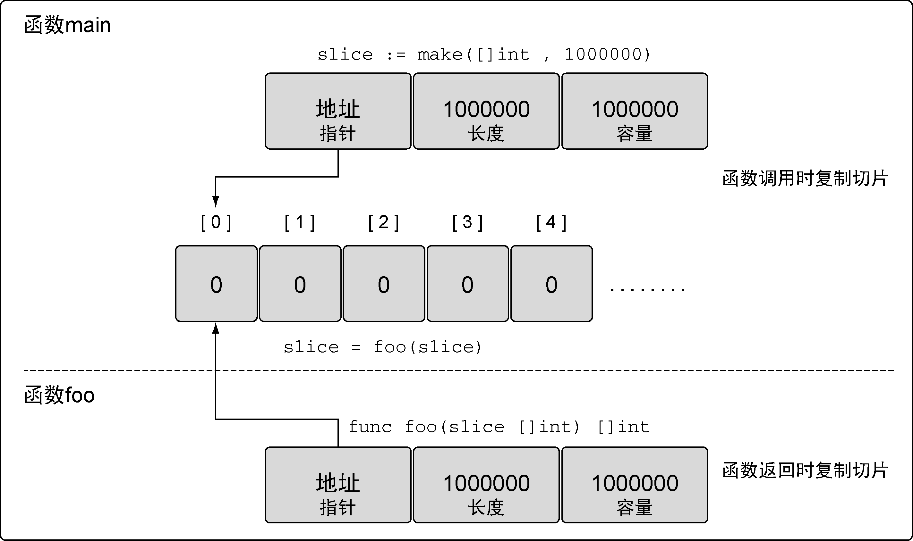

### 4.2.5　在函数间传递切片

在函数间传递切片就是要在函数间以值的方式传递切片。由于切片的尺寸很小，在函数间复制和传递切片成本也很低。让我们创建一个大切片，并将这个切片以值的方式传递给函数 `foo` ，如代码清单4-44所示。

代码清单4-44　在函数间传递切片

```go
// 分配包含100万个整型值的切片
slice := make([]int, 1e6)
// 将slice传递到函数foo
slice = foo(slice)
// 函数foo接收一个整型切片，并返回这个切片
func foo(slice []int) []int {
　　...
　　return slice
}
```

在64位架构的机器上，一个切片需要24字节的内存：指针字段需要8 字节，长度和容量字段分别需要8字节。由于与切片关联的数据包含在底层数组里，不属于切片本身，所以将切片复制到任意函数的时候，对底层数组大小都不会有影响。复制时只会复制切片本身，不会涉及底层数组（见图4-22）。


<center class="my_markdown"><b class="my_markdown">图4-22　函数调用之后两个切片指向同一个底层数组</b></center>

在函数间传递24字节的数据会非常快速、简单。这也是切片效率高的地方。不需要传递指针和处理复杂的语法，只需要复制切片，按想要的方式修改数据，然后传递回一份新的切片副本。

