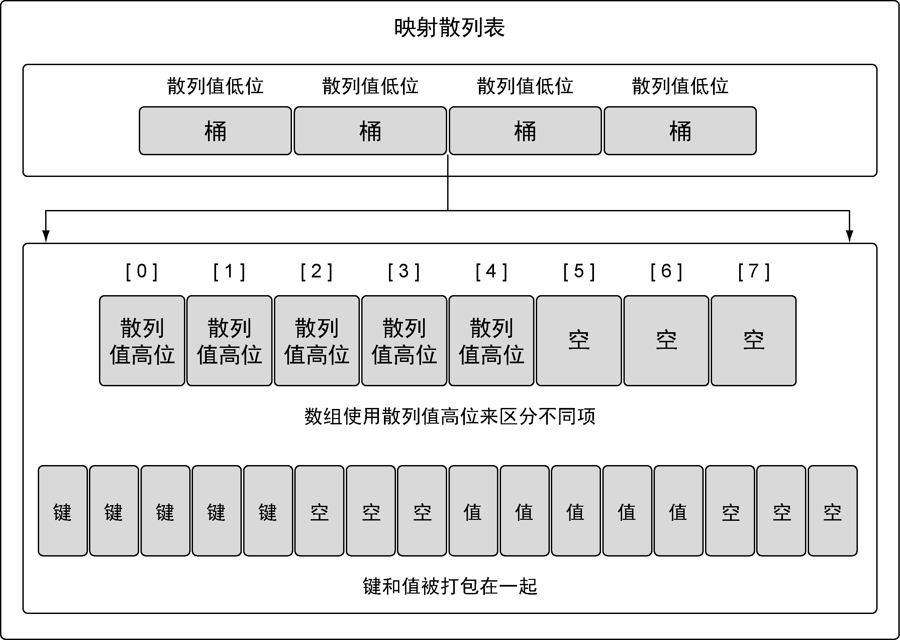
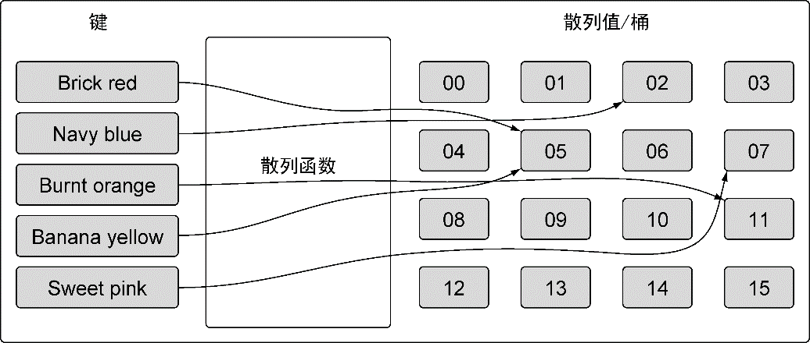

### 4.3.1　内部实现

映射是一个集合，可以使用类似处理数组和切片的方式迭代映射中的元素。但映射是无序的集合，意味着没有办法预测键值对被返回的顺序。即便使用同样的顺序保存键值对，每次迭代映射的时候顺序也可能不一样。无序的原因是映射的实现使用了散列表，见图4-24。

<b class="my_markdown">图4-24　映射的内部结构的简单表示</b>

映射的散列表包含一组桶。在存储、删除或者查找键值对的时候，所有操作都要先选择一个桶。把操作映射时指定的键传给映射的散列函数，就能选中对应的桶。这个散列函数的目的是生成一个索引，这个索引最终将键值对分布到所有可用的桶里。

随着映射存储的增加，索引分布越均匀，访问键值对的速度就越快。如果你在映射里存储了10 000个元素，你不希望每次查找都要访问10 000个键值对才能找到需要的元素，你希望查找键值对的次数越少越好。对于有10 000个元素的映射，每次查找只需要查找8个键值对才是一个分布得比较好的映射。映射通过合理数量的桶来平衡键值对的分布。

Go语言的映射生成散列键的过程比图4-25展示的过程要稍微长一些，不过大体过程是类似的。在我们的例子里，键是字符串，代表颜色。这些字符串会转换为一个数值（散列值）。这个数值落在映射已有桶的序号范围内表示一个可以用于存储的桶的序号。之后，这个数值就被用于选择桶，用于存储或者查找指定的键值对。对Go语言的映射来说，生成的散列键的一部分，具体来说是低位（LOB），被用来选择桶。

<b class="my_markdown">图4-25　简单描述散列函数是如何工作的</b>

如果再仔细看看图4-24，就能看出桶的内部实现。映射使用两个数据结构来存储数据。第一个数据结构是一个数组，内部存储的是用于选择桶的散列键的高八位值。这个数组用于区分每个键值对要存在哪个桶里。第二个数据结构是一个字节数组，用于存储键值对。该字节数组先依次存储了这个桶里所有的键，之后依次存储了这个桶里所有的值。实现这种键值对的存储方式目的在于减少每个桶所需的内存。

映射底层的实现还有很多细节，不过这些细节超出了本书的范畴。创建并使用映射并不需要了解所有的细节，只要记住一件事：映射是一个存储键值对的无序集合。

