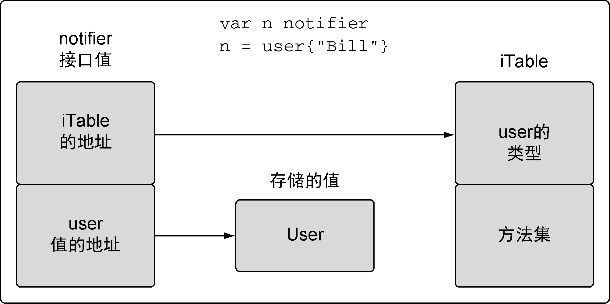
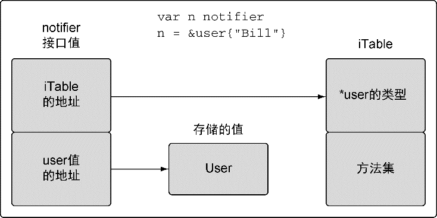

### 5.4.2　实现

接口是用来定义行为的类型。这些被定义的行为不由接口直接实现，而是通过方法由用户定义的类型实现。如果用户定义的类型实现了某个接口类型声明的一组方法，那么这个用户定义的类型的值就可以赋给这个接口类型的值。这个赋值会把用户定义的类型的值存入接口类型的值。

对接口值方法的调用会执行接口值里存储的用户定义的类型的值对应的方法。因为任何用户定义的类型都可以实现任何接口，所以对接口值方法的调用自然就是一种多态。在这个关系里，用户定义的类型通常叫作 **实体类型** ，原因是如果离开内部存储的用户定义的类型的值的实现，接口值并没有具体的行为。

并不是所有值都完全等同，用户定义的类型的值或者指针要满足接口的实现，需要遵守一些规则。这些规则在5.4.3节介绍方法集时有详细说明。探寻方法集的细节之前，了解接口类型值大概的形式以及用户定义的类型的值是如何存入接口的，会有很多帮助。

图5-1展示了在 `user` 类型值赋值后接口变量的值的内部布局。接口值是一个两个字长度的数据结构，第一个字包含一个指向内部表的指针。这个内部表叫作iTable，包含了所存储的值的类型信息。iTable包含了已存储的值的类型信息以及与这个值相关联的一组方法。第二个字是一个指向所存储值的指针。将类型信息和指针组合在一起，就将这两个值组成了一种特殊的关系。

<b class="my_markdown">图5-1　实体值赋值后接口值的简图</b>

图5-2展示了一个指针赋值给接口之后发生的变化。在这种情况里，类型信息会存储一个指向保存的类型的指针，而接口值第二个字依旧保存指向实体值的指针。

<b class="my_markdown">图5-2　实体指针赋值后接口值的简图</b>

