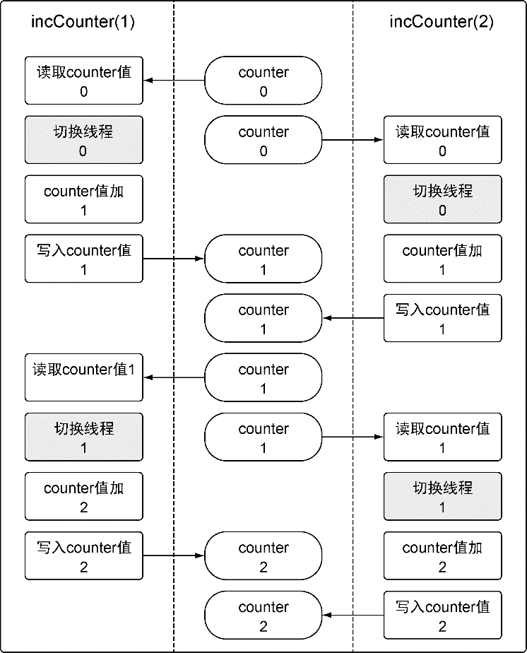

### 6.3　竞争状态

如果两个或者多个goroutine在没有互相同步的情况下，访问某个共享的资源，并试图同时读和写这个资源，就处于相互竞争的状态，这种情况被称作 **竞争状态** （race candition）。竞争状态的存在是让并发程序变得复杂的地方，十分容易引起潜在问题。对一个共享资源的读和写操作必须是原子化的，换句话说，同一时刻只能有一个goroutine对共享资源进行读和写操作。代码清单6-9中给出的是包含竞争状态的示例程序。

代码清单6-9　listing09.go

```go
01 // 这个示例程序展示如何在程序里造成竞争状态
02 // 实际上不希望出现这种情况
03 package main
04
05 import (
06　　 "fmt"
07　　 "runtime"
08　　 "sync"
09 )
10
11 var (
12　　 // counter是所有goroutine都要增加其值的变量
13　　 counter int
14
15　　 // wg用来等待程序结束
16　　 wg sync.WaitGroup
17 )
18
19 // main是所有Go程序的入口
20 func main() {
21　　 // 计数加2，表示要等待两个goroutine
22　　 wg.Add(2)
23
24　　 // 创建两个goroutine
25　　 go incCounter(1)
26　　 go incCounter(2)
27
28　　 // 等待goroutine结束
29　　 wg.Wait()
30　　 fmt.Println("Final Counter:", counter)
31 }
32
33 // incCounter增加包里counter变量的值
34 func incCounter(id int) {
35　　 // 在函数退出时调用Done来通知main函数工作已经完成
36　　 defer wg.Done()
37
38　　 for count := 0; count < 2; count++ {
39　　　　 // 捕获counter的值
40　　　　 value := counter
41
42　　　　 // 当前goroutine从线程退出，并放回到队列
43　　　　 runtime.Gosched()
44
45　　　　 // 增加本地value变量的值
46　　　　 value++
47
48　　　　 // 将该值保存回counter
49　　　　 counter = value
50　　 }
51 }
```

对应的输出如代码清单6-10所示。

代码清单6-10　listing09.go的输出

```go
Final Counter: 2
```

变量 `counter` 会进行4次读和写操作，每个goroutine执行两次。但是，程序终止时， `counter` 变量的值为2。图6-5提供了为什么会这样的线索。

每个goroutine都会覆盖另一个goroutine的工作。这种覆盖发生在goroutine切换的时候。每个goroutine创造了一个 `counter` 变量的副本，之后就切换到另一个goroutine。当这个goroutine再次运行的时候， `counter` 变量的值已经改变了，但是goroutine并没有更新自己的那个副本的值，而是继续使用这个副本的值，用这个值递增，并存回 `counter` 变量，结果覆盖了另一个goroutine完成的工作。


<center class="my_markdown"><b class="my_markdown">图6-5　竞争状态下程序行为的图像表达</b></center>

让我们顺着程序理解一下发生了什么。在第25行和第26行，使用 `incCounter` 函数创建了两个goroutine。在第34行， `incCounter` 函数对包内变量 `counter` 进行了读和写操作，而这个变量是这个示例程序里的共享资源。每个goroutine都会先读出这个 `counter` 变量的值，并在第40行将 `counter` 变量的副本存入一个叫作 `value` 的本地变量。之后在第46行， `incCounter` 函数对 `value` 的副本的值加1，最终在第49行将这个新值存回到 `counter` 变量。这个函数在第43行调用了 `runtime` 包的 `Gosched` 函数，用于将goroutine从当前线程退出，给其他goroutine运行的机会。在两次操作中间这样做的目的是强制调度器切换两个goroutine，以便让竞争状态的效果变得更明显。

Go语言有一个特别的工具，可以在代码里检测竞争状态。在查找这类错误的时候，这个工具非常好用，尤其是在竞争状态并不像这个例子里这么明显的时候。让我们用这个竞争检测器来检测一下我们的例子代码，如代码清单6-11所示。

代码清单6-11　用竞争检测器来编译并执行listing09的代码

```go
go build -race　 // 用竞争检测器标志来编译程序
./example　　　　// 运行程序
==================
WARNING: DATA RACE
Write by goroutine 5:
　main.incCounter()
　　　/example/main.go:49 +0x96
Previous read by goroutine 6:
　main.incCounter()
　　　/example/main.go:40 +0x66
Goroutine 5 (running) created at:
　main.main()
　　　/example/main.go:25 +0x5c
Goroutine 6 (running) created at:
　main.main()
　　　/example/main.go:26 +0x73
==================
Final Counter: 2
Found 1 data race(s)
```

代码清单6-11中的竞争检测器指出这个例子里面代码清单6-12所示的4行代码有问题。

代码清单6-12　竞争检测器指出的代码

```go
Line 49: counter = value
Line 40: value := counter
Line 25: go incCounter(1)
Line 26: go incCounter(2)
```

代码清单6-12展示了竞争检测器查到的哪个goroutine引发了数据竞争，以及哪两行代码有冲突。毫不奇怪，这几行代码分别是对 `counter` 变量的读和写操作。

一种修正代码、消除竞争状态的办法是，使用Go语言提供的锁机制，来锁住共享资源，从而保证goroutine的同步状态。

