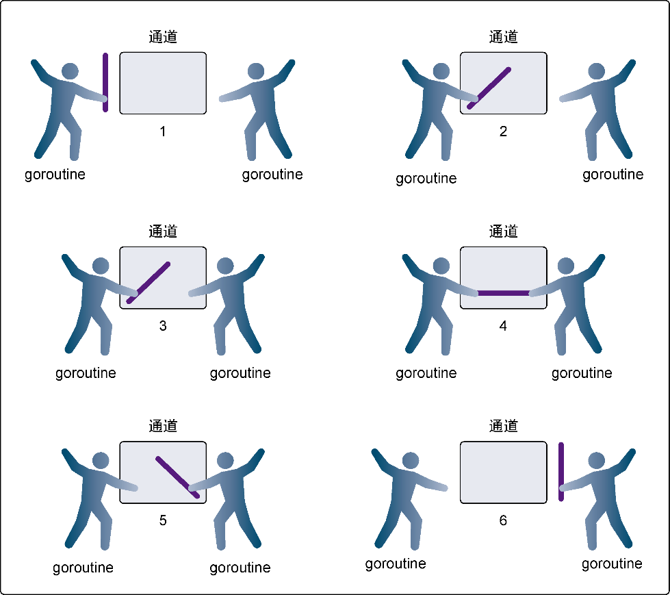

### 6.5.1　无缓冲的通道

**无缓冲的通道** （unbuffered channel）是指在接收前没有能力保存任何值的通道。这种类型的通道要求发送goroutine和接收goroutine同时准备好，才能完成发送和接收操作。如果两个goroutine没有同时准备好，通道会导致先执行发送或接收操作的goroutine阻塞等待。这种对通道进行发送和接收的交互行为本身就是同步的。其中任意一个操作都无法离开另一个操作单独存在。

在图6-6里，可以看到一个例子，展示两个goroutine如何利用无缓冲的通道来共享一个值。在第1步，两个goroutine都到达通道，但哪个都没有开始执行发送或者接收。在第2步，左侧的goroutine将它的手伸进了通道，这模拟了向通道发送数据的行为。这时，这个goroutine会在通道中被锁住，直到交换完成。在第3步，右侧的goroutine将它的手放入通道，这模拟了从通道里接收数据。这个goroutine一样也会在通道中被锁住，直到交换完成。在第4步和第5步，进行交换，并最终，在第6步，两个goroutine都将它们的手从通道里拿出来，这模拟了被锁住的goroutine得到释放。两个goroutine现在都可以去做别的事情了。


<center class="my_markdown"><b class="my_markdown">图6-6　使用无缓冲的通道在goroutine之间同步</b></center>

为了讲得更清楚，让我们来看两个完整的例子。这两个例子都会使用无缓冲的通道在两个goroutine之间同步交换数据。

在网球比赛中，两位选手会把球在两个人之间来回传递。选手总是处在以下两种状态之一：要么在等待接球，要么将球打向对方。可以使用两个goroutine来模拟网球比赛，并使用无缓冲的通道来模拟球的来回，如代码清单6-20所示。

代码清单6-20　listing20.go

```go
01 // 这个示例程序展示如何用无缓冲的通道来模拟
02 // 2个goroutine间的网球比赛
03 package main
04
05 import (
06　　 "fmt"
07　　 "math/rand"
08　　 "sync"
09　　 "time"
10 )
11
12 // wg用来等待程序结束
13 var wg sync.WaitGroup
14
15 func init() {
16　　 rand.Seed(time.Now().UnixNano())
17 }
18
19 // main是所有Go程序的入口
20 func main() {
21　　 // 创建一个无缓冲的通道
22　　 court := make(chan int)
23
24　　 // 计数加2，表示要等待两个goroutine
25　　 wg.Add(2)
26
27　　 // 启动两个选手
28　　 go player("Nadal", court)
29　　 go player("Djokovic", court)
30
31　　 // 发球
32　　 court <- 1
33
34　　 // 等待游戏结束
35　　 wg.Wait()
36 }
37
38 // player 模拟一个选手在打网球
39 func player(name string, court chan int) {
40　　 // 在函数退出时调用Done来通知main函数工作已经完成
41　　 defer wg.Done()
42
43　　 for {
44　　　　 // 等待球被击打过来
45　　　　 ball, ok := <-court
46　　　　 if !ok {
47　　　　　　 // 如果通道被关闭，我们就赢了
48　　　　　　 fmt.Printf("Player %s Won\n", name)
49　　　　　　 return
50　　　　 }
51
52　　　　 // 选随机数，然后用这个数来判断我们是否丢球
53　　　　 n := rand.Intn(100)
54　　　　 if n%13 == 0 {
55　　　　　　 fmt.Printf("Player %s Missed\n", name)
56
57　　　　　　 // 关闭通道，表示我们输了
58　　　　　　 close(court)
59　　　　　　 return
60　　　　 }
61
62　　　　 // 显示击球数，并将击球数加1
63　　　　 fmt.Printf("Player %s Hit %d\n", name, ball)
64　　　　 ball++
65
66　　　　 // 将球打向对手
67　　　　 court <- ball
68　　 }
69 }
```

运行这个程序会得到代码清单6-21所示的输出。

代码清单6-21　listing20.go的输出

```go
Player Nadal Hit 1
Player Djokovic Hit 2
Player Nadal Hit 3
Player Djokovic Missed
Player Nadal Won
```

在 `main` 函数的第22行，创建了一个 `int` 类型的无缓冲的通道，让两个goroutine在击球时能够互相同步。之后在第28行和第29行，创建了参与比赛的两个goroutine。在这个时候，两个goroutine都阻塞住等待击球。在第32行，将球发到通道里，程序开始执行这个比赛，直到某个goroutine输掉比赛。

在 `player` 函数里，在第43行可以找到一个无限循环的 `for` 语句。在这个循环里，是玩游戏的过程。在第45行，goroutine从通道接收数据，用来表示等待接球。这个接收动作会锁住goroutine，直到有数据发送到通道里。通道的接收动作返回时，第46行会检测 `ok` 标志是否为 `false` 。如果这个值是 `false` ，表示通道已经被关闭，游戏结束。在第53行到第60行，会产生一个随机数，用来决定goroutine是否击中了球。如果击中了球，在第64行 `ball` 的值会递增1，并在第67行，将 `ball` 作为球重新放入通道，发送给另一位选手。在这个时刻，两个goroutine都会被锁住，直到交换完成。最终，某个goroutine没有打中球，在第58行关闭通道。之后两个goroutine都会返回，通过 `defer` 声明的 `Done` 会被执行，程序终止。

另一个例子，用不同的模式，使用无缓冲的通道，在goroutine之间同步数据，来模拟接力比赛。在接力比赛里，4个跑步者围绕赛道轮流跑（如代码清单6-22所示）。第二个、第三个和第四个跑步者要接到前一位跑步者的接力棒后才能起跑。比赛中最重要的部分是要传递接力棒，要求同步传递。在同步接力棒的时候，参与接力的两个跑步者必须在同一时刻准备好交接。

代码清单6-22　listing22.go

```go
01 // 这个示例程序展示如何用无缓冲的通道来模拟
02 // 4个goroutine间的接力比赛
03 package main
04
05 import (
06　　 "fmt"
07　　 "sync"
08　　 "time"
09 )
10
11 // wg用来等待程序结束
12 var wg sync.WaitGroup
13
14 // main是所有Go程序的入口
15 func main() {
16　　 // 创建一个无缓冲的通道
17　　 baton := make(chan int)
18
19　　 // 为最后一位跑步者将计数加1
20　　 wg.Add(1)
21
22　　 // 第一位跑步者持有接力棒
23　　 go Runner(baton)
24
25　　 // 开始比赛
26　　 baton <- 1
27
28　　 // 等待比赛结束
29　　 wg.Wait()
30 }
31
32 // Runner模拟接力比赛中的一位跑步者
33 func Runner(baton chan int) {
34　　 var newRunner int
35
36　　 // 等待接力棒
37　　 runner := <-baton
38
39　　 // 开始绕着跑道跑步
40　　 fmt.Printf("Runner %d Running With Baton\n", runner)
41
42　　 // 创建下一位跑步者
43　　 if runner != 4 {
44　　　　 newRunner = runner + 1
45　　　　 fmt.Printf("Runner %d To The Line\n", runner)
46　　　　 go Runner(baton)
47　　 }
48
49　　 // 围绕跑道跑
50　　 time.Sleep(100 * time.Millisecond)
51
52　　 // 比赛结束了吗？
53　　 if runner == 4 {
54　　　　 fmt.Printf("Runner %d Finished, Race Over\n", runner)
55　　　　 wg.Done()
56　　　　 return
57　　 }
58
59　　 // 将接力棒交给下一位跑步者
60　　 fmt.Printf("Runner %d Exchange With Runner %d\n",
61　　　　 runner,
62　　　　 newRunner)
63
64　　 baton <- newRunner
65 }
```

运行这个程序会得到代码清单6-23所示的输出。

代码清单6-23　listing22.go 的输出

```go
Runner 1 Running With Baton
Runner 1 To The Line
Runner 1 Exchange With Runner 2
Runner 2 Running With Baton
Runner 2 To The Line
Runner 2 Exchange With Runner 3
Runner 3 Running With Baton
Runner 3 To The Line
Runner 3 Exchange With Runner 4
Runner 4 Running With Baton
Runner 4 Finished, Race Over
```

在 `main` 函数的第17行，创建了一个无缓冲的 `int` 类型的通道 `baton` ，用来同步传递接力棒。在第20行，我们给 `WaitGroup` 加1，这样 `main` 函数就会等最后一位跑步者跑步结束。在第23行创建了一个goroutine，用来表示第一位跑步者来到跑道。之后在第26行，将接力棒交给这个跑步者，比赛开始。最终，在第29行， `main` 函数阻塞在 `WaitGroup` ，等候最后一位跑步者完成比赛。

在 `Runner`  goroutine里，可以看到接力棒 `baton` 是如何在跑步者之间传递的。在第37行，goroutine对 `baton` 通道执行接收操作，表示等候接力棒。一旦接力棒传了进来，在第46行就会创建一位新跑步者，准备接力下一棒，直到goroutine是第四个跑步者。在第50行，跑步者围绕跑道跑100 ms。在第55行，如果第四个跑步者完成了比赛，就调用 `Done` ，将 `WaitGroup` 减1，之后goroutine返回。如果这个goroutine不是第四个跑步者，那么在第64行，接力棒会交到下一个已经在等待的跑步者手上。在这个时候，goroutine会被锁住，直到交接完成。

在这两个例子里，我们使用无缓冲的通道同步goroutine，模拟了网球和接力赛。代码的流程与这两个活动在真实世界中的流程完全一样，这样的代码很容易读懂。现在知道了无缓冲的通道是如何工作的，接下来我们会学习有缓冲的通道的工作方法。

