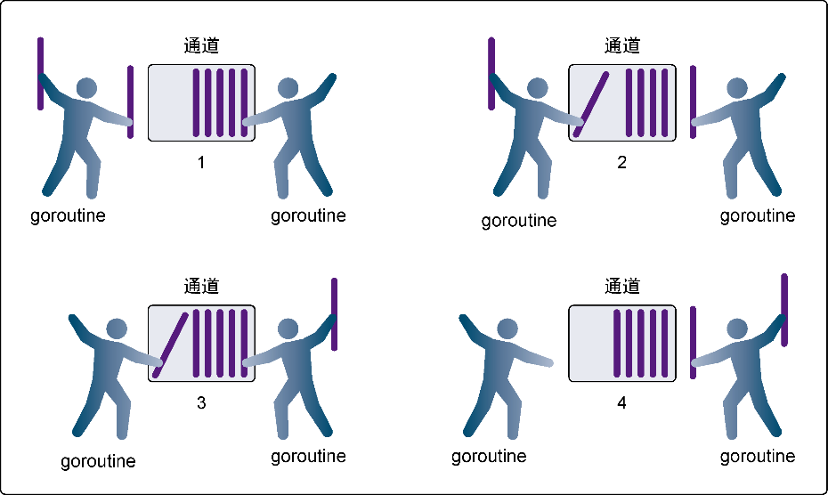

### 6.5.2　有缓冲的通道

**有缓冲的通道** （buffered channel）是一种在被接收前能存储一个或者多个值的通道。这种类型的通道并不强制要求goroutine之间必须同时完成发送和接收。通道会阻塞发送和接收动作的条件也会不同。只有在通道中没有要接收的值时，接收动作才会阻塞。只有在通道没有可用缓冲区容纳被发送的值时，发送动作才会阻塞。这导致有缓冲的通道和无缓冲的通道之间的一个很大的不同：无缓冲的通道保证进行发送和接收的goroutine会在同一时间进行数据交换；有缓冲的通道没有这种保证。

在图6-7中可以看到两个goroutine分别向有缓冲的通道里增加一个值和从有缓冲的通道里移除一个值。在第1步，右侧的goroutine正在从通道接收一个值。在第2步，右侧的这个goroutine独立完成了接收值的动作，而左侧的goroutine正在发送一个新值到通道里。在第3步，左侧的goroutine还在向通道发送新值，而右侧的goroutine正在从通道接收另外一个值。这个步骤里的两个操作既不是同步的，也不会互相阻塞。最后，在第4步，所有的发送和接收都完成，而通道里还有几个值，也有一些空间可以存更多的值。


<center class="my_markdown"><b class="my_markdown">图6-7　使用有缓冲的通道在goroutine之间同步数据</b></center>

让我们看一个使用有缓冲的通道的例子，这个例子管理一组goroutine来接收并完成工作。有缓冲的通道提供了一种清晰而直观的方式来实现这个功能，如代码清单6-24所示。

代码清单6-24　listing24.go

```go
01 // 这个示例程序展示如何使用
02 // 有缓冲的通道和固定数目的
03 // goroutine来处理一堆工作
04 package main
05
06 import (
07　　 "fmt"
08　　 "math/rand"
09　　 "sync"
10　　 "time"
11 )
12
13 const (
14　　 numberGoroutines = 4　// 要使用的goroutine的数量
15　　 taskLoad　　　　 = 10　// 要处理的工作的数量
16 )
17
18 // wg用来等待程序完成
19 var wg sync.WaitGroup
20
21 // init初始化包，Go语言运行时会在其他代码执行之前
22 // 优先执行这个函数
23 func init() {
24　　 // 初始化随机数种子
25　　 rand.Seed(time.Now().Unix())
26 }
27
28 // main是所有Go程序的入口
29 func main() {
30　　 // 创建一个有缓冲的通道来管理工作
31　　 tasks := make(chan string, taskLoad)
32
33　　 // 启动goroutine来处理工作
34　　 wg.Add(numberGoroutines)
35　　 for gr := 1; gr <= numberGoroutines; gr++ {
36　　　　 go worker(tasks, gr)
37　　 }
38
39　　 // 增加一组要完成的工作
40　　 for post := 1; post <= taskLoad; post++ {
41　　　　 tasks <- fmt.Sprintf("Task : %d", post)
42　　 }
43
44　　 // 当所有工作都处理完时关闭通道
45　　 // 以便所有goroutine退出
46　　 close(tasks)
47
48　　 // 等待所有工作完成
49　　 wg.Wait()
50 }
51
52 // worker作为goroutine启动来处理
53 // 从有缓冲的通道传入的工作
54 func worker(tasks chan string, worker int) {
55　　 // 通知函数已经返回
56　　 defer wg.Done()
57
58　　 for {
59　　　　 // 等待分配工作
60　　　　 task, ok := <-tasks
61　　　　 if !ok {
62　　　　　　 // 这意味着通道已经空了，并且已被关闭
63　　　　　　 fmt.Printf("Worker: %d : Shutting Down\n", worker)
64　　　　　　 return
65　　　　 }
66
67　　　　 // 显示我们开始工作了
68　　　　 fmt.Printf("Worker: %d : Started %s\n", worker, task)
69
70　　　　 // 随机等一段时间来模拟工作
71　　　　 sleep := rand.Int63n(100)
72　　　　 time.Sleep(time.Duration(sleep) * time.Millisecond)
73
74　　　　 // 显示我们完成了工作
75　　　　 fmt.Printf("Worker: %d : Completed %s\n", worker, task)
76　　 }
77 }
```

运行这个程序会得到代码清单6-25所示的输出。

代码清单6-25　listing24.go的输出

```go
Worker: 1 : Started Task : 1
Worker: 2 : Started Task : 2
Worker: 3 : Started Task : 3
Worker: 4 : Started Task : 4
Worker: 1 : Completed Task : 1
Worker: 1 : Started Task : 5
Worker: 4 : Completed Task : 4
Worker: 4 : Started Task : 6
Worker: 1 : Completed Task : 5
Worker: 1 : Started Task : 7
Worker: 2 : Completed Task : 2
Worker: 2 : Started Task : 8
Worker: 3 : Completed Task : 3
Worker: 3 : Started Task : 9
Worker: 1 : Completed Task : 7
Worker: 1 : Started Task : 10
Worker: 4 : Completed Task : 6
Worker: 4 : Shutting Down
Worker: 3 : Completed Task : 9
Worker: 3 : Shutting Down
Worker: 2 : Completed Task : 8
Worker: 2 : Shutting Down
Worker: 1 : Completed Task : 10
Worker: 1 : Shutting Down
```

由于程序和Go语言的调度器带有随机成分，这个程序每次执行得到的输出会不一样。不过，通过有缓冲的通道，使用所有4个goroutine来完成工作，这个流程不会变。从输出可以看到每个goroutine是如何接收从通道里分发的工作。

在 `main` 函数的第31行，创建了一个 `string` 类型的有缓冲的通道，缓冲的容量是10。在第34行，给 `WaitGroup` 赋值为4，代表创建了4个工作goroutine。之后在第35行到第37行，创建了4个goroutine，并传入用来接收工作的通道。在第40行到第42行，将10个字符串发送到通道，模拟发给goroutine的工作。一旦最后一个字符串发送到通道，通道就会在第46行关闭，而 `main` 函数就会在第49行等待所有工作的完成。

第46行中关闭通道的代码非常重要。当通道关闭后，goroutine依旧可以从通道接收数据，但是不能再向通道里发送数据。能够从已经关闭的通道接收数据这一点非常重要，因为这允许通道关闭后依旧能取出其中缓冲的全部值，而不会有数据丢失。从一个已经关闭且没有数据的通道里获取数据，总会立刻返回，并返回一个通道类型的零值。如果在获取通道时还加入了可选的标志，就能得到通道的状态信息。

在 `worker` 函数里，可以在第58行看到一个无限的 `for` 循环。在这个循环里，会处理所有接收到的工作。每个goroutine都会在第60行阻塞，等待从通道里接收新的工作。一旦接收到返回，就会检查 `ok` 标志，看通道是否已经清空而且关闭。如果 `ok` 的值是 `false` ，goroutine就会终止，并调用第56行通过 `defer` 声明的 `Done` 函数，通知 `main` 有工作结束。

如果 `ok` 标志是 `true` ，表示接收到的值是有效的。第71行和第72行模拟了处理的工作。一旦工作完成，goroutine会再次阻塞在第60行从通道获取数据的语句。一旦通道被关闭，这个从通道获取数据的语句会立刻返回，goroutine也会终止自己。

有缓冲的通道和无缓冲的通道的例子很好地展示了如何编写使用通道的代码。在下一章，我们会介绍真实世界里的一些可能会在工程里用到的并发模式。

