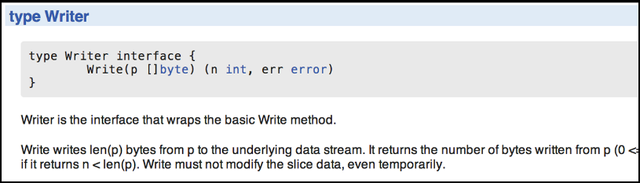
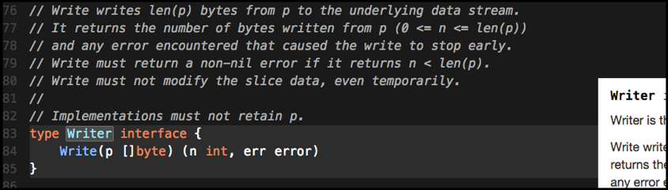
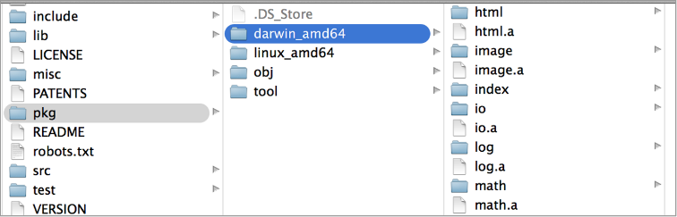

### 8.1　文档与源代码

标准库里包含众多的包，不可能在一章内把这些包都讲一遍。目前，标准库里总共有超过100个包，这些包被分到38个类别里，如代码清单8-1所示。

代码清单8-1　标准库里的顶级目录和包

```go
archive　 bufio　　　bytes　　 compress　 container　 crypto　　database
debug　　 encoding　 errors　　expvar　　 flag　　　　fmt　　　 go
hash　　　html　　　 image　　 index　　　io　　　　　log　　　 math
mime　　　net　　　　os　　　　path　　　 reflect　　 regexp　　runtime
sort　　　strconv　　strings　 sync　　　 syscall　　 testing　 text
time　　　unicode　　unsafe
```

代码清单8-1里列出的许多分类本身就是一个包。如果想了解所有包以及更详细的描述，Go语言团队在网站上维护了一个文档，参见<a class="my_markdown" href="['http://golang.org/pkg/']">http://golang.org/pkg/</a>。

`golang` 网站的 `pkg` 页面提供了每个包的 `godoc` 文档。图8-1展示了 `golang` 网站上 `io` 包的文档。


<center class="my_markdown"><b class="my_markdown">图8-1　golang.org/pkg/io/#Writer</b></center>

如果想以交互的方式浏览文档，Sourcegraph索引了所有标准库的代码，以及大部分包含Go代码的公开库。图8-2是Sourcegraph网站的一个例子，展示的是 `io` 包的文档。


<center class="my_markdown"><b class="my_markdown">图8-2　sourcegraph.com/code.google.com/p/go/.GoPackage/io/.def/Writer</b></center>

不管用什么方式安装Go，标准库的源代码都会安装在$GOROOT/src/pkg文件夹中。拥有标准库的源代码对Go工具正常工作非常重要。类似 `godoc` 、 `gocode` 甚至 `go build` 这些工具，都需要读取标准库的源代码才能完成其工作。如果源代码没有安装在以上文件夹中，或者无法通过 `$GOROOT` 变量访问，在试图编译程序时会产生错误。

作为Go发布包的一部分，标准库的源代码是经过预编译的。这些预编译后的文件，称作 **归档文件** （archive file），可以在$GOROOT/pkg文件夹中找到已经安装的各目标平台和操作系统的归档文件。在图8-3里，可以看到扩展名是.a的文件，这些就是归档文件。


<center class="my_markdown"><b class="my_markdown">图8-3　pkg文件夹中的归档文件的文件夹的视图</b></center>

这些文件是特殊的Go静态库文件，由Go的构建工具创建，并在编译和链接最终程序时被使用。归档文件可以让构建的速度更快。但是在构建的过程中，没办法指定这些文件，所以没办法与别人共享这些文件。Go工具链知道什么时候可以使用已有的.a文件，什么时候需要从机器上的源代码重新构建。

有了这些背景知识，让我们看一下标准库里的几个包，看看如何用这些包来构建自己的程序。

