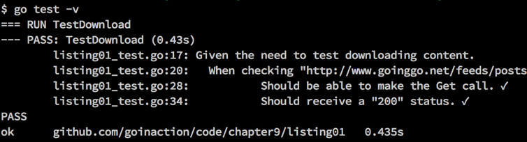
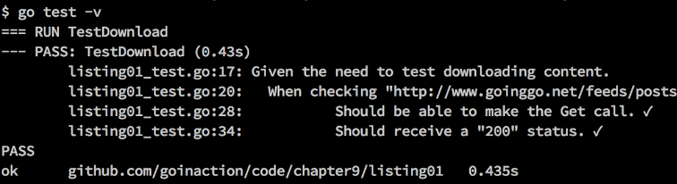

### 9.1.1　基础单元测试

让我们看一个单元测试的例子，如代码清单9-1所示。

代码清单9-1　listing01_test.go

```go
01 // 这个示例程序展示如何写基础单元测试
02 package listing01
03
04 import (
05　　 "net/http"
06　　 "testing"
07 )
08
09 const checkMark = "\u2713"
10 const ballotX = "\u2717"
11
12 // TestDownload确认http包的Get函数可以下载内容
13 func TestDownload(t *testing.T) {
14　　 url := "http://www.goinggo.net/feeds/posts/default?alt=rss"
15　　 statusCode := 200
16
17　　 t.Log("Given the need to test downloading content.")
18　　 {
19　　　　 t.Logf("\tWhen checking \"%s\" for status code \"%d\"",
20　　　　　　 url, statusCode)
21　　　　 {
22　　　　　　 resp, err := http.Get(url)
23　　　　　　 if err != nil {
24　　　　　　　　 t.Fatal("\t\tShould be able to make the Get call.",
25　　　　　　　　　　 ballotX, err)
26　　　　　　 }
27　　　　　　 t.Log("\t\tShould be able to make the Get call.",
28　　　　　　　　 checkMark)
29
30　　　　　　 defer resp.Body.Close()
31
32　　　　　　 if resp.StatusCode == statusCode {
33　　　　　　　　 t.Logf("\t\tShould receive a \"%d\" status. %v",
34　　　　　　　　　　 statusCode, checkMark)
35　　　　　　 } else {
36　　　　　　　　 t.Errorf("\t\tShould receive a \"%d\" status. %v %v",
37　　　　　　　　　　 statusCode, ballotX, resp.StatusCode)
38　　　　　　 }
39　　　　 }
40　　 }
41 }

```

代码清单9-1展示了测试 `http` 包的 `Get` 函数的单元测试。测试的内容是确保可以从网络正常下载goinggo.net的RSS列表。如果通过调用 `go test -v` 来运行这个测试（ `-v` 表示 **提供冗余输出** ），会得到图9-1所示的测试结果。


<center class="my_markdown"><b class="my_markdown">图9-1　基础单元测试的输出</b></center>

这个例子背后发生了很多事情，来确保测试能正确工作，并显示结果。让我们从测试文件的文件名开始。如果查看代码清单9-1一开始的部分，会看到测试文件的文件名是listing01_test.go。Go语言的测试工具只会认为以_test.go结尾的文件是测试文件。如果没有遵从这个约定，在包里运行 `go test` 的时候就可能会报告没有测试文件。一旦测试工具找到了测试文件，就会查找里面的测试函数并执行。

让我们仔细看看listing01_test.go测试文件里面的代码，如代码清单9-2所示。

代码清单9-2　listing01_test.go：第01行到第10行

```go
01 // 这个示例程序展示如何写基础单元测试
02 package listing01
03
04 import (
05　　 "net/http"
06　　 "testing"
07 )
08
09 const checkMark = "\u2713"
10 const ballotX = "\u2717"
```

在代码清单9-2里，可以看到第06行引入了 `testing` 包。这个 `testing` 包提供了从测试框架到报告测试的输出和状态的各种测试功能的支持。第09行和第10行声明了两个常量，这两个常量包含写测试输出时会用到的对号（√）和叉号（×）。

接下来，让我们看一下测试函数的声明，如代码清单9-3所示。

代码清单9-3　listing01_test.go：第12行到第13行

```go
12 // TestDownload确认http包的Get函数可以下载内容
13 func TestDownload(t *testing.T) {
```

在代码清单9-3的第13行中，可以看到测试函数的名字是 `TestDownload` 。一个测试函数必须是公开的函数，并且以 `Test` 单词开头。不但函数名字要以 `Test` 开头，而且函数的签名必须接收一个指向 `testing.T` 类型的指针，并且不返回任何值。如果没有遵守这些约定，测试框架就不会认为这个函数是一个测试函数，也不会让测试工具去执行它。

指向 `testing.T` 类型的指针很重要。这个指针提供的机制可以报告每个测试的输出和状态。测试的输出格式没有标准要求。我更喜欢使用Go写文档的方式，输出容易读的测试结果。对我来说，测试的输出是代码文档的一部分。测试的输出需使用完整易读的语句，来记录为什么需要这个测试，具体测试了什么，以及测试的结果是什么。让我们来看一下更多的代码，了解我是如何完成这些测试的，如代码清单9-4所示。

代码清单9-4　listing01_test.go：第14行到第18行

```go
14　　 url := "http://www.goinggo.net/feeds/posts/default?alt=rss"
15　　 statusCode := 200
16
17　　 t.Log("Given the need to test downloading content.")
18　　 {

```

可以看到，在代码清单9-4的第14行和第15行，声明并初始化了两个变量。这两个变量包含了要测试的URL，以及期望从响应中返回的状态。在第17行，使用方法 `t.Log` 来输出测试的消息。这个方法还有一个名为 `t.Logf` 的版本，可以格式化消息。如果执行 `go test` 的时候没有加入冗余选项（ `-v` ），除非测试失败，否则我们是看不到任何测试输出的。

每个测试函数都应该通过解释这个测试的 **给定要求** （given need），来说明为什么应该存在这个测试。对这个例子来说，给定要求是测试能否成功下载数据。在声明了测试的给定要求后，测试应该说明被测试的代码应该在什么情况下被执行，以及如何执行。

代码清单9-5　listing01_test.go：第19行到第21行

```go
19　　　　 t.Logf("\tWhen checking \"%s\" for status code \"%d\"",
20　　　　　　 url, statusCode)
21　　　　 {
```

可以在代码清单9-5的第19行看到测试执行条件的说明。它特别说明了要测试的值。接下来，让我们看一下被测试的代码是如何使用这些值来进行测试的。

代码清单9-6　listing01_test.go：第22行到第30行

```go
22　　　　　　 resp, err := http.Get(url)
23　　　　　　 if err != nil {
24　　　　　　　　 t.Fatal("\t\tShould be able to make the Get call.",
25　　　　　　　　　　 ballotX, err)
26　　　　　　 }
27　　　　　　 t.Log("\t\tShould be able to make the Get call.",
28　　　　　　　　 checkMark)
29
30　　　　　　 defer resp.Body.Close()
```

代码清单9-6中的代码使用 `http` 包的 `Get` 函数来向goinggo.net网络服务器发起请求，请求下载该博客的RSS列表。在 `Get` 调用返回之后，会检查错误值，来判断调用是否成功。在每种情况下，我们都会说明测试应有的结果。如果调用失败，除了结果，还会输出叉号以及得到的错误值。如果测试成功，会输出对号。

如果 `Get` 调用失败，使用第24行的 `t.Fatal` 方法，让测试框架知道这个测试失败了。 `t.Fatal` 方法不但报告这个单元测试已经失败，而且会向测试输出写一些消息，而后立刻停止这个测试函数的执行。如果除了这个函数外还有其他没有执行的测试函数，会继续执行其他测试函数。这个方法对应的格式化版本名为 `t.Fatalf` 。

如果需要报告测试失败，但是并不想停止当前测试函数的执行，可以使用 `t.Error` 系列方法，如代码清单9-7所示。

代码清单9-7　listing01_test.go：第32行到第41行

```go
32　　　　　　 if resp.StatusCode == statusCode {
33　　　　　　　　 t.Logf("\t\tShould receive a \"%d\" status. %v",
34　　　　　　　　　　 statusCode, checkMark)
35　　　　　　 } else {
36　　　　　　　　 t.Errorf("\t\tShould receive a \"%d\" status. %v %v",
37　　　　　　　　　　 statusCode, ballotX, resp.StatusCode)
38　　　　　　 }
39　　　　 }
40　　 }
41 }
```

在代码清单9-7的第32行，会将响应返回的状态码和我们期望收到的状态码进行比较。我们再次声明了期望测试返回的结果是什么。如果状态码匹配，我们就使用 `t.Logf` 方法输出信息；否则，就使用 `t.Errorf` 方法。因为 `t.Errorf` 方法不会停止当前测试函数的执行，所以，如果在第38行之后还有测试，单元测试就会继续执行。如果测试函数执行时没有调用过 `t.Fatal` 或者 `t.Error` 方法，就会认为测试通过了。

如果再看一下测试的输出（如图9-2所示），你会看到这段代码组合在一起的效果。


<center class="my_markdown"><b class="my_markdown">图9-2　基础单元测试的输出</b></center>

在图9-2中能看到这个测试的完整文档。下载给定的内容，当检测获取URL的内容返回的状态码时（在图中被截断），我们应该能够成功完成这个调用并收到状态200。测试的输出很清晰，能描述测试的目的，同时包含了足够的信息。我们知道具体是哪个单元测试被运行，测试通过了，并且运行消耗的时间是435毫秒。

