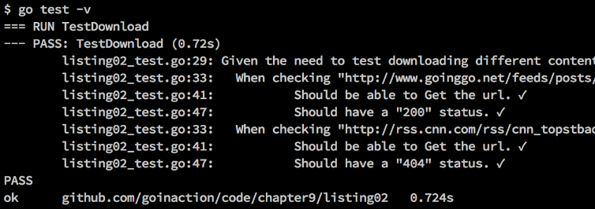

### 9.1.2　表组测试

如果测试可以接受一组不同的输入并产生不同的输出的代码，那么应该使用表组测试的方法进行测试。 **表组测试** 除了会有一组不同的输入值和期望结果之外，其余部分都很像基础单元测试。测试会依次迭代不同的值，来运行要测试的代码。每次迭代的时候，都会检测返回的结果。这便于在一个函数里测试不同的输入值和条件。让我们看一个表组测试的例子，如代码清单9-8所示。

代码清单9-8　listing08_test.go

```go
01 // 这个示例程序展示如何写一个基本的表组测试
02 package listing08
03
04 import (
05　　 "net/http"
06　　 "testing"
07 )
08
09 const checkMark = "\u2713"
10 const ballotX = "\u2717"
11
12 // TestDownload确认http包的Get函数可以下载内容
13 // 并正确处理不同的状态
14 func TestDownload(t *testing.T) {
15　　 var urls = []struct {
16　　　　 url　　　　string
17　　　　 statusCode int
18　　 }{
19　　　　 {
20　　　　　　 "http://www.goinggo.net/feeds/posts/default?alt=rss",
21　　　　　　 http.StatusOK,
22　　　　 },
23　　　　 {
24　　　　　　 "http://rss.cnn.com/rss/cnn_topstbadurl.rss",
25　　　　　　 http.StatusNotFound,
26　　　　 },
27　　 }
28
29　　 t.Log("Given the need to test downloading different content.")
30　　 {
31　　　　 for _, u := range urls {
32　　　　　　 t.Logf("\tWhen checking \"%s\" for status code \"%d\"",
33　　　　　　　　 u.url, u.statusCode)
34　　　　　　 {
35　　　　　　　　 resp, err := http.Get(u.url)
36　　　　　　　　 if err != nil {
37　　　　　　　　　　 t.Fatal("\t\tShould be able to Get the url.",
38　　　　　　　　　　　　 ballotX, err)
39　　　　　　　　 }
40　　　　　　　　 t.Log("\t\tShould be able to Get the url",
41　　　　　　　　　　 checkMark)
42
43　　　　　　　　 defer resp.Body.Close()
44
45　　　　　　　　 if resp.StatusCode == u.statusCode {
46　　　　　　　　　　 t.Logf("\t\tShould have a \"%d\" status. %v",
47　　　　　　　　　　　　 u.statusCode, checkMark)
48　　　　　　　　 } else {
49　　　　　　　　　　 t.Errorf("\t\tShould have a \"%d\" status %v %v",
50　　　　　　　　　　　　 u.statusCode, ballotX, resp.StatusCode)
51　　　　　　　　 }
52　　　　　　 }
53　　　　 }
54　　 }
55 }

```

在代码清单9-8中，我们稍微改动了之前的基础单元测试，将其变为表组测试。现在，可以使用一个测试函数来测试不同的URL以及 `http.Get` 方法的返回状态码。我们不需要为每个要测试的URL和状态码创建一个新测试函数。让我们看一下，和之前相比，做了哪些改动，如代码清单9-9所示。

代码清单9-9　listing08_test.go：第12行到第27行

```go
12 // TestDownload确认http包的Get函数可以下载内容
13 // 并正确处理不同的状态
14 func TestDownload(t *testing.T) {
15　　 var urls = []struct {
16　　　　 url　　　　string
17　　　　 statusCode int
18　　 }{
19　　　　 {
20　　　　　　 "http://www.goinggo.net/feeds/posts/default?alt=rss",
21　　　　　　 http.StatusOK,
22　　　　 },
23　　　　 {
24　　　　　　 "http://rss.cnn.com/rss/cnn_topstbadurl.rss",
25　　　　　　 http.StatusNotFound,
26　　　　 },
27　　 }

```

在代码清单9-9中，可以看到和之前同名的测试函数 `TestDownload` ，它接收一个指向 `testing.T` 类型的指针。但这个版本的 `TestDownload` 略微有些不同。在第15行到第27行，可以看到表组的实现代码。表组的第一个字段是URL，指向一个给定的互联网资源，第二个字段是我们请求资源后期望收到的状态码。

目前，我们的表组只配置了两组值。第一组值是goinggo.net的URL，响应状态为OK，第二组值是另一个URL，响应状态为NotFound。运行这个测试会得到图9-3所示的输出。


<center class="my_markdown"><b class="my_markdown">图9-3　表组测试的输出</b></center>

图9-3所示的输出展示了如何迭代表组里的值，并使用其进行测试。输出看起来和基础单元测试的输出很像，只是每次都会输出两个不同的URL及其结果。测试又通过了。

让我们看一下我们是如何让表组测试工作的，如代码清单9-10所示。

代码清单9-10　listing08_test.go：第29行到第34行

```go
29　　 t.Log("Given the need to test downloading different content.")
30　　 {
31　　　　 for _, u := range urls {
32　　　　　　 t.Logf("\tWhen checking \"%s\" for status code \"%d\"",
33　　　　　　　　 u.url, u.statusCode)
34　　　　　　 {
```

代码清单9-10的第31行的 `for range` 循环让测试迭代表组里的值，使用不同的URL运行测试代码。测试的代码与基础单元测试的代码相同，只不过这次使用的是表组内的值进行测试，如代码清单9-11所示。

代码清单9-11　listing08_test.go：第35行到第55行

```go
35　　　　　　　　 resp, err := http.Get(u.url)
36　　　　　　　　 if err != nil {
37　　　　　　　　　　 t.Fatal("\t\tShould be able to Get the url.",
38　　　　　　　　　　　　 ballotX, err)
39　　　　　　　　 }
40　　　　　　　　 t.Log("\t\tShould be able to Get the url",
41　　　　　　　　　　 checkMark)
42
43　　　　　　　　 defer resp.Body.Close()
44
45　　　　　　　　 if resp.StatusCode == u.statusCode {
46　　　　　　　　　　 t.Logf("\t\tShould have a \"%d\" status. %v",
47　　　　　　　　　　　　 u.statusCode, checkMark)
48　　　　　　　　 } else {
49　　　　　　　　　　 t.Errorf("\t\tShould have a \"%d\" status %v %v",
50　　　　　　　　　　　　 u.statusCode, ballotX, resp.StatusCode)
51　　　　　　　　 }
52　　　　　　 }
53　　　　 }
54　　 }
55 }
```

代码清单9-11的第35行中展示了代码如何使用 `u.url` 字段来做URL调用。在第 45 行中， `u.statusCode` 字段被用于和实际的响应状态码进行比较。如果以后需要扩展测试，只需要将新的URL和状态码加入表组就可以，不需要改动测试的核心代码。

