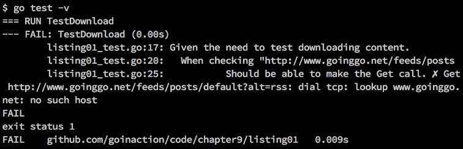
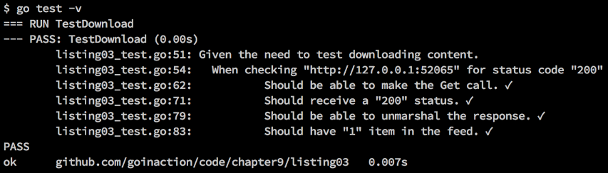

### 9.1.3　模仿调用

我们之前写的单元测试都很好，但是还有些瑕疵。首先，这些测试需要访问互联网，才能保证测试运行成功。图9-4展示了如果没有互联网连接，运行基础单元测试会测试失败。


<center class="my_markdown"><b class="my_markdown">图9-4　由于没有互联网连接导致测试失败</b></center>

不能总是假设运行测试的机器可以访问互联网。此外，依赖不属于你的或者你无法操作的服务来进行测试，也不是一个好习惯。这两点会严重影响测试持续集成和部署的自动化。如果突然断网，导致测试失败，就没办法部署新构建的程序。

为了修正这个问题，标准库包含一个名为 `httptest` 的包，它让开发人员可以模仿基于HTTP的网络调用。模仿（mocking）是一个很常用的技术手段，用来在运行测试时模拟访问不可用的资源。包 `httptest` 可以让你能够模仿互联网资源的请求和响应。在我们的单元测试中，通过模仿 `http.Get` 的响应，我们可以解决在图9-4中遇到的问题，保证在没有网络的时候，我们的测试也不会失败，依旧可以验证我们的 `http.Get` 调用正常工作，并且可以处理预期的响应。让我们看一下基础单元测试，并将其改为模仿调用goinggo.net网站的RSS列表，如代码清单9-12所示。

代码清单9-12　listing12_test.go：第01行到第41行

```go
01 // 这个示例程序展示如何内部模仿HTTP GET调用
02 // 与本书之前的例子有些差别
03 package listing12
04
05 import (
06　　 "encoding/xml"
07　　 "fmt"
08　　 "net/http"
09　　 "net/http/httptest"
10　　 "testing"
11 )
12
13 const checkMark = "\u2713"
14 const ballotX = "\u2717"
15
16 // feed模仿了我们期望接收的XML文档
17 var feed = `<?xml version="1.0" encoding="UTF-8"?>
18 <rss>
19 <channel>
20　　 <title>Going Go Programming</title>
21　　 <description>Golang : https://github.com/goinggo</description>
22　　 <link>http://www.goinggo.net/</link>
23　　 <item>
24　　　　 <pubDate>Sun, 15 Mar 2015 15:04:00 +0000</pubDate>
25　　　　 <title>Object Oriented Programming Mechanics</title>
26　　　　 <description>Go is an object oriented language.</description>
27　　　　 <link>http://www.goinggo.net/2015/03/object-oriented</link>
28　　 </item>
29 </channel>
30 </rss>`
31
32 // mockServer返回用来处理请求的服务器的指针
33 func mockServer() *httptest.Server {
34　　 f := func(w http.ResponseWriter, r *http.Request) {
35　　　　 w.WriteHeader(200)
36　　　　 w.Header().Set("Content-Type", "application/xml")
37　　　　 fmt.Fprintln(w, feed)
38　　 }
39
40　　 return httptest.NewServer(http.HandlerFunc(f))
41 }

```

代码清单9-12展示了如何模仿对goinggo.net网站的调用，来模拟下载RSS列表。在第17行中，声明了包级变量 `feed` ，并初始化为模仿服务器返回的RSS XML文档的字符串。这是实际RSS文档的一小段，足以完成我们的测试。在第33行中，我们声明了一个名为 `mockServer` 的函数，这个函数利用 `httptest` 包内的支持来模拟对互联网上真实服务器的调用，如代码清单9-13所示。

代码清单9-13　listing12_test.go：第32行到第41行

```go
32 // mockServer返回用来处理调用的服务器的指针
33 func mockServer() *httptest.Server {
34　　 f := func(w http.ResponseWriter, r *http.Request) {
35　　　　 w.WriteHeader(200)
36　　　　 w.Header().Set("Content-Type", "application/xml")
37　　　　 fmt.Fprintln(w, feed)
38　　 }
39
40　　 return httptest.NewServer(http.HandlerFunc(f))
41 }
```

代码清单9-13中声明的 `mockServer` 函数，返回一个指向 `httptest.Server` 类型的指针。这个 `httptest.Server` 的值是整个模仿服务的关键。函数的代码一开始声明了一个匿名函数，其签名符合 `http.HandlerFunc` 函数类型，如代码清单9-14所示。

代码清单9-14　golang.org/pkg/net/http/#HandlerFunc

```go
type HandlerFunc func(ResponseWriter, *Request)
HandlerFunc类型是一个适配器，允许常规函数作为HTTP的处理函数使用。如果函数f具有合适的签名，
HandlerFunc(f)就是一个处理HTTP请求的Handler对象，内部通过调用f处理请求
```

遵守这个签名，让匿名函数成了处理函数。一旦声明了这个处理函数，第40行就会使用这个匿名函数作为参数来调用 `httptest.NewServer` 函数，创建我们的模仿服务器。之后在第40行，通过指针返回这个模仿服务器。

我们可以通过 `http.Get` 调用来使用这个模仿服务器，用来模拟对goinggo.net网络服务器的请求。当进行 `http.Get` 调用时，实际执行的是处理函数，并用处理函数模仿对网络服务器的请求和响应。在第35行，处理函数首先设置状态码，之后在第36行，设置返回内容的类型 `Content-Type` ，最后，在第37行，使用包含XML内容的字符串 `feed` 作为响应数据，返回给调用者。

现在，让我们看一下模仿服务器与基础单元测试是怎么整合在一起的，以及如何将 `http.Get` 请求发送到模仿服务器，如代码清单9-15所示。

代码清单9-15　listing12_test.go：第43行到第74行

```go
43 // TestDownload确认http包的Get函数可以下载内容 
44 // 并且内容可以被正确地反序列化并关闭
45 func TestDownload(t *testing.T) {
46　　 statusCode := http.StatusOK
47
48　　 server := mockServer()
49　　 defer server.Close()
50
51　　 t.Log("Given the need to test downloading content.")
52　　 {
53　　　　 t.Logf("\tWhen checking \"%s\" for status code \"%d\"",
54　　　　　　 server.URL, statusCode)
55　　　　 {
56　　　　　　 resp, err := http.Get(server.URL)
57　　　　　　 if err != nil {
58　　　　　　　　 t.Fatal("\t\tShould be able to make the Get call.",
59　　　　　　　　　　 ballotX, err)
60　　　　　　 }
61　　　　　　 t.Log("\t\tShould be able to make the Get call.",
62　　　　　　　　 checkMark)
63
64　　　　　　 defer resp.Body.Close()
65
66　　　　　　 if resp.StatusCode != statusCode {
67　　　　　　　　 t.Fatalf("\t\tShould receive a \"%d\" status. %v %v",
68　　　　　　　　　　 statusCode, ballotX, resp.StatusCode)
69　　　　　　 }
70　　　　　　 t.Logf("\t\tShould receive a \"%d\" status. %v",
71　　　　　　　　statusCode, checkMark)
72　　　　 }
73　　 }
74 }
```

在代码清单9-15中再次看到了 `TestDownload` 函数，不过这次它在请求模仿服务器。在第48行和第49行，调用 `mockServer` 函数生成模仿服务器，并安排在测试函数返回时执行服务器的 `Close` 方法。之后，除了代码清单9-16所示的这一行代码，这段测试代码看上去和基础单元测试的代码一模一样。

代码清单9-16　listing12_test.go：第56行

```go
56　　　　　　 resp, err := http.Get(server.URL)
```

这次由 `httptest.Server` 值提供了请求的URL。当我们使用由模仿服务器提供的URL时， `http.Get` 调用依旧会按我们预期的方式运行。 `http.Get` 方法调用时并不知道我们的调用是否经过互联网。这次调用最终会执行，并且我们自己的处理函数最终被执行，返回我们预先准备好的XML文档和状态码 `http.StatusOK` 。

在图9-5里，如果在没有互联网连接的时候运行测试，可以看到测试依旧可以运行并通过。这张图展示了程序是如何再次通过测试的。如果仔细看用于调用的URL，会发现这个URL使用了 `localhost` 作为地址，端口是52065。这个端口号每次运行测试时都会改变。包 `http` 与包 `httptest` 和模仿服务器结合在一起，知道如何通过URL路由到我们自己的处理函数。现在，我们可以在没有触碰实际服务器的情况下，测试请求goinggo.net的RSS列表。


<center class="my_markdown"><b class="my_markdown">图9-5　没有互联网接入情况下测试成功</b></center>

