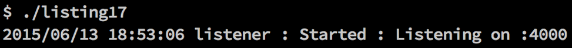
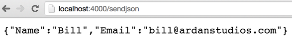

### 9.1.4　测试服务端点

服务端点（endpoint）是指与服务宿主信息无关，用来分辨某个服务的地址，一般是不包含宿主的一个路径。如果在构造网络API，你会希望直接测试自己的服务的所有服务端点，而不用启动整个网络服务。包 `httptest` 正好提供了做到这一点的机制。让我们看一个简单的包含一个服务端点的网络服务的例子，如代码清单9-17所示，之后你会看到如何写一个单元测试，来模仿真正的调用。

代码清单9-17　listing17.go

```go
01 // 这个示例程序实现了简单的网络服务
02 package main
03
04 import (
05　　 "log"
06　　 "net/http"
07
08　　 "github.com/goinaction/code/chapter9/listing17/handlers"
09 )
10
11 // main是应用程序的入口
12 func main() {
13　　 handlers.Routes()
14
15　　 log.Println("listener : Started : Listening on :4000")
16　　 http.ListenAndServe(":4000", nil)
17 }
```

代码清单9-17展示的代码文件是整个网络服务的入口。在第13行的 `main` 函数里，代码调用了内部 `handlers` 包的 `Routes` 函数。这个函数为托管的网络服务设置了一个服务端点。在 `main` 函数的第15行和第16行，显示服务监听的端口，并且启动网络服务，等待请求。

现在让我们来看一下 `handlers` 包的代码，如代码清单9-18所示。

代码清单9-18　 `handlers` /handlers.go

```go
01 // handlers包提供了用于网络服务的服务端点
02 package handlers
03
04 import (
05　　 "encoding/json"
06　　 "net/http"
07 )
08
09 // Routes为网络服务设置路由
10 func Routes() {
11　　 http.HandleFunc("/sendjson", SendJSON)
12 }
13
14 // SendJSON返回一个简单的JSON文档
15 func SendJSON(rw http.ResponseWriter, r *http.Request) {
16　　 u := struct {
17　　　　 Name　string
18　　　　 Email string
19　　 }{
20　　　　 Name:　"Bill",
21　　　　 Email: "bill@ardanstudios.com",
22　　 }
23
24　　 rw.Header().Set("Content-Type", "application/json")
25　　 rw.WriteHeader(200)
26　　 json.NewEncoder(rw).Encode(&u)
27 }
```

代码清单9-18里展示了 `handlers` 包的代码。这个包提供了实现好的处理函数，并且能为网络服务设置路由。在第10行，你能看到 `Routes` 函数，使用 `http` 包里默认的 `http.ServeMux` 来配置路由，将URL映射到对应的处理代码。在第11行，我们将 `/sendjson` 服务端点与 `SendJSON` 函数绑定在一起。

从第15行起，是 `SendJSON` 函数的实现。这个函数的签名和之前看到代码清单9-14里 `http.HandlerFunc` 函数类型的签名一致。在第16行，声明了一个匿名结构类型，使用这个结构创建了一个名为 `u` 的变量，并赋予一组初值。在第24行和第25行，设置了响应的内容类型和状态码。最后，在第26行，将 `u` 值编码为JSON文档，并发送回发起调用的客户端。

如果我们构建了一个网络服务，并启动服务器，就可以像图9-6和图9-7展示的那样，通过服务获取JSON文档。


<center class="my_markdown"><b class="my_markdown">图9-6　启动网络服务</b></center>


<center class="my_markdown"><b class="my_markdown">图9-7　网络服务提供的JSON文档</b></center>

现在有了包含一个服务端点的可用的网络服务，我们可以写单元测试来测试这个服务端点，如代码清单9-19所示。

代码清单9-19　 `handlers` /handlers_test.go

```go
01 // 这个示例程序展示如何测试内部服务端点
02 // 的执行效果
03 package handlers_test
04
05 import (
06　　 "encoding/json"
07　　 "net/http"
08　　 "net/http/httptest"
09　　 "testing"
10
11　　 "github.com/goinaction/code/chapter9/listing17/handlers"
12 )
13
14 const checkMark = "\u2713"
15 const ballotX = "\u2717"
16
17 func init() {
18　　 handlers.Routes()
19 }
20
21 // TestSendJSON测试/sendjson内部服务端点
22 func TestSendJSON(t *testing.T) {
23　　 t.Log("Given the need to test the SendJSON endpoint.")
24　　 {
25　　　　 req, err := http.NewRequest("GET", "/sendjson", nil)
26　　　　 if err != nil {
27　　　　　　 t.Fatal("\tShould be able to create a request.",
28　　　　　　　　 ballotX, err)
29　　　　 }
30　　　　 t.Log("\tShould be able to create a request.",
31　　　　　　 checkMark)
32
33　　　　 rw := httptest.NewRecorder()
34　　　　 http.DefaultServeMux.ServeHTTP(rw, req)
35
36　　　　 if rw.Code != 200 {
37　　　　　　 t.Fatal("\tShould receive \"200\"", ballotX, rw.Code)
38　　　　 }
39　　　　 t.Log("\tShould receive \"200\"", checkMark)
40
41　　　　 u := struct {
42　　　　　　 Name　string
43　　　　　　 Email string
44　　　　 }{}
45
46　　　　 if err := json.NewDecoder(rw.Body).Decode(&u); err != nil {
47　　　　　　 t.Fatal("\tShould decode the response.", ballotX)
48　　　　 }
49　　　　 t.Log("\tShould decode the response.", checkMark)
50
51　　　　 if u.Name == "Bill" {
52　　　　　 t.Log("\tShould have a Name.", checkMark)
53　　　　 } else {
54　　　　　 t.Error("\tShould have a Name.", ballotX, u.Name)
55　　　　 }
56
57　　　　 if u.Email == "bill@ardanstudios.com" {
58　　　　　　 t.Log("\tShould have an Email.", checkMark)
59　　　　 } else {
60　　　　　　 t.Error("\tShould have an Email.", ballotX, u.Email)
61　　　　 }
62　　 }
63 }
```

代码清单9-19展示了对 `/sendjson` 服务端点的单元测试。注意，第03行包的名字和其他测试代码的包的名字不太一样，如代码清单9-20所示。

代码清单9-20　 `handlers` /handlers_test.go：第01行到第03行

```go
01 // 这个示例程序展示如何测试内部服务端点
02 // 的执行效果
03 package handlers_test
```

正如在代码清单9-20里看到的，这次包的名字也使用 `_test` 结尾。如果包使用这种方式命名，测试代码只能访问包里公开的标识符。即便测试代码文件和被测试的代码放在同一个文件夹中，也只能访问公开的标识符。

就像直接运行服务时一样，需要为服务端点初始化路由，如代码清单9-21所示。

代码清单9-21　 `handlers` /handlers_test.go：第17行到第19行

```go
17 func init() {
18　　 handlers.Routes()
19 }
```

在代码清单9-21的第17行，声明的 `init` 函数里对路由进行初始化。如果没有在单元测试运行之前初始化路由，那么测试就会遇到 `http.StatusNotFound` 错误而失败。现在让我们看一下 `/sendjson` 服务端点的单元测试，如代码清单9-22所示。

代码清单9-22　 `handlers` /handlers_test.go：第21行到第34行

```go
21 // TestSendJSON测试/sendjson内部服务端点
22 func TestSendJSON(t *testing.T) {
23　　 t.Log("Given the need to test the SendJSON endpoint.")
24　　 {
25　　　　 req, err := http.NewRequest("GET", "/sendjson", nil)
26　　　　 if err != nil {
27　　　　　　 t.Fatal("\tShould be able to create a request.",
28　　　　　　　　 ballotX, err)
29　　　　 }
30　　　　 t.Log("\tShould be able to create a request.",
31　　　　　　 checkMark)
32
33　　　　 rw := httptest.NewRecorder()
34　　　　 http.DefaultServeMux.ServeHTTP(rw, req)
```

代码清单9-22展示了测试函数 `TestSendJSON` 的声明。测试从记录测试的给定要求开始，然后在第25行创建了一个 `http.Request` 值。这个 `Request` 值使用 `GET` 方法调用 `/sendjson` 服务端点的响应。由于这个调用使用的是 `GET` 方法，第三个发送数据的参数被传入 `nil` 。

之后，在第33行，调用 `httptest.NewRecoder` 函数来创建一个 `http.ResponseRecorder` 值。有了 `http.Request` 和 `http.ResponseRecoder` 这两个值，就可以在第34行直接调用服务默认的多路选择器（mux）的 `ServeHttp` 方法。调用这个方法模仿了外部客户端对 `/sendjson` 服务端点的请求。

一旦 `ServeHTTP` 方法调用完成， `http.ResponseRecorder` 值就包含了 `SendJSON` 处理函数的响应。现在，我们可以检查这个响应的内容，如代码清单9-23所示。

代码清单9-23　 `handlers` /handlers_test.go：第36行到第39行

```go
36　　　　 if rw.Code != 200 {
37　　　　　　 t.Fatal("\tShould receive \"200\"", ballotX, rw.Code)
38　　　　 }
39　　　　 t.Log("\tShould receive \"200\"", checkMark)
```

首先，在第36行检查了响应的状态。一般任何服务端点成功调用后，都会期望得到 `200` 的状态码。如果状态码是 `200` ，之后将JSON响应解码成Go的值。

代码清单9-24　 `handlers` /handlers_test.go：第41行到第49行

```go
41　　　　 u := struct {
42　　　　　　 Name　string
43　　　　　　 Email string
44　　　　 }{}
45
46　　　　 if err := json.NewDecoder(rw.Body).Decode(&u); err != nil {
47　　　　　　 t.Fatal("\tShould decode the response.", ballotX)
48　　　　 }
49　　　　 t.Log("\tShould decode the response.", checkMark)”
```

在代码清单9-24的第41行，声明了一个匿名结构类型，使用这个类型创建了名为 `u` 的变量，并初始化为零值。在第46行，使用 `json` 包将响应的JSON文档解码到变量 `u` 里。如果解码失败，单元测试结束；否则，我们会验证解码后的值是否正确，如代码清单9-25所示。

代码清单9-25　 `handlers` /handlers_test.go：第51行到第63行

```go
51　　　　 if u.Name == "Bill" {
52　　　　　 t.Log("\tShould have a Name.", checkMark)
53　　　　 } else {
54　　　　　 t.Error("\tShould have a Name.", ballotX, u.Name)
55　　　　 }
56
57　　　　 if u.Email == "bill@ardanstudios.com" {
58　　　　　　 t.Log("\tShould have an Email.", checkMark)
59　　　　 } else {
60　　　　　　 t.Error("\tShould have an Email.", ballotX, u.Email)
61　　　　 }
62　　 }
63 }
```

代码清单9-25展示了对收到的两个值的检测。在第51行，我们检测 `Name` 字段的值是否为 `"Bill"` ，之后在第57行，检查 `Email` 字段的值是否为 `"bill@ardanstudios.com"` 。如果这些值都匹配，单元测试通过；否则，单元测试失败。这两个检测使用 `Error` 方法来报告失败，所以不管检测结果如何，两个字段都会被检测。

