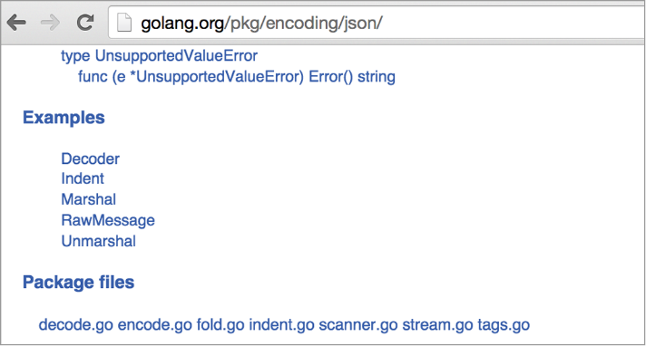
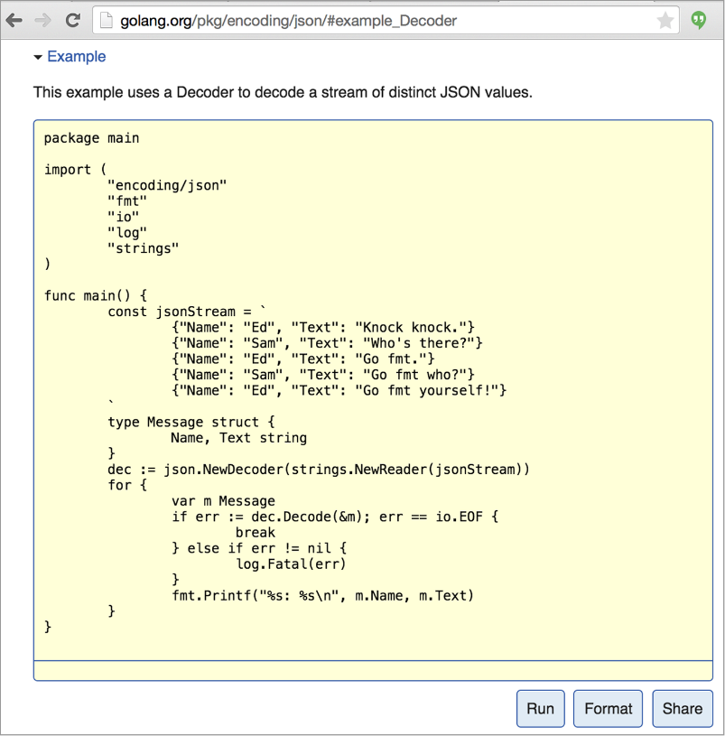
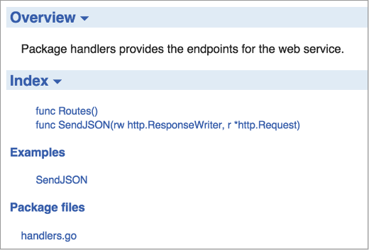
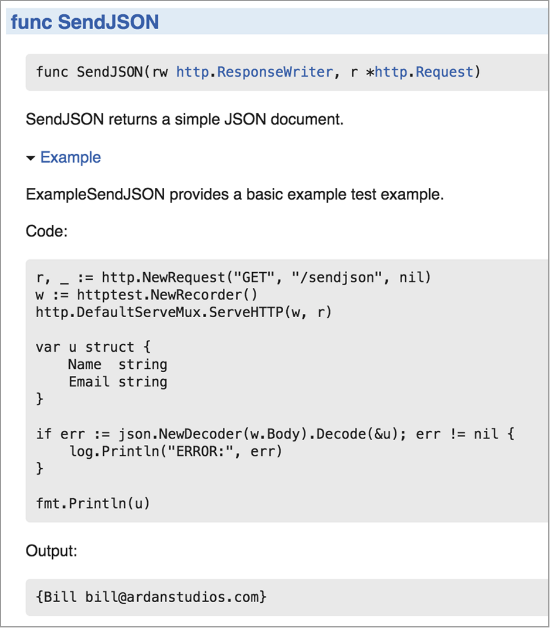
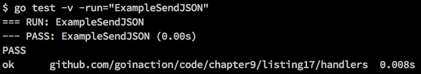
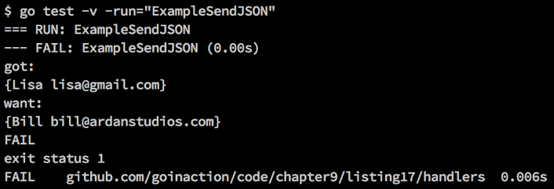

### 9.2　示例

Go语言很重视给代码编写合适的文档。专门内置了 `godoc` 工具来从代码直接生成文档。在第3章中，我们已经学过如何使用 `godoc` 工具来生成包的文档。这个工具的另一个特性是示例代码。示例代码给文档和测试都增加了一个可以扩展的维度。

如果使用浏览器来浏览 `json` 包的Go文档，会看到类似图9-8所示的文档。


<center class="my_markdown"><b class="my_markdown">图9-8　包 `json` 的示例代码列表</b></center>

包 `json` 含有5个示例，这些示例都会在这个包的Go文档里有展示。如果选中第一个示例，会看到一段示例代码，如图9-9所示。


<center class="my_markdown"><b class="my_markdown">图9-9　Go文档里显示的Decoder示例视图</b></center>

开发人员可以创建自己的示例，并且在包的Go文档里展示。让我们看一个来自前一节例子的 `SendJSON` 函数的示例，如代码清单9-26所示。

代码清单9-26　handlers_example_test.go

```go
01 // 这个示例程序展示如何编写基础示例
02 package handlers_test
03
04 import (
05　　 "encoding/json"
06　　 "fmt"
07　　 "log"
08　　 "net/http"
09　　 "net/http/httptest"
10 )
11
12 // ExampleSendJSON提供了基础示例
13 func ExampleSendJSON() {
14　　 r, _ := http.NewRequest("GET", "/sendjson", nil)
15　　 rw := httptest.NewRecorder()
16　　 http.DefaultServeMux.ServeHTTP(rw, r)
17
18　　 var u struct {
19　　　　 Name　string
20　　　　 Email string
21　　 }
22
23　　 if err := json.NewDecoder(w.Body).Decode(&u); err != nil {
24　　　　 log.Println("ERROR:", err)
25　　 }
26
27　　 // 使用fmt将结果写到stdout来检测输出
28　　 fmt.Println(u)
29　　 // Output:
30　　 // {Bill bill@ardanstudios.com}
31 }
```

示例基于已经存在的函数或者方法。我们需要使用 `Example` 代替 `Test` 作为函数名的开始。在代码清单9-26的第13行中，示例代码的名字是 `ExampleSendJSON` 。

对于示例代码，需要遵守一个规则。示例代码的函数名字必须基于已经存在的公开的函数或者方法。我们的示例的名字基于 `handlers` 包里公开的 `SendJSON` 函数。如果没有使用已经存在的函数或者方法，这个示例就不会显示在包的Go文档里。

写示例代码的目的是展示某个函数或者方法的特定使用方法。为了判断测试是成功还是失败，需要将程序最终的输出和示例函数底部列出的输出做比较，如代码清单9-27所示。

代码清单9-27　handlers_example_test.go：第27行到第31行

```go
27　　 // 使用fmt将结果写到stdout来检测输出
28　　 fmt.Println(u)
29　　 // Output:
30　　 // {Bill bill@ardanstudios.com}
31 }
```

在代码清单9-27的第28行，代码使用 `fmt.Println` 输出变量 `u` 的值到标准输出。变量 `u` 的值在调用 `/sendjson` 服务端点之前使用零值初始化。在第29行中，有一段带有 `Output:` 的注释。

这个 `Output:` 标记用来在文档中标记出示例函数运行后期望的输出。Go的测试框架知道如何比较注释里的期望输出和标准输出的最终输出。如果两者匹配，这个示例作为测试就会通过，并加入到包的Go文档里。如果输出不匹配，这个示例作为测试就会失败。

如果启动一个本地的 `godoc` 服务器（ `godoc -http=":3000"` ），并找到 `handlers` 包，就能看到包含示例的文档，如图9-10所示。


<center class="my_markdown"><b class="my_markdown">图9-10　 `handlers` 包的 `godoc` 视图</b></center>

在图9-10里可以看到 `handlers` 包的文档里展示了 `SendJSON` 函数的示例。如果选中这个 `SendJSON` 链接，文档就会展示这段代码，如图9-11所示。


<center class="my_markdown"><b class="my_markdown">图9-11　在 `godoc` 里显示完整的示例代码</b></center>

图9-11展示了示例的一组完整文档，包括代码和期望的输出。由于这个示例也是测试的一部分，可以使用 `go test` 工具来运行这个示例函数，如图9-12所示。


<center class="my_markdown"><b class="my_markdown">图9-12　运行示例代码</b></center>

运行测试后，可以看到测试通过了。这次运行测试时，使用 `-run` 选项指定了特定的函数 `ExampleSendJSON` 。 `-run` 选项接受任意的正则表达式，来过滤要运行的测试函数。这个选项既支持单元测试，也支持示例函数。如果示例运行失败，输出会与图9-13所示的样子类似。


<center class="my_markdown"><b class="my_markdown">图9-13　示例运行失败</b></center>

如果示例运行失败， `go test` 会同时展示出生成的输出，以及期望的输出。

