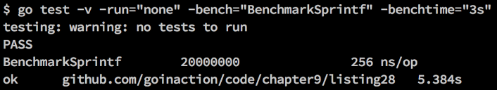
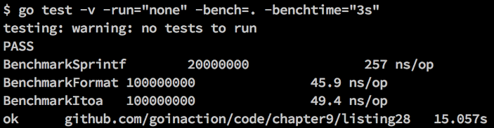
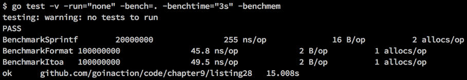

### 9.3　基准测试

基准测试是一种测试代码性能的方法。想要测试解决同一问题的不同方案的性能，以及查看哪种解决方案的性能更好时，基准测试就会很有用。基准测试也可以用来识别某段代码的CPU或者内存效率问题，而这段代码的效率可能会严重影响整个应用程序的性能。许多开发人员会用基准测试来测试不同的并发模式，或者用基准测试来辅助配置工作池的数量，以保证能最大化系统的吞吐量。

让我们看一组基准测试的函数，找出将整数值转为字符串的最快方法。在标准库里，有3种方法可以将一个整数值转为字符串。

代码清单9-28展示了listing28_test.go基准测试开始的几行代码。

代码清单9-28　listing28_test.go：第01行到第10行

```go
01 // 用来检测要将整数值转为字符串，使用哪个函数会更好的基准
02 // 测试示例。先使用fmt.Sprintf函数，然后使用
03 // strconv.FormatInt函数，最后使用strconv.Itoa
04 package listing28_test
05
06 import (
07　　 "fmt"
08　　 "strconv"
09　　 "testing"
10 )
```

和单元测试文件一样，基准测试的文件名也必须以 `_test.go` 结尾。同时也必须导入 `testing` 包。接下来，让我们看一下其中一个基准测试函数，如代码清单9-29所示。

代码清单9-29　listing28_test.go：第12行到第22行

```go
12 // BenchmarkSprintf对fmt.Sprintf函数
13 // 进行基准测试
14 func BenchmarkSprintf(b *testing.B) {
15　　 number := 10
16
17　　 b.ResetTimer()
18
19　　 for i := 0; i < b.N; i++ {
20　　　　 fmt.Sprintf("%d", number)
21　　 }
22 }
```

在代码清单9-29的第14行，可以看到第一个基准测试函数，名为 `BenchmarkSprintf` 。基准测试函数必须以 `Benchmark` 开头，接受一个指向 `testing.B` 类型的指针作为唯一参数。为了让基准测试框架能准确测试性能，它必须在一段时间内反复运行这段代码，所以这里使用了 `for` 循环，如代码清单9-30所示。

代码清单9-30　listing28_test.go：第19行到第22行

```go
19　　 for i := 0; i < b.N; i++ {
20　　　　 fmt.Sprintf("%d", number)
21　　 }
22 }
```

代码清单9-30第19行的 `for` 循环展示了如何使用 `b.N` 的值。在第20行，调用了 `fmt` 包里的 `Sprintf` 函数。这个函数是将要测试的将整数值转为字符串的函数。

基准测试框架默认会在持续1秒的时间内，反复调用需要测试的函数。测试框架每次调用测试函数时，都会增加 `b.N` 的值。第一次调用时， `b.N` 的值为 `1` 。需要注意，一定要将所有要进行基准测试的代码都放到循环里，并且循环要使用 `b.N` 的值。否则，测试的结果是不可靠的。

如果我们只希望运行基准测试函数，需要加入 `-bench` 选项，如代码清单9-31所示。

代码清单9-31　运行基准测试

```go
go test -v -run="none" -bench="BenchmarkSprintf"
```

在这次 `go test` 调用里，我们给 `-run` 选项传递了字符串 `"none"` ，来保证在运行制订的基准测试函数之前没有单元测试会被运行。这两个选项都可以接受正则表达式，来决定需要运行哪些测试。由于例子里没有单元测试函数的名字中有 `none` ，所以使用 `none` 可以排除所有的单元测试。发出这个命令后，得到图9-14所示的输出。


<center class="my_markdown"><b class="my_markdown">图9-14　运行单个基准测试</b></center>

这个输出一开始明确了没有单元测试被运行，之后开始运行 `BenchmarkSprintf` 基准测试。在输出 `PASS` 之后，可以看到运行这个基准测试函数的结果。第一个数字 `5000000` 表示在循环中的代码被执行的次数。在这个例子里，一共执行了500万次。之后的数字表示代码的性能，单位为每次操作消耗的纳秒（ns）数。这个数字展示了这次测试，使用 `Sprintf` 函数平均每次花费了258纳秒。

最后，运行基准测试输出了 `ok` ，表明基准测试正常结束。之后显示的是被执行的代码文件的名字。最后，输出运行基准测试总共消耗的时间。默认情况下，基准测试的最小运行时间是1 秒。你会看到这个测试框架持续运行了大约1.5秒。如果想让运行时间更长，可以使用另一个名为 `-benchtime` 的选项来更改测试执行的最短时间。让我们再次运行这个测试，这次持续执行3秒（见图9-15）。


<center class="my_markdown"><b class="my_markdown">图9-15　使用 `-benchtime` 选项来运行基准测试</b></center>

这次 `Sprintf` 函数运行了2000万次，持续了5.384秒。这个函数的执行性能并没有太大的变化，这次的性能是每次操作消耗256纳秒。有时候，增加基准测试的时间，会得到更加精确的性能结果。对大多数测试来说，超过3秒的基准测试并不会改变测试的精确度。只是每次基准测试的结果会稍有不同。

让我们看另外两个基准测试函数，并一起运行这3个基准测试，看看哪种将整数值转换为字符串的方法最快，如代码清单9-32所示。

代码清单9-32　listing28_test.go：第24行到第46行

```go
24 // BenchmarkFormat对strconv.FormatInt函数
25 // 进行基准测试
26 func BenchmarkFormat(b *testing.B) {
27　　 number := int64(10)
28
29　　 b.ResetTimer()
30
31　　 for i := 0; i < b.N; i++ {
32　　　　 strconv.FormatInt(number, 10)
33　　 }
34 }
35
36 // BenchmarkItoa对strconv.Itoa函数
37 // 进行基准测试
38 func BenchmarkItoa(b *testing.B) {
39　　 number := 10
40
41　　 b.ResetTimer()
42
43　　 for i := 0; i < b.N; i++ {
44　　　　 strconv.Itoa(number)
45　　 }
46 }
```

代码清单9-32展示了另外两个基准测试函数。函数 `BenchmarkFormat` 测试了 `strconv` 包里的 `FormatInt` 函数，而函数 `BenchmarkItoa` 测试了同样来自 `strconv` 包的 `Itoa` 函数。这两个基准测试函数的模式和 `BenchmarkSprintf` 函数的模式很类似。函数内部的 `for` 循环使用 `b.N` 来控制每次调用时迭代的次数。

我们之前一直没有提到这3个基准测试里面调用 `b.ResetTimer` 的作用。在代码开始执行循环之前需要进行初始化时，这个方法用来重置计时器，保证测试代码执行前的初始化代码，不会干扰计时器的结果。为了保证得到的测试结果尽量精确，需要使用这个函数来跳过初始化代码的执行时间。

让这3个函数至少运行3秒后，我们得到图9-16所示的结果。


<center class="my_markdown"><b class="my_markdown">图9-16　运行所有3个基准测试</b></center>

这个结果展示了 `BenchmarkFormat` 测试函数运行的速度最快，每次操作耗时45.9纳秒。紧随其后的是 `BenchmarkItoa` ，每次操作耗时49.4 ns。这两个函数的性能都比 `Sprintf` 函数快得多。

运行基准测试时，另一个很有用的选项是 `-benchmem` 选项。这个选项可以提供每次操作分配内存的次数，以及总共分配内存的字节数。让我们看一下如何使用这个选项（见图9-17）。


<center class="my_markdown"><b class="my_markdown">图9-17　使用 `-benchmem` 选项来运行基准测试</b></center>

这次输出的结果会多出两组新的数值：一组数值的单位是 `B/op` ，另一组的单位是 `allocs/op` 。单位为 `allocs/op` 的值表示每次操作从堆上分配内存的次数。你可以看到 `Sprintf` 函数每次操作都会从堆上分配两个值，而另外两个函数每次操作只会分配一个值。单位为 `B/op` 的值表示每次操作分配的字节数。你可以看到 `Sprintf` 函数两次分配总共消耗了16字节的内存，而另外两个函数每次操作只会分配2字节的内存。

在运行单元测试和基准测试时，还有很多选项可以用。建议读者查看一遍所有选项，以便在编写自己的包和工程时，充分利用测试框架。社区希望包的作者在正式发布包的时候提供足够的测试。

