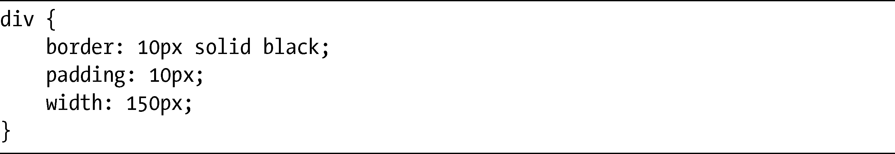
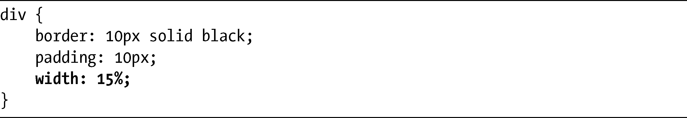
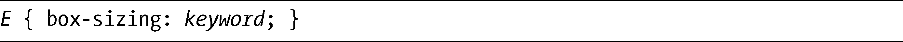
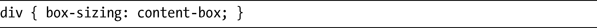
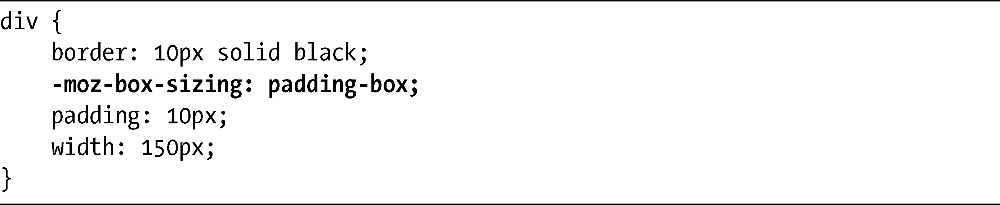
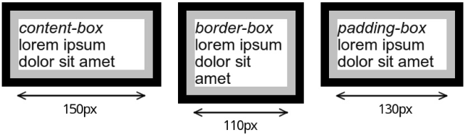
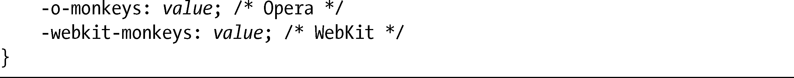
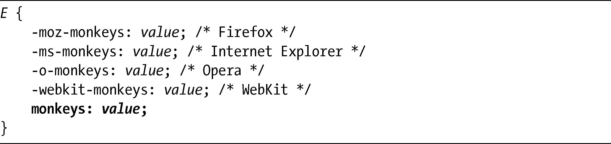

### 1.2　入门：语法介绍

讲了那么多题外话和说明之后，我们现在来看看CSS3的实际内容。在整本书中，我在演示每条新规则和属性的时候，使用了某种语法上的约定。我不想简单地描述这一约定，我想如果我在介绍第一个CSS3新属性的时候，同时也解释一下这种约定，会让人觉得有趣许多。

我将介绍的这个属性就是box-sizing，它可以设定元素的大小应该如何计算。如你所知，一个元素的总宽度——不包括它的边距（margin）——通常从它规定（或继承）的width值计算而得到，再加上左右的padding（填充）和它的border-width（边框宽度）。我们用下面的代码来举例说明，这段代码对你来说可能已经非常熟悉了。

在这个例子中，div的总宽度是190px——即150px的width，加上20px的padding，再加上20px的border。当使用绝对值设置width的时候，这段代码不会有什么问题，也毫无争议，但是，如果在其中混入百分比值，这段代码就有点问题了：

现在，宽度会变得难以计算。这是因为只有先知道父元素的width值，才清楚它的15%究竟是多少，然后才能把相应的像素值加到宽度的计算中。这种情况下，计算很快就会变得非常复杂，所以我们很难恰到好处地管理基于百分比的布局。

此时，box-sizing属性就派上用场了。有了这个属性，我们可以设置用方框模型的哪一部分，即内容本身或者border（边框）去计算元素的宽度。在讲完为什么存在这样一个新属性之后，我将开始进行演示，查看它的语法。我在这个演示中所使用的约定也将会成为本书的标准。

在这个代码示例中，选择器用E表示。当然，在HTML中，E这个选择器是不存在的，我只是用它表示该位置可以使用任何的选择器。对于本节开头所使用的例子，E就代表了div元素。

接下来是属性本身：box-sizing。这个属性在所有主要浏览器上均已被实现。但在某些浏览器中，该属性需要使用浏览器特定的前缀：在Firefox中，要使用-moz-前缀，即变成-moz-box-sizing；而在WebKit浏览器中，使用的是-webkit-前缀，所以会变成-webkit-box-sizing。不过，使用所有这些不同的前缀并不会把代码弄得一团糟，我会根据CSS3规范只使用正确的属性名称，并在需要前缀的时候在文本中进行注释，就像我在这里做的一样（在下一节我会对这些浏览器前缀进行更多的解释）。

上述声明的值是单词keyword，同样的，这个值只是一个指示符，表示一系列可能的值。对于box-sizing，它所允许的值是border-box和content-box。

了解这些约定之后，如果用实际的值去代替，现实世界的应用程序中的一个新属性可能会是这样：

那么，这个属性有什么用呢？前面提过，box-sizing设置了元素计算宽度时要从哪个位置算起。默认值是content-box，也就是说对元素所设定的宽度会应用到该元素的内容上，而填充和边框值会照常添加上去。

如果把值设置为border-box，则意味着设定的width值是内容、填充和边框的总宽度——换句话说，是整个方框（没有边距）的宽度。为了举例说明，我们回到前面的示例代码中，然后添加该属性：

现在150px的宽度包括了填充和边框。二者在内容两侧都占据了10px，所以div元素的内容计算宽度就是110px，即150px减去20px的填充和20px的边框。

在形象化地举例说明这两个值的差异之前，我要先提一下Firefox（关于它的-moz-box-sizing属性）。Firefox额外有一个允许使用的值是其他浏览器所不具备的，就是：padding-box。如果使用这个值，计算元素宽度时会对它的填充和内容进行计算，而不包括元素的边框。下面是一个例子：

在这段代码中，150px的宽度包括了填充，所以内容本身的宽度是130px。在图1-1中可以看到这几个值在Firefox渲染的时候出现的差异。

从左到右依次看看这几个例子：第一个div的box-sizing设置为默认的content-box值，所以设定宽度150px就是内容的宽度，边框和填充的宽度会再添加到内容上；在第二个例子中，box-sizing的值是border-box，意味着150px的宽度已经包含了边框和填充，这样内容的宽度就是110px；最后，右侧的div使用了Firefox自己的-moz-box-sizing属性，所设定的值是padding-box，所以150px包括了内容和填充，但不包括边框，这样内容宽度就是130px。

请注意，在所有这些例子中，尽管我只讨论了width属性，但是同样的规则也可以应用到元素的height属性上（你也许会注意到进入“怪异”模式（“quirks”mode）的浏览器使用处理方式也是完全一样的）。

<b class="my_markdown">图1-1　 box-sizing属性使用的不同值的效果</b>

注意

> 如果你是较“年轻”的开发人员，也许想不起“怪异”模式了。这是一个模仿Internet Explorer 5.5网页布局的错误方法的系统，可以在Wikipedia上了解到关于它的更多信息（<a class="my_markdown" href="['http://en.wikipedia.org/wiki/Quirks_mode']">http://en.wikipedia.org/wiki/Quirks_mode</a>）。

在整本书中，我在几个例子中使用了box-sizing属性，所以如果其效果（以及它的好处）现在还无法立即显现，相信随着你对剩余章节的阅读，对它的感受应该会越来越深刻。

### 1.2.1　浏览器特定的前缀

在上一节，我简略地讨论过在box-sizing属性上使用浏览器特定的前缀。由于CSS3仍然处于变化和修订之中，在本书的剩余部分我也会多次提到这一情况，所以，我要先花一些时间更详细地谈谈这些内容。

当一个模块仍然处于活跃评审状态时（多少就像CSS3自身一样），许多内容都有可能发生改变，属性的语法也许会被修订，或者属性也可能会被完全抛弃。有时，甚至是草案本身所采用的措辞都可能会有点儿含糊不清，所以人们可以进行开放的解释。

与此同时，浏览器却需要实现这些特性，这样我们才能够看到这些特性在实际中是如何发挥作用的。但如果两个单独的浏览器实现了同一个属性，但在解释该属性的时候稍微有点差异，这时麻烦就出现了：你的代码将会有不同的展示，也许在每个浏览器中都是完全不同的。为了防止这种情况发生，每种不同的浏览器引擎都会在实验性的属性前面加上一个简短的代码作为前缀。我们假设一个名为monkeys的属性（我一直想要一个monkeys属性），它是规范中一个全新的属性，并且所有的浏览器都决定实现它，看看它如何发挥作用。这种情况下，就必须使用下面的代码：

这种重复的数量似乎有些多余，但这种重复对我们自己来说却是有好处的。你最不愿意见到的事情肯定是所有浏览器对monkeys属性的实现都是不相同的，从而导致了混乱的发生（我在第11章讨论渐变的时候，你将会看到前缀优点的大量例子）。

### 1.2.2　让实验性的CSS适用未来

通常，人们会建议在使用带前缀的、实验性的CSS属性的时候，也应该在结尾处添加无前缀的属性：

这种理论是为了让代码能够适用未来，这样当一个属性在各种浏览器中得到完全实现时，就不需要回过头来把该属性添加到样式表中。我过去常常支持人们使用这种技术，但现在我的态度也不是那么明确了。我想，如果不只一个浏览器已经以兼容的方式实现了该属性，这种适用未来的技术也还是不错的，因为这通常都表明在规范中这个属性已经稳定下来了。不过，如果规范仍然处于评审之中，它的语法就很可能会发生改变。当浏览器在实际中实现了更新的语法之后，添加无前缀的属性就可能会引起问题；或者，它甚至根本就不会起作用。

本书的一些属性——比如第8章的background-size就只实现了一半，也就是说它们在某些浏览器上还需要使用前缀，但在其他一些浏览器上则是无前缀的。这种情况下，很明显我们就需要把两种声明方式混合起来使用。如果要使用第11章的那些属性——它们是不成熟的，也仍然处于开放评审阶段，离最终结果仍然遥远，这种情况下我们最好不要马上就使用这种适用未来的方法。

