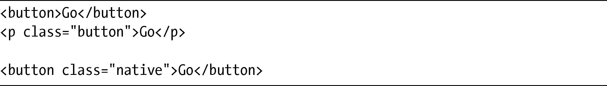
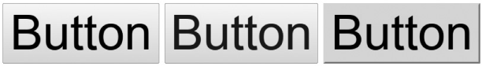

### 10.3　匹配操作系统的外观

在CSS2中，我们可以使用来自操作系统的不同地方的颜色，令网站有一种更加“本地”的外观。例如，可以使用下面的代码，让网页上button元素的背景颜色和系统上的button元素的背景颜色相匹配：

这一功能在CSS3中已经被降级，并且被appearance属性所代替，该属性是在基本用户界面模块（Basic User Interface Module）中引入的。以下是其语法：

keyword的取值来自于用户界面元素的一长串列表，包括button、radio-button、password，等等。Firefox和WebKit都通过专用前缀支持了这一属性，二者有不同的可接受值列表。此处我们不列出所有的值，只要查看CSS参考页面中指向每种浏览器的链接就可以了，附录B也提供了这些链接。

为了进行快速演示，我会使用这段代码：

然后把它应用到这段标记上：

其结果如图10-9所示。

<b class="my_markdown">图10-9　Ubuntu操作系统的WebKit浏览器的不同按钮外观</b>

前两个元素的外观非常相像，但也有所不同：第一个元素是一个appearance值默认为button的button元素，它会从操作系统获取它的样式；第二个是一个在appearance属性上明确设置了button值的p元素，和button元素本身相匹配；第三个例子也是一个button元素，但它的appearance值是none，所以它显示的是浏览器的默认外观，没有引用操作系统的任何样式。

> 注意：
> 图10-9中的例子是在Ubuntu Linux的WebKit浏览器中显示的样子，如果你使用其他任何的操作系统，效果看上去都会存在差异。

