### 11.1　线性渐变

线性渐变是各种颜色跨过直线上两点之间的距离所产生的一种逐步的过渡。最简单的情况是，线性渐变在两种颜色间沿着一条线的全长成比例地变化。

### 11.1.1　Firefox中的线性渐变

以下是Firefox中的线性渐变语法：

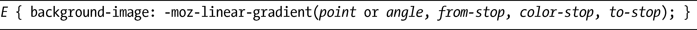
在本节接下来的部分，我会详细解释该语法的每一部分，但我要先从Firefox中最简单的几个值的开始，举例如下：

渐变通过的每种不同的颜色是由一个称为color-stop的值所提供的，最简单的渐变需要两个值：一个起始值，我会把它称作from-stop（为了避免使用术语“start-stop”！），另一个是终止值，我会称之为to-stop。在第一个例子中，渐变会以白色开始，以黑色终止，逐步地经过两种颜色之间的所有变化。你可以在图11-1中看到这一结果。

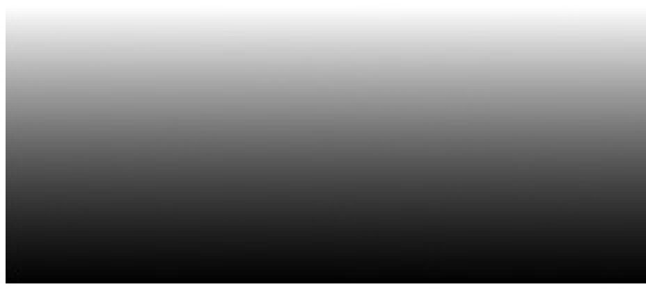

<b class="my_markdown">图11-1　一种简单的自上而下、两种颜色的线性渐变</b>

注意这种渐变从方框的顶部开始，垂直地移到底部——这是因为语法中的point值所起的作用。point是渐变开始的位置，使用类似于background-position的语法去指定，也就是说，可以使用关键字（top、bottom、left、right、center）或者一个百分比值。point需要两个参数（left center、top right，0% 50%，等等），但如果只指定了其中的一个，那么另外一个就会被假设为center（或者50%）。因此，参数left会被假定为left center，而参数100%则被假定为100% 50%。如果没有提供point值，就像第一个例子一样，那么它的值会被假定为top center或者0% 50%，就是方框的顶部。

使用下面的任意组合，我可都以获得相同的结果：

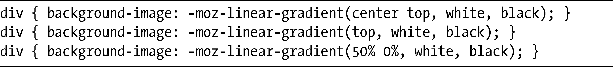
point的一种替代方案是使用一个angle（角度）参数。角度可以使用几种不同的单位来声明：取值与单位模块（Values and Units Module）允许使用度数、梯度、弧度与转数去指定角度，但我打算坚持使用度数（deg），因为它们最为大家所理解（查看<a class="my_markdown" href="['http://www.w3.org/TR/css3-values/#angle/']">http://www.w3.org/TR/css3-values/#angle/</a>可以了解有关其他单位的更多信息）。angle值设置了渐变的角度：0deg（或者360deg）是从左到右，45deg是从左下到右上，90deg是从下到上，等等。你也可以使用负值，表示按照逆时针方向：-45deg和315deg是一样的，而-315deg和45deg又是一样的……你应该可以理解。

所以对于前面的例子，你也可以使用这些可能的选项：

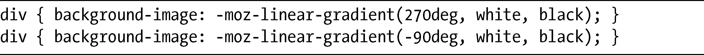
### 11.1.2　WebKit中的线性渐变

WebKit的实现非常类似于Firefox的实现，尽管它并不允许使用角度值，它的语法多少更加精确和冗长一些：

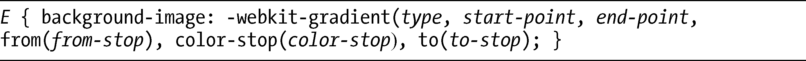
这里我们要关注的是，就像在介绍本章的时候所提到的，你需要用一个值去指定渐变的类型。该值可以是linear或者radial，但现在我还是要使用linear。另外，开始点和结束点这两个值也是必须的，而from-stop和to-stop要使用from()和to()函数去指定。

WebKit实现图10-1所示的简单例子需要使用下面的声明：

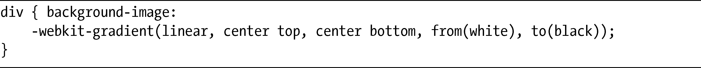
和Firefox一样，我也可以把百分比值用于开始点和结束点：

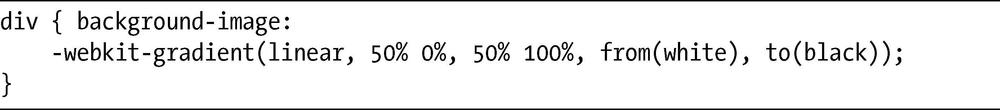
但是，和Firefox不同的是，WebKit是不允许使用角度值的，而且两个参数都是必须的，如果其中一个值没有设置的活，不会有任何的假设值。

### 11.1.3　使用线性渐变

要记住这两种语法之间的差异，我打算展现五个不同的例子，然后带你历经创建这些例子的代码。这里是相关的CSS片段：

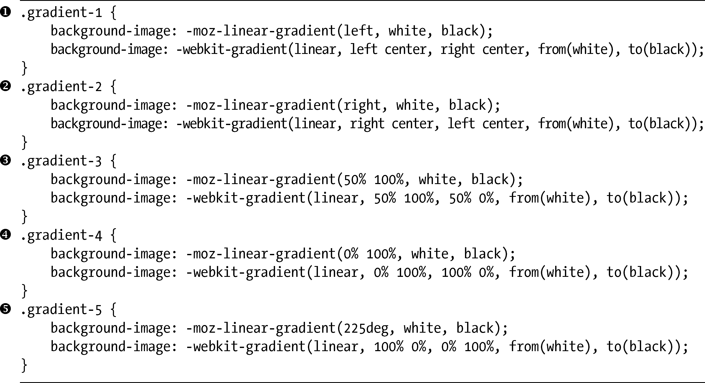
这些例子显示在图11-2中。

<b class="my_markdown">图11-2　为线性渐变设置不同点值的例子</b>

第1个例子（）是左-右渐变。在Firefox中，我仅仅使用left作为point参数的值，因为这对值会被假设为left center，同样，我也不需要指定一个结束点。但在WebKit中，我必须为开始点和结束点指定一对值。第2个例子（）使用相同的语法，但渐变是从右边开始，到左边结束。

在第3个例子中（），我使用百分比值设置了从下到上的渐变。同样地，在Firefox中，结束点是自动设置的，反之在WebKit中，我就必须去手动设置。第4个例子（）使用相同的语法，但这一次渐变是沿着从左下到右上的对角线发生的。

在最后一个例子中（），我为Firefox使用了一个angle值。225deg的值设置渐变沿着右上到左下发生。我在WebKit中使用了百分比值去实现相同的效果。

### 11.1.4　添加额外的color-stop值

目前在我的例子中，我使用的是只有两个color-stop的简单渐变，但是，你当然也可以使用更多的值。不过我必须说明，因为本书是黑白印刷的，所以受到了可供选择的调色板的限制。

你所添加的每一种不同的颜色都在一个color-stop之中声明。在Firefox中，只需在from-stop和to-stop之间添加更多的值（用逗号隔开），如下：

color-stop会按照列出的顺序进行处理，所以这个例子将会创建一种从黑色到白色，又再次回到黑色的渐变。Firefox语法会沿着渐变的长度均匀地分配color-stop。在这个例子中，白色的color-stop会位于两种黑色的正中间。

在WebKit中，要实现相同的效果需要使用下面的语法：

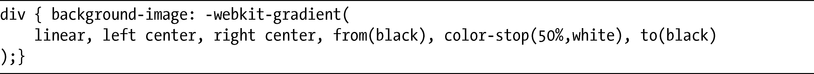
注意这里我使用color-stop()函数去声明color-stop，它需要两个值：渐变应该停止的位置以及它的颜色。和Firefox不同，颜色的分布并不是自动计算的。

和以前一样，阐明这两种语法之间的差异的最佳方法就是使用一个演示，为此，我要使用下面的代码：

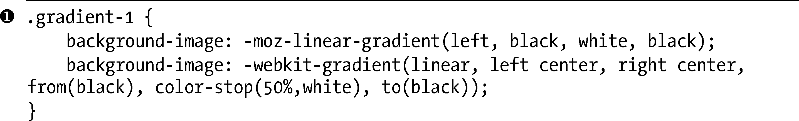

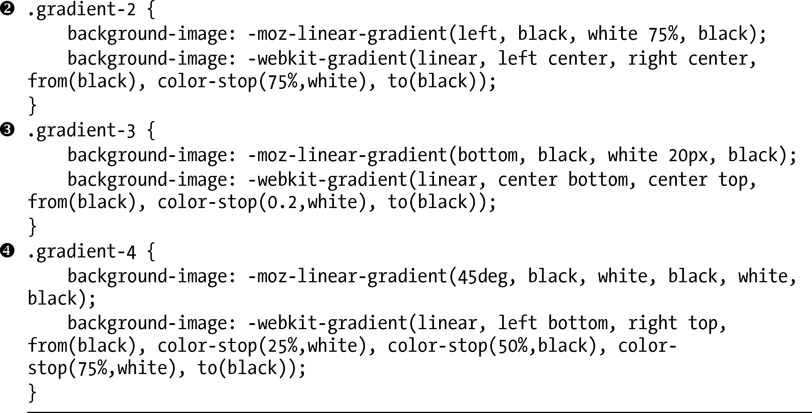
可以在图11-3中看到其输出。

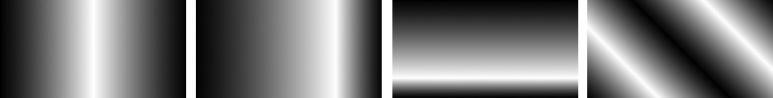

<b class="my_markdown">图11-3　不同color-stop值的例子</b>

第1个例子（）使用了我在本节开头所介绍的值，一个开始和结束均为黑色的左右渐变，中间是白色的color-stop。正如我在前面提到的，在WebKit语法中，我要在开始和结束之间的正中间设置color-stop，而这在Firefox中是自动完成的。

下一个例子（）展示了在渐变长度75%的位置指定的color-stop。你已经看到它在WebKit中是如何实现的，但在Firefox中稍微有些不同：必须在color-stop()函数中把百分比值添加在颜色值之后，不使用逗号。

第3个例子（）展示了color-stop()函数中一些不同的单位。Firefox允许使用的一些长度单位（这里我使用的是px）是WebKit所不允许的，但WebKit允许使用从0.0到1.0的数字去代替百分比。因为我的方框有100px高，所以Firefox和WebKit的值是等效的。

最后，第4个例子（）有5个黑白交替的color-stop。这就是WebKit语法开始显现出不便的地方，它需要我为每个color-stop指定color-stop()函数，还要计算出在渐变长度上平均分配的百分比值。

