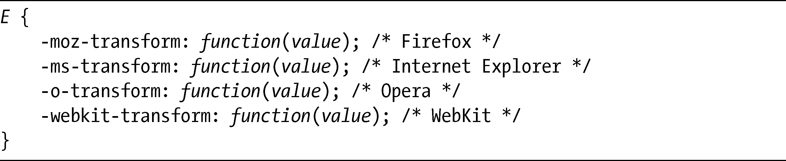
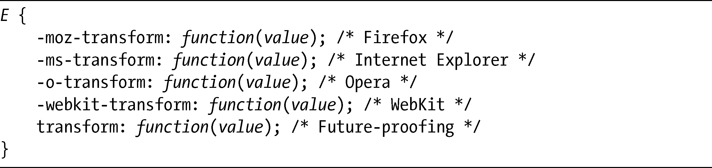

### 12.1　transform属性

在2D变换模块中，有一系列不同的变化可以应用到元素上，但所有这些变换都被声明为transform属性中的函数。这是它的基本语法：

其中有若干函数可以供我们使用，我会在本章接下来的部分依次对每个函数进行探讨。这些函数都将使用一个值或者用逗号隔开的一系列值。在我单独讨论每个函数的时候，我也将解释这些值究竟代表什么意思。

正如我在本章开头提到的，Firefox（3.5+）、Opera（10.5+）、IE9（候选版）和WebKit全都开发了transform属性的实现，每个浏览器都有其专用的前缀，意味着如果我们现在要使用这个属性，就需要在代码中指定四次：

一般来说，我推荐的方式是在每个浏览器专用的属性之后添加没有前缀的属性，如果未来发布的浏览器版本已经实现了无前缀的属性，代码就就可以使用这些属性，比如：

然而，一些浏览器对transform的实现存在一些非常细微的差异，并且由于该模块仍然处于工作草案状态，其语法也有可能会发生改变。基于这个原因，我还是要对使用这种在前缀属性后面包含无前缀属性的未来适用的方法提出告诫，一定要防止最终的语法和现在有所不同。在我自己的例子中，我会按照自己的习惯，只使用无前缀的规则，但是要记住，在你创建自己的页面时，一定要指定全部4个属性。

