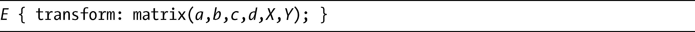
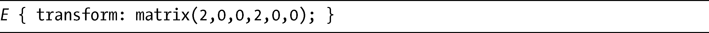
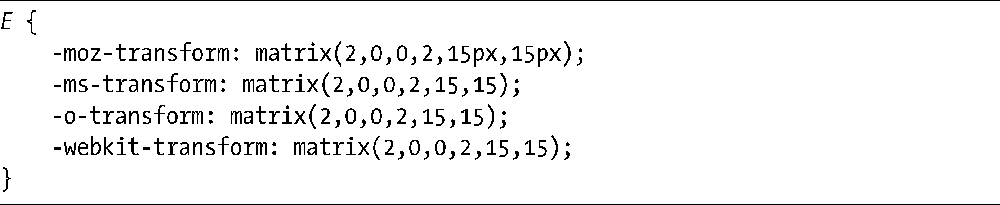
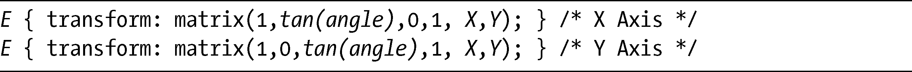
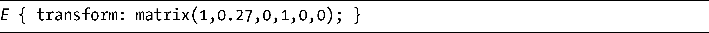
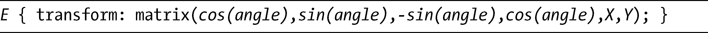
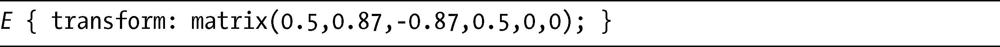
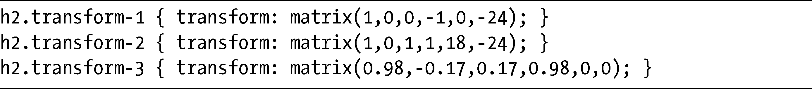

### 12.7　使用矩阵变换元素

你可以使用一个最终变换函数，将多个值应用到一个元素上，这个函数称为matrix。我不打算解释变换矩阵背后的理论（这是相当复杂的，完全可以单独用一章来讲解），我会试着给出一些使用的基础知识，尽可能简单地进行解释。。如果你真的想要深入研究该理论，建议阅读W3C的解释，位于<a class="my_markdown" href="['http://www.w3.org/TR/SVG/coords.html#TransformMatrixDefined']">http://www.w3.org/TR/SVG/coords.html#TransformMatrixDefined</a>。

matrix函数接受六个值。通过对它们进行组合，就可以复制出本章所介绍的函数。以下是其语法：

所有的默认值均为0（零），根据所提供的值，它们的表现稍微有些不同——接下来我会解释这是什么意思。我说过我们可以使用matrix执行所有在本节介绍过的函数，但这一过程并不是那么简单——你需要先知道一些三角学知识。

在进入这难以弄懂的东西之前，我先从不需要任何三角知识的简单内容开始：缩放。如果要缩放一个元素，我们可以使用a和d去比拟scaleX和scaleY，并相应地设置它们的值，让b和c为0。因此，要双倍放大元素，可以使用：

我们也可以使用matrix旋转一个元素，只要（分别）为X和Y提供水平和垂直偏移值。Firefox对此的实现与其他浏览器稍微有些不同，它需要为每个值提供长度单位，而WebKit、Opera和IE9只接受无单位的数字，用以表示像素值。在这种情况下，对于下一个例子，我将列出所有不同前缀的属性：

这段代码的结果是把元素的尺寸扩大一倍，并让它垂直、水平偏移15px。

Mozilla已经建议修改规范，以支持它们提出的改变，因为当前的规范只能够为矩阵变换使用像素值，这是各种不同的浏览器在实现上存在的关键差异，在本章接下来的例子中，我会使用无单位的值，因为它们更为通用。

如果我们要倾斜一个元素，是的，这下子会变得复杂许多，我就需要引入三角函数了。你可以在Wikipedia上了解这些函数的完整解释（<a class="my_markdown" href="['http://en.wikipedia.org/wiki/Trigonometric_functions#Sine.2C_cosine_and_tangent']">http://en.wikipedia.org/wiki/Trigonometric_functions#Sine.2C_cosine_and_tangent</a>），但现在我先给出一个临时应急的介绍：三角函数是一些比值，常用于在三角形中计算角度。

我要使用的第一个三角函数是tan（tangent，正切），这是沿x 轴或y 轴倾斜一个元素所必需的。对于原始的matrix语法，需要把x 轴的倾斜值提供给b，而y 轴的值则提供给c。以下是每条轴所对应的语法：

这里angle和要倾斜的角度（逆时针方向）相关。如果要让一个元素倾斜15度，要使用的值就是15的正切。所以，拿出你的科学计算器——如果没有，操作系统的计算器应该有一种科学型模式——然后得到tan(15)=0.27的结果。该结果就是你要提供给matrix函数的值。例如，如果要沿着x 轴倾斜，语法将是：

> 注意：
> 因为我在例子中使用了度数，所以如果你要跟着我的例子做，就要确保你的计算器的三角函数类型也设置为度数。如果你更喜欢使用梯度或者弧度，这些例子就必须进行相应的修改。

如前所述，skew也常被用于旋转元素——你可以使用matrix实现相同的效果。这一次你要利用sin（sine，正弦）和cos（cosine，余弦）函数。要旋转一个元素，matrix的语法是：

注意a和d采用了相同的值，而b和c则使用相反的值（如果b是一个正值，c就是相同数值的负值，反之亦然）。同样，angle是指元素要旋转的角度。为了旋转60度，你要回到科学计算器中，计算60的cos值和sin值。我的计算器得出cos(60)=0.5，而sin(60)=0.87，所以需要的代码如下：

现在我们来看几个例子，这里是我使用的代码：

输出如图12-8所示。

<b class="my_markdown">图12-8　使用matrix函数生成变换的例子</b>

在第一个例子中，我把元素进行垂直翻转（就像之前在图12-6中使用scale一样），让它沿着y 轴平移-24px，平整地位于原始元素的下方。在下一个例子中，我让元素沿着y 轴倾斜45度（先计算出tan(45)=1），然后让它沿着两条轴平移。最后一个例子展示了元素被旋转10度的效果，之前已经向你展示过它的值和计算的结果：cos(10)=0.98，而sin(10)=0.17。前面我已经提到，sin值在位置b是负的，在位置c是正的，这样才能均匀地旋转起来。

我知道这些内容是相当复杂的，但希望我能够使之足够简化以便于理解，但又不至于让它看起来太过简单，以致你无法了解它那极大的灵活性——只要你一直把科学计算器放在身边！如果上面的内容看起来过于复杂，你觉得理解有困难，请记住，如果你愿意的话，可以使用独立的函数执行所有这些变换，这样就可以快乐地忘掉matrix和三角函数。

