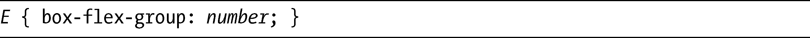
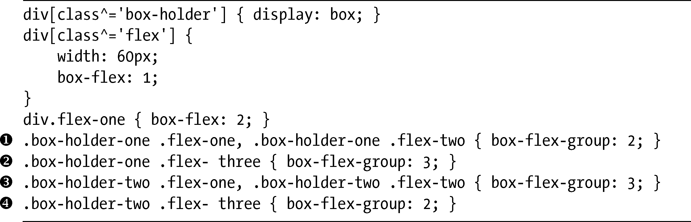
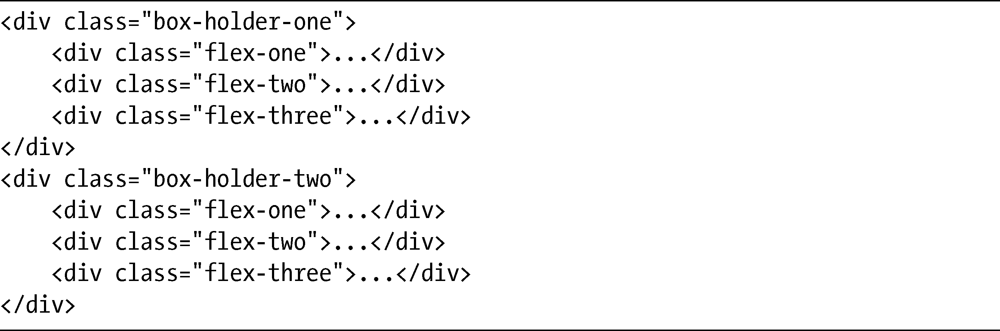
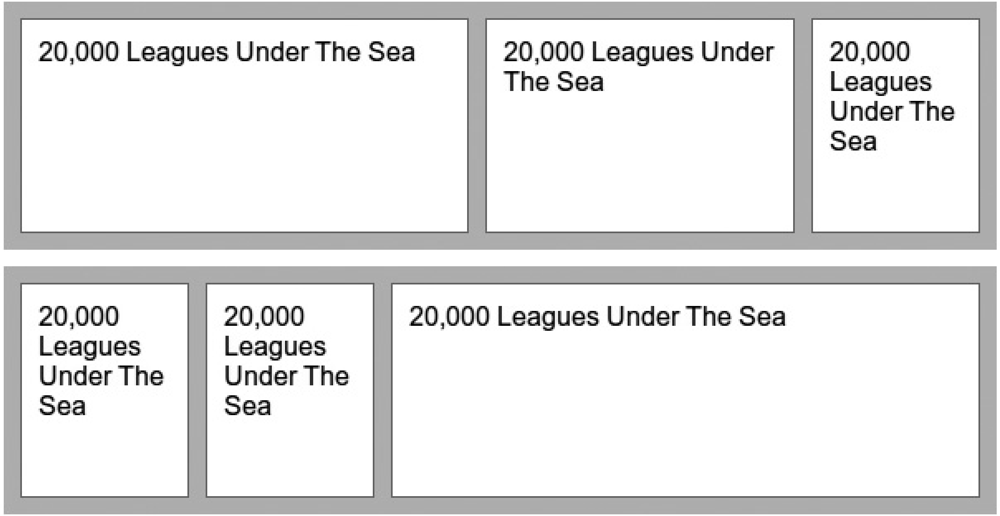

### 15.3　弹性方框分组

不但可以让单独的方框根据它们的box-flex值调整大小，你也可以创建方框分组，使用box-flex-group属性共同调整它们的大小。该属性语法如下：

对于这个属性，number值是生成编号分组的一个单独整数，所有具有相同值的元素均被认为是属于同一分组的。它的默认值是1，所以除非另有指定，所有的元素都属于这一分组。当元素重新调整大小以适应它们的父元素时，所有在相同分组中的元素都会被设置为相同的大小。较低编号的分组具有较高的优先级。

在我给出一些例子之前，先岔开讲讲浏览器支持的话题：Firefox和IE9的最新预览版根本没有实现这个属性，而WebKit也没有按照规范工作。在WebKit中，所有在最低的box-flex-group值的分组中的元素都被认为是有弹性的，并且也应用了单独的box-flex值；所有在其他编号的分组中的元素是不可伸缩的，意味着它们的作用就像box-flex值为0一样。

当我通过一个简单的并排演示进行讲解的时候，一定要把这一点牢牢记住。我有两个弹性方框父元素，每个元素均拥有三个子元素。每个父元素的第一个子元素的box-flex值都是2，而所有其他的子元素的box-flex值都是1。所有其他属性均有相同的值，除了box-flex-group属性。

以下是代码：

以下是相关的标记：

结果如图15-8所示。

在上面的例子中，第一个和第二个方框（）的box-flex-group值是2，而第三个方框（）的值是3。较低编号的分组具有优先权，所以第三个元素被当作是不可伸缩的，会保持它的原始大小。第一个和第二个元素是弹性的，所以会动态地调整大小，按2:1的比例分配空间，第一个方框更大一些。

下面的例子中，元素的值是相反的。现在第一个和第二个元素（）是没有弹性的，所以box-flex值会被忽略，而第三个（）元素，就是在具有较低box-flex-group值的分组中，是具有弹性的，它会填满剩余宽度。

<b class="my_markdown">图15-8　使用不同的box-flex-group值的两个例子</b>

