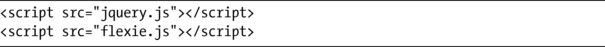
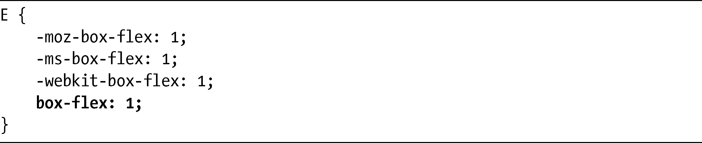

### 15.9　使用JavaScript实现跨浏览器的弹性方框

尽管弹性方框目前只在Firefox和WebKit中实现，但你可以使用一个称为Flexie（<a class="my_markdown" href="['http://www.flexiejs.com/']">http://www.flexiejs.com/</a>）的灵巧的JavaScript小组件，使得这一技术能够跨越所有的浏览器去使用。安装Flexie是非常简单的，你需要链接另一个JavaScript库（任何JavaScript库都可以，在这个例子中，我使用的是jQuery，可以从<a href="http://www.jquery.com/">http://www.jquery.com/</a>得到）。下载这些文件之后按照下面的方法在文档中链接它们：

为了让JavaScript能够处理你的代码，你只需要在CSS中有前缀的属性后面添加无前缀的属性：

该脚本会检查浏览器是否原生支持弹性方框，如果不支持的话就替换它的效果。开发人员也可以把一个非常有用的测试页面（<a class="my_markdown" href="['http://www.flexiejs.com/playground/']">http://www.flexiejs.com/playground/</a>）放在一起使用，在上面你可以修改各种弹性方框值，随时查看更新的结果。

