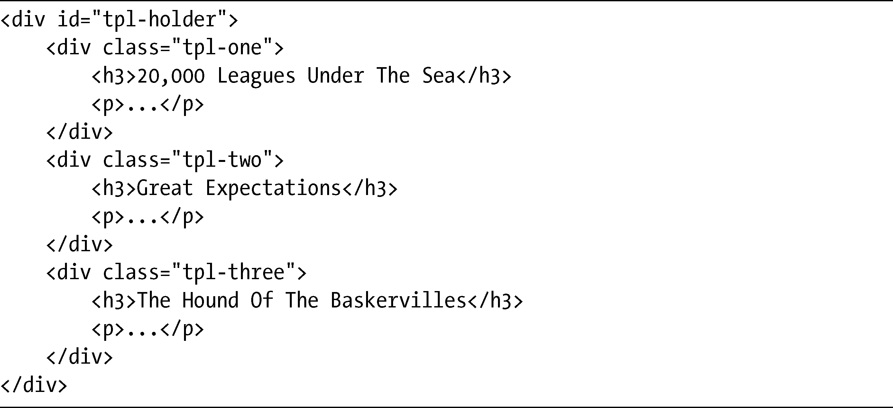
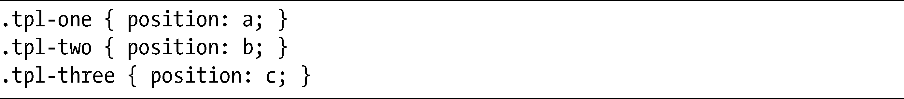
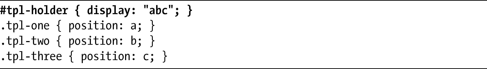
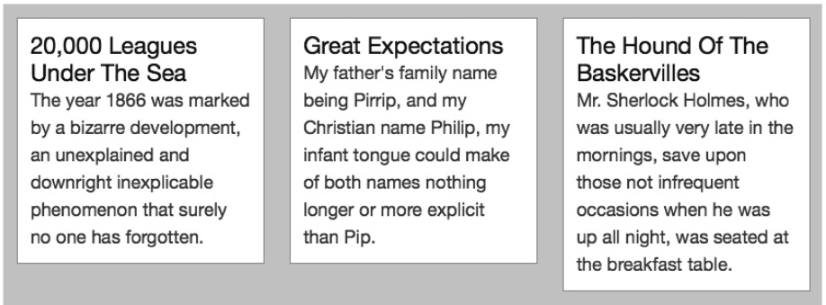
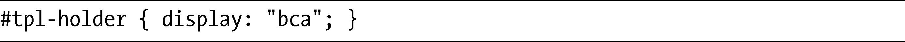
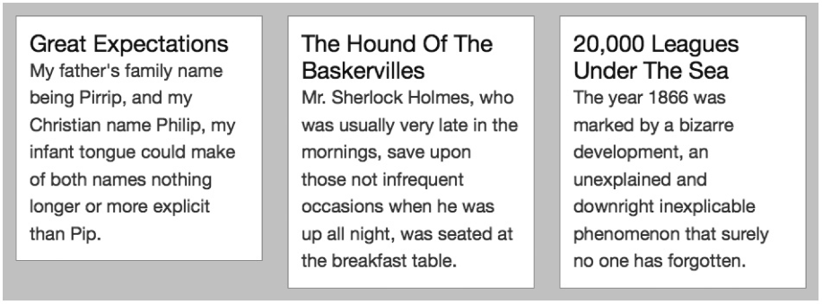
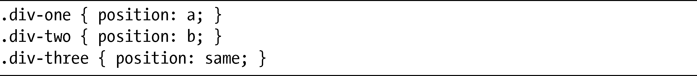
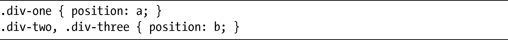

### 16.2　使用position和display创建行

模板布局方法需要至少设置两个不同的属性才能正常工作，所以在我展示结果之前，要先讨论这两个属性。这两个属性已经存在于CSS2.1当中，但我会为它们设置新的值。

第一个属性是position，你应该记得它的值是absolute、fixed、relative或者static。但是在新的方法中，position的用法有点不同。为了展示它是如何工作的，我会召集第15章的演示所使用的相同页面元素：一个父元素和三个子元素。通常我会先展示有关的CSS，再展示CSS所应用的标记，但是这一次我会破例，先展示标记，如下：

这里有三个div子元素，每个元素的类名都是tpl-*。为了使用模板方法创建布局，我为每个div的赋予字母表中的一个字母，作为position属性的值：

字母本身是随意的——你可以使用字母表中任何一个字母——但是一个元素只允许使用单独一个字母（也可以使用关键字，在本节后面我会回过头再讲）。

到目前为止，还是没有什么意义。那么，这些字母究竟代表什么？为此，你需要先看一看另外一个关键属性：display。同样，你也应该熟悉这个属性，它目前允许使用像block、inline和list-item这样的值，常用于设置元素的方框类型。但在模板方法中，它是用来设置元素的顺序，就是之前我赋予字母的元素。

display属性的值是一个用引号包围的字母串，该字符串表示在同一水平中一行内的元素——在本章接下来的部分我会称之为行字符串（row strings）。例如，这里有三个元素，是我在前面介绍过的，现在它们已经按照字母顺序陈列在一行当中：

> 注意：
> 规范中说明只有字母才可以在字符串中声明，所以可以使用单引号或者双引号。但是，我用于模拟这些属性的JavaScript只接受双引号，所以我在这一整章中都会使用双引号。

想要知道代码的结果，可以看看图16-1。这里，你可以看到元素按照我赋给它们的字符，ABC，在一行内显示——也就是说，水平地显示在父元素里面，没有使用任何浮动或其他的布局方法。因为这三个元素上都没有设置width属性的值，所以它们会被平均地分为三列，合起来的宽度（包括填充、边框和边距）就等同于它们的父元素宽度。

<b class="my_markdown">图16-1　使用模板布局方法排序的一行元素</b>

你可以通过改变字符串中字母的顺序，轻松地以不同的顺序显示子元素。考虑这句代码：

将图16-1的结果和图16-2的新结果做对比，你可以看到，把字符串中的字母改变为BCA，方框就已经重新排序。同样，所分配的宽度等同于其父元素的宽度。

<b class="my_markdown">图16-2　图16-1中的示例元素通过改变display属性重新排序</b>

在接着往下讲之前，我要回到position属性所允许使用的一个新的关键字值，这是我之前提到的。这个值就是same，它的功能也如它的名称一般：将元素的位置设置等同于兄弟元素最后所指定的位置。例如，考虑以下代码：

元素.div-two和.div-three二者的position值都是b，这和你使用下面的代码所产生的效果是完全一样的：

