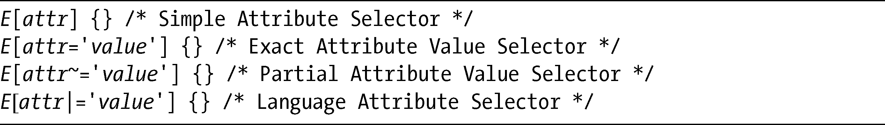
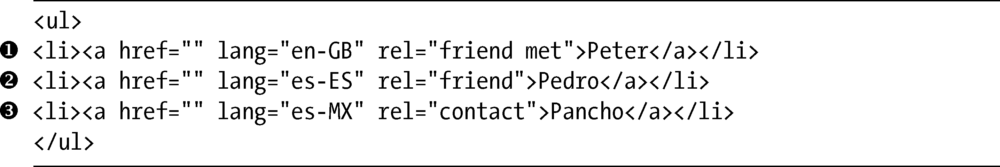

### 3.1　属性选择器

属性选择器（Attribute Selectors）是在CSS2中引入的，从它的名称可以看出，它们能够指定一些规则，这些规则根据元素的属性（诸如href或者title）以及这些属性的值对元素进行匹配。CSS2定义的4个选择器是：

进入CSS3的新选择器之前，我们很有必要快速回顾一下上面提到的每个选择器是如何使用的。为此，我要使用下面的标记，它是一份（非常短的）联系人列表：

简单属性选择器（Simple Attribute Selector）会把规则应用到定义了指定属性的元素上，而不管属性的值是什么。所以可以给出以下代码：

在我的标记中，所有a元素都有一个rel属性，虽然它们具有不同的值。所以对于这个例子，所有元素都会应用这条规则。如果想要更加具体，我们可以使用精确属性值选择器（Exact Attribute Value Selector）去定义一个值：

这行代码只会将规则应用到标记中的第二个a元素（），这是因为它只会选择那些具有精确friend值的元素。如果还要选择包含friend值的元素，可以使用部分属性值选择器（Partial Attribute Value Selector）：

这行代码会在所有的rel属性中寻找friend值，而friend值在属性值中是以空格隔开的列表的一部分（大多数情况下是一个单词），所以这条规则会应用到元素和。

最后一个要说的选择器是语言属性选择器（Language Attribute Selector），该选择器会根据元素的lang属性将规则应用到元素上。例子中的标记有两个西班牙名字，尽管其中一个是来自西班牙，而另一个是来自墨西哥。如果要同时选择二者，可以使用这行代码：

这行代码会选择所有属性值是以es开头的lang属性，不管后面表示具体国家的值是什么——也就是说，会选中元素和。

