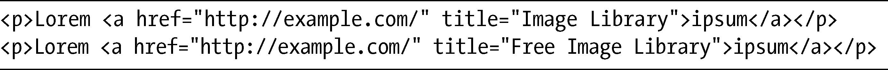
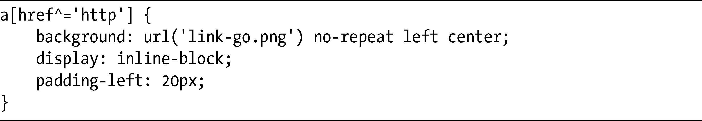
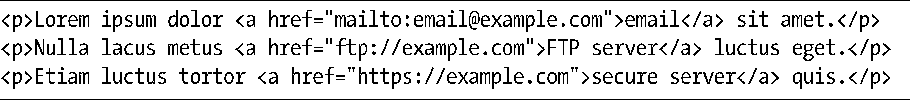
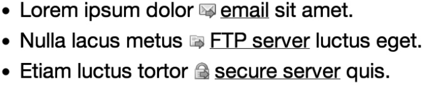
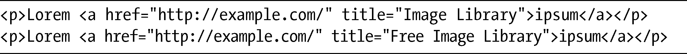
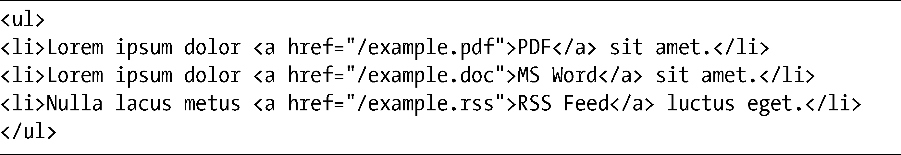
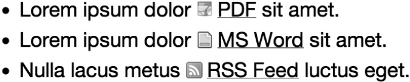

### 3.2　CSS3的新属性选择器

你已经看到了在选择器中，属性选择器在寻找精确值或者部分值方面是非常有效的，但如果想拥有更大的灵活性呢？CSS3的新选择器提供了一种在属性值里面匹配子字符串的能力。这种特性在将规则应用到XML文档的时候特别的有用，因为XML文档比HTML有更多任意的属性——不过它们对HTML的开发也同样非常有用。

### 3.2.1　开始子串属性值选择器

第一个新的属性选择器——为了避免半天说不完它的名字，我更喜欢称之为开始选择器（Beginning Selector）——该选择器会寻找这样一些元素，它们所选择的属性必须以一个字符串为起始，该字符串会作为参数提供给选择器。这个选择器使用插入符号（^）修饰属性中的等号，以下是其完整的语法：

这行代码将在指定属性的起始处寻找指定的值。例如，如果使用以下规则：

并且把它应用到这段标记中：

该规则将会应用到第一个段落中的a元素上，因为它的title属性的字符串是以单词image开头的。相反，该规则将不会应用到第二个段落的a元素上，因为它的title属性的字符串虽然包含了那些字符，但并不是以它们开头。

> 注意：
> 在HTML文档中，对属性选择器的值是大小写不敏感的；不过在XML文档中，对该值的大小写是敏感的。

开始选择器在需要为超链接添加可视化信息的时候特别有用。以下是一个典型的指向外部网站的超级链接的例子：

当你在浏览器中查看这个链接的时候，无法立即指出这是一个指向同一网站内的其他页面的链接，还是一个指向外部URI的链接。不过，有了这个新的属性，就可以把其协议（http）作为参数传递给选择器，并添加一个图标去清晰地表示它是一个外部链接：

结果如图3-1所示。

<b class="my_markdown">图3-1　启用了开始选择器的一个图标</b>

当然，也可以对其进行扩展，覆盖其他的许多Web协议，下面这个例子使用了其他一些协议：

将不同的协议作为值提供给选择器之后，就可以把选择器应用到这段示例标记当中：

输出的结果如图3-2所示。

<b class="my_markdown">图3-2　更多启用开始选择器的链接图标的例子</b>

当然，开始选择器通过让属性接受更多详细的值（比如alt、cite和title）也可以有许多用途。并且，随着HTML5和大量具有新形式的元素和属性的引入，这个选择器和它那即将引入的兄弟一起将会变得更加灵活。

例如，不妨考虑一下提议的datetime属性。该属性接受诸如2010-03-11这样的日期字符串，所以你可以使用开始选择器把样式应用到所有具有符合年份值的元素上，这对于日历或归档应用程序来说是非常方便的。

### 3.3.2　结束子串属性值选择器

结束选择器（Ending Selector），我是这么叫它的，其作用和开始选择器类似——只不过恰恰是反过来的！也就是说，我们可以使用该选择器去选择以指定的值结束的属性。其语法的差别也仅仅只有一个字符：这一次要使用美元符号（$）去修饰等号（=）。以下是其完整的语法：

我们回到本章的第一个例子，它使用的是这段标记：

我们使用一个新的值来应用这条新规则：

这一次，这条规则会同时应用到两个a元素上，因为它们都是以单词library结束的。

和开始选择器一样，我们可以使用这个选择器为超级链接提供一种视觉上的分辨。不过这一次我们并不使用href属性开始的协议，我们要使用结尾处的文件类型。这里的代码展示了用在许多流行的文件类型扩展名上的规则：

这里是一段标记片段，包含了一系列指向文件的链接：

当该样式表应用到标记上的时候，适当的图标就会应用到每个a元素上，如图3-3所示。

<b class="my_markdown">图3-3　启用了结束选择器的链接图标的例子</b>

要使用CSS达到这种效果，就必须为标记设置class值（例如，class=“pdf”）。而使用结束属性选择器的优势就是指向文件的链接能够被自动地检测到，不需要终端用户非得应用一个特定的类；但是，其缺点是有些时候文件类型的后缀并不在URI的末端。不过，接下来这个新的选择器将帮助你克服这种缺点。

### 3.2.3　任意子串属性值选择器

最后一个新的属性选择器——我称之为任意选择器（Arbitrary Selector）——它的作用和前面两个选择器是相同的，但是它会在指定的属性字符串的内部任意位置搜索指定的子串。该选择器使用的是星号（*），以下是它的新语法：

为了演示这个选择器，我要使用第一个例子中的标记：

然后为这个新选择器提供一个值：

和结束选择器一样，这条规则会应用到例子中的两个a元素上。不过，这一次它们之所以得到应用，是因为两个元素在title属性中都包含了单词image，即便该单词在每个例子中都出现在不同的位置上。

你也许会注意到，这个选择器和CSS2中的部分属性值选择器（Partial Attribute Value Selector）多少有些类似。的确，在这个例子中，它们是可以相互替换的。但是这两个选择器还是有很大差别，比如在这段示例标记中，使用CSS3的话，我也可以仅仅使用该字符串的一个小片段：

这样该规则仍然会应用。而部分属性值选择器需要用户输入的值必须匹配空格隔开的列表中的一个完整项——在这个例子中，必须是free、image或library的其中之一——所以值im在CSS2中将不会在上述标记中的任何位置被找到。

我们继续使用为前两个属性选择器提供的例子，如果要为那些结尾处有参数的URI添加文件类型图标，任意选择器也是很有用的。考虑这个相当典型的URI：

如果使用结束选择器去选择pdf值，该元素将不会被识别为一个有效的目标，尽管它的文件类型的确是PDF文件，只是因为该值并没有出现在字符串的最末端。不过，使用任意选择器并提供相同的值就可以成功地把它识别出来：

.pdf子串值在指定属性的内部出现了，所以图标就会被应用。结果如图3-4所示。

<b class="my_markdown">图3-4　应用了任意选择器的链接图标</b>

这个选择器是这三个新的属性选择器当中最为灵活的，因为它在字符串内部采用更多的通配符进行搜索。但这种额外的灵活性也意味着在定义提供给选择器的值的时候要更加小心，当你在字符串的内部进行匹配的时候，简单的字母组合出现的几率要高出许多。

### 3.2.4　多属性选择器

你也可以把多个选择器串接在一次，这样在选择目标的时候能够做到非常的具体。使用多选择器，可以通过定义在开始、结束以及中间任意位置的值创建应用到属性上的规则。比方说，假设有指向两个文件的链接，文件具有完全相同的名称，但是位于不同的文件夹中：

如果要指定一条只应用到第二个p元素的规则，可以把一些选择器串接到一起：

这行代码会寻找这样的a元素，它具有一个href属性，是以http://开始，以.pdf结束，并且在中间包含了/folder2/。非常的明确！

