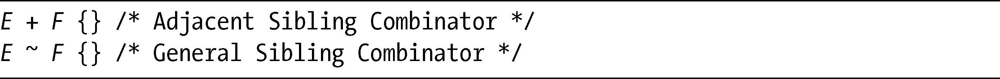
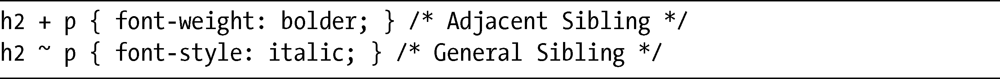
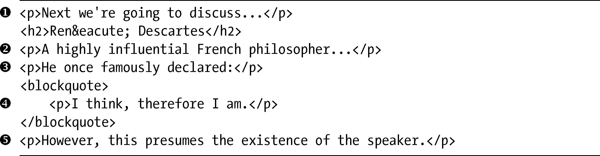
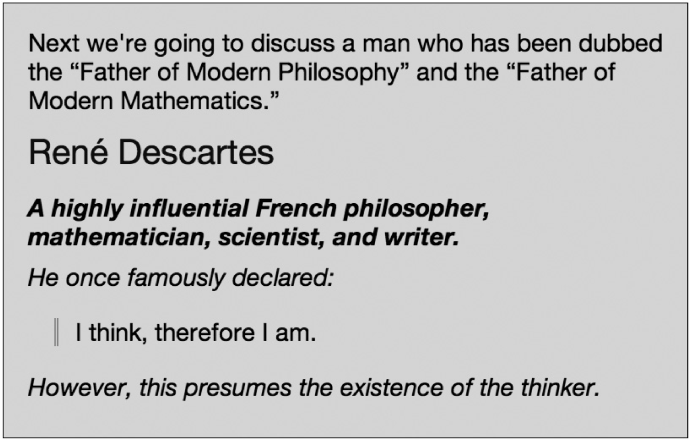

### 3.3　普通兄弟连结符

我们在CSS3中要学的最后一个新的DOM选择器是一个连结符（combinator），你会想到，这就意味着它能够把不只一个选择器连结在一起。普通兄弟连结符（General Sibling Combinator）是CSS2所引入的相邻兄弟连结符（Adjacent Sibling Combinator）的一个扩展。它们的语法差别仅仅是一个字符：

二者之间的差别虽然微妙但却相当重要：相邻兄弟选择的是文档树的同一层级中，紧邻在元素（E）之后的任意元素（F）。但普通兄弟选择的是文档树的同一层级中，位于元素（E）之后的任意元素（F），不管它们是否直接相邻。

如果听起来仍然觉得混淆，我会尝试用一个例子来解释清楚。我们先从这段CSS代码开始：

然后把它应用到下面的标记上（为了简洁进行了删减）：

可以在图3-5中看到其结果。在这段CSS中，我使用相邻兄弟连结符将紧邻在h2元素后面的p元素加粗——也就是元素。然后我又使用普通兄弟连结符将跟随在h2元素后面的所有p元素变成斜体，即应用到元素和。

<b class="my_markdown">图3-5　显示相邻兄弟连结符和普通兄弟连结符的差异</b>

注意，元素和并没有规则应用到上面。为什么没有呢？这是因为元素位于h2元素的前面，而元素则在一个blockquote元素内部，因此是在文档树的不同层级上（属于下一个层级），所以这两个元素都不会受到这些规则的影响。

如果在CSS2中，要实现只对h2元素同一个层级的段落加上斜体的预期效果，没有普通兄弟连结符的话，就需要先设置所有的p元素均显示为斜体，之后再为blockquote内部的p元素添加一条附加的规则，以阻止这种继承：

你很可能并不需要经常使用普通兄弟连结符，因为它的大部分功能和基本的DOM选择器是重叠的。即便如此，你仍然会发现在很多场合，它都可以帮助你节省一点点代码（和时间）。

