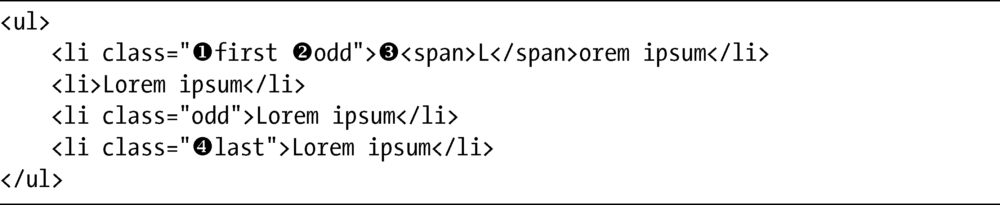
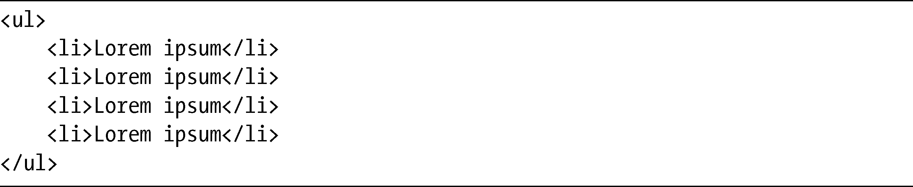

### 第4章　伪类与伪元素

最早的CSS规范——CSS1，引入了伪类（pseudo-class）和伪元素（pseudo-elements）的概念。这些选择器对文档树（或者在文档树之外）的扩展信息（比如链接的状态或者文本节点的首个字母）发生作用的。伪类可以对一个元素的不同状态或者类型进行区分，这包括但不限于链接的状态（:hover、:visited、:active等）信息。伪元素能够访问一个元素的组成部分，还有一些能够选择文本节点部分内容的伪元素，例如，:first-line和:first-letter。

虽然我刚刚提到的这些选择器从CSS1就已经存在了，在CSS2.1的时候又增加了一些——尽管伪元素的支持一直就没有得到很好的实现，但如果确实要说实现的话，也就是最近的事儿。CSS3在此基础上扩展了伪类范围，并且对其语法进行了（轻微的）调整，使之和伪元素相区分。

能够拥有更多方式去遍历文档所带来的好处是显而易见的：我们不再需要那么多的样式化钩子（hooks）。例如，这样的标记对你来说很可能已经相当熟悉了：

这段标记包含了描述文档树中每个元素位置的类名：first（）和last（）表明li元素是ul元素的第一个和最后一个子元素，而odd（）则用于第奇数个li元素。附加的span（）则围绕在第一个li元素的第一个字母外围。

当你要添加样式去修改元素的时候，需要像上面这样为代码做标记，在第一个和最后一个元素上设置不同的值，或者为文本节点的首个字母添加特别的格式。这种标记会有损代码的清晰度和语义。此外，使用这种标记的话，在许多情况下还需要提供钩子才能把样式挂上。

而CSS3的新方法能够实现相同的视觉效果，不会让那些不必要的类和非语义的元素把标记弄得一团糟：

这种改变令CSS朝着它所宣称的目标——内容与表现的隔离大大前进了一步。

