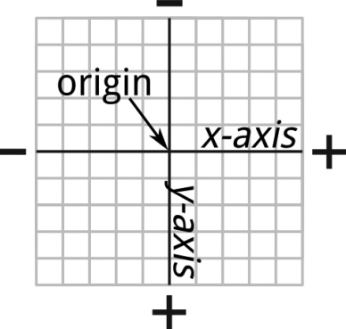
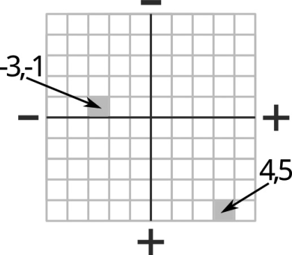

### 6.1　理解轴与坐标

CSS3新引入的一个语法概念就是坐标轴。如果你还记得数学课上所讲过的内容，也许知道坐标轴的概念。但是如果你正在阅读这一节，我就假设你在这方面需要补习一下。

CSS使用笛卡尔坐标系，该系统由两条线构成，一条是水平线，一条是垂直线，两条线以直角相互交叉。每一条线都称为轴：水平线称为x 轴，垂直线则称为y 轴。两条线的交叉点称为原点。图6-1阐明了这一情况。

<b class="my_markdown">图6-1　x 轴、y 轴与原点</b>

对于屏幕上的东西，轴的长度是以像素去计量的。在图6-1中，可以看到坐标轴和原点覆盖在一个网格上。假设每个正方形相对应一个像素，你会注意到在每一条轴的两端各有正（+）负（-）标签，就是告诉你在轴线的每个方向上与原点相距的距离是以正值还是负值表示。

现在你理解了这个概念，就可以得到任意的点相对于原点的坐标。坐标就是一对值——每条轴对应一个值——分别表示与原点之间的距离，而原点的坐标则是（0，0）。例如，给出坐标（4，5），只要沿着x 轴移动4个像素，再沿y 轴移动5个像素就可以找到这个点。同样地，坐标（-3，-1）则要沿着x 轴远离原点向负方向移动3个像素，再沿y 轴远离原点向负方向移动1个像素就可以找到该点。可以在图6-2的图表上看到标注的这些值。

<b class="my_markdown">图6-2　两组坐标</b>

如果你觉得这听起来极度复杂，请别担心——其实你一直都在通过像background- position这样的属性使用笛卡尔坐标系，只是你没有意识到罢了。

在CSS中，所有的元素都具有高度和宽度，二者都是用像素表示的长度数字（即便使用其他的长度单位，例如em或者百分比，也是表示长度）。高度和宽度一起构成了一个像素网格，例如，一个10px×10px大小的元素的像素网格就是100px。如果考虑到元素的原点在其左上角，那么像background-position这样的属性的两个位置值就精确地和它的x 和y 坐标相对应。

> 注意：
> 在CSS中，默认的原点是在元素的左上角，但也不总是固定的，一些CSS属性允许改变原点的位置。例如，我们可以把原点设在元素的正中央或右下角，或者任何你愿意放的位置上。我们将在本书后面看到这方面的内容。

