### 6.4　更多的文本属性

正如我在本章开头提到的，CSS3也提供了一些新的文本效果，尽管不是那么令人印象深刻，但它在内容的可识别性和易读性上也可以产生微妙的差异。的确，这些特性并不是全部都已经被实现，这是因为规范还很不确定，并且其中有一些也许永远也不会被实现。但是，在这里提一提这些属性还是很有价值的，因为这样我们就可以看出文本处理在网页上的改进思路。

### 6.4.1　限制溢出

在某些情况下——也许是屏幕空间受限制的移动设备上，我们需要把文本限制在单独的一行和固定的宽度中；有或者在显示指向其他页面的链接列表的时候，我们不想让链接文本折叠成多行。在这些情况下，文本都会比其容器还要宽，如果文本从中间的字符被截断可能会相当令人失望。

CSS3中有一个称为text-overflow的新属性可以应付刚刚提到的这些情况。它的语法如下：

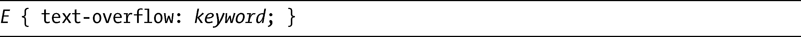
该属性允许使用的关键字值是clip和ellipsis。默认的值是clip，其作用就像我刚才所描述的：文本会在它溢出容器元素的点被截断。但真正有趣的新值是ellipsis，它会在溢出之前用一个省略号替换掉最后的全部或部分字符——看上去就像是三个点（...）。

我们来看一个例子，使用了下面的CSS代码：

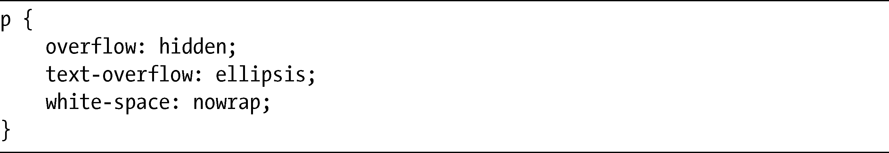
在这个p元素上，我把overflow设置为hidden，防止内容显示在边框外，把white-space设置为nowrap，防止文本被折叠成多行，还把text-overflow属性的值设置为ellipsis，结果如图6-9所示。

<b class="my_markdown">图6-9　使用值为ellipsis的text-overflow属性</b>

在这个句子中，最后一个单词被截断，并且使用一个省略号去替换被去掉的字符，预示此处发生了截断。

text-overflow属性在文本模块的最后一个草案中被去掉了，但它在编辑者草案（editor’s draft）中又恢复了，并且有望回到下一个工作草案中。目前，这个属性已经在Internet Explorer和WebKit中得到了实现，而在Opera中则需要使用-o-前缀。

文本模块还提供了第三个值，可以使用一串字符去代替省略号，如下：

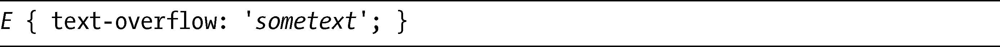
不过，这个值迄今为止在所有浏览器上都还没有实现。

### 6.4.2　改变元素大小

另外还有一个新属性，尽管实际不在文本模块当中，但对于那些内容比其容器宽的元素来说也是很有用的，那就是resize属性。该属性让用户能够对元素的大小进行控制，它提供了一个手柄，让用户可以通过手柄拖拽元素成为不同的尺寸。

该属性有以下语法：

keyword值规定了元素可以被拖拽的方向，分别有：horizontal或vertical，both或者none。在下面的例子中，我会展示一个resize属性值为both的p元素，使用这段代码：

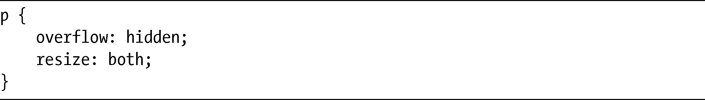
在图6-10中可以看到其实际效果，第一个例子展示了应用resize属性的元素，我们可以看到在其右下角有一个条纹状的手柄。在第二个例子中使用了相同的元素，但它被向外拖拽出来，所以我们可以看到更多的文本。

当前，所有的WebKit浏览器都支持resize，而Firefox 4也计划将其包含在内。在所支持的浏览器中，textarea元素默认被设置为both值。

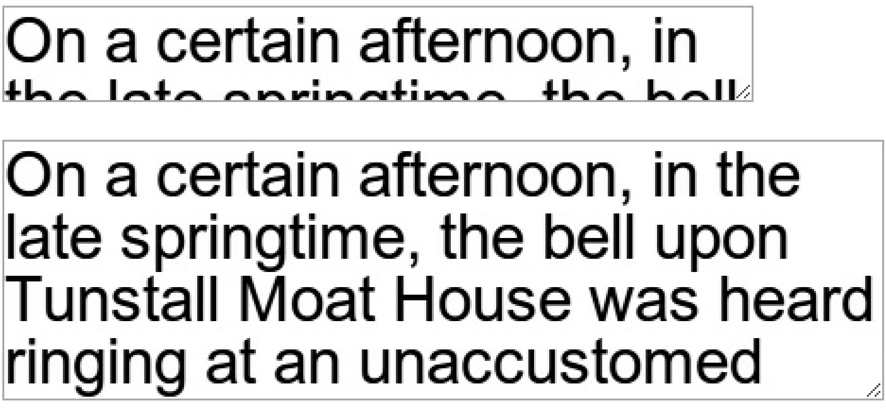

<b class="my_markdown">图6-10　可调整大小的文本框分别以默认尺寸（上）和扩大尺寸（下）显示</b>

### 6.4.3　文本对齐

text-align属性已经存在很长一段时间了，但CSS3为它添加了两个新的值：start和and。对于从左到右阅读的人来说，它们分别相当于值left和right。不过，对于那些可能会使用从右至左文本的国际化网站，它们才是真正发挥了作用。你可以在Firefox和Safari中使用这些新的值。

CSS3中新引入的是text-align-last属性，它允许你设置一个两端对齐块中的文本的最后（或唯一）一行的对齐方式。这个属性接受和text-align一样的值，但目前只在唯一一个浏览器上得到实现——Internet Explorer，而且还需要使用专门的-ms-前缀。

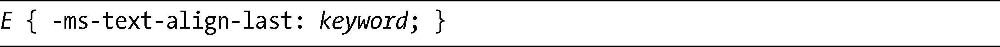
所以，如果我们要让一大块文本两端对齐，但只是把最后一行改为右对齐，可以使用：

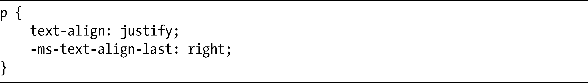
### 6.4.4　文本换行

我们在处理动态文本的时候，时常会面临一个问题，就是文本在不恰当的位置上发生了自动换行。例如，如果我们提供一个事件的细节，需要让开始时间和结束时间在同一行中紧挨着显示，但是如果文本发生了动态分行，结束时间也许就会被放到随后的一行中。而文本模块的目标就是对此提供更多的控制，解决这一类的问题。它提供了一组属性，可以更加明确地定义文本换行的方式。

#### word-wrap属性

第一个属性是word-wrap，它指定了浏览器是否可以把长单词折断，使其容纳在父元素中。其语法是非常简单的：

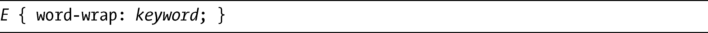
这个属性允许使用的关键字值是normal或者break-word。前者指定文本行只能在两个单词之间折断（除非在标记中另有指定），而后者则允许单词在需要防止溢出父元素的时候折断。

举例来说，如果我要允许长单词被折断而不是在其包含元素中溢出，我可以使用：

图6-11展示了这一效果。左边的文本块没有使用单词换行，而右边的文本块则使用了单词换行。

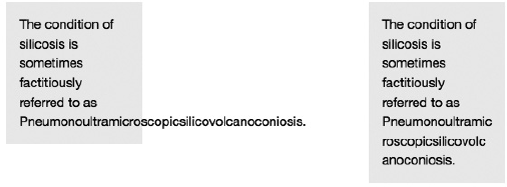

<b class="my_markdown">图6-11　使用word-wrap属性的文本示例，左边的例子不使用break-word值，右边的例子使用了break-word值</b>

word-wrap属性在主流的浏览器上有广泛的实现（是的，包括了Internet Explorer）。

#### text-wrap属性

text-wrap属性的作用也差不多，但是它设置的是文本行的换行参数，而非针对单个单词。以下是它的语法：

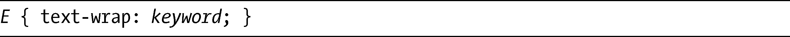
它接受四个关键字值：normal、none、unrestricted和suppress。默认的值是normal，表示换行将会发生在任何普通的中断点，取决于特定浏览器的布局算法；反之，none则将阻止任何形式的换行；suppress也将阻止换行，除非没有替代的选择，就是说如果兄弟元素没有可供使用的更方便的折断点，则折断会和设置了normal值一样的方式发生；最后的值是unrestricted，它表示文本行可以没有限制地在任何位置发生折断。

如果text-wrap被设置为normal或者suppress，你也可以应用word-wrap属性。例如，如果要让换行不发生，但是想在必要的时候允许单词折断，可以使用这种组合：

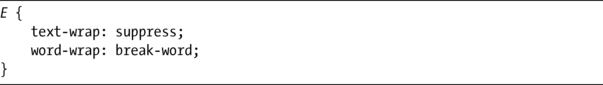
在我写这本书的时候，text-wrap属性仍然没有得到实现。

### 6.4.5　设置文本渲染选项

Firefox和WeKit浏览器支持一个名为text-rendering的属性，允许开发者控制文本渲染速度或者控制对文本可识别性的优化。这个新特性意味着开发者可以选择浏览器如何渲染页面上的文本。以下是它的语法：

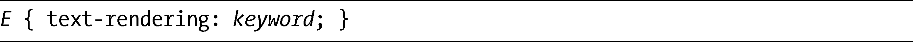
text-rendering属性有四个指定的关键字值：auto、optimizeSpeed、optimizeLegibility和geometricPrecision。默认值是auto，该值允许浏览器做出渲染的选择。optimizeSpeed表示速度优先于可识别性，禁用高级字体特性以得到更快的渲染；而optimizeLegibility则相反，会以速度为少许代价进行渲染。geometricPrecision关键字也许是一个未来的值，当前的作用就像optimizeLegibility一样。

为了更好地了解这个属性在实际中的作用，我们不妨考虑下面的代码示例：

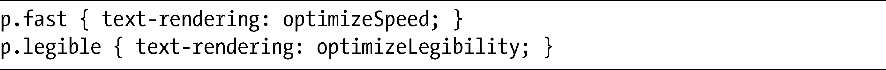
这段代码会为同一个p元素应用两种不同的优化效果，图6-12显示了其结果。第一个例子为文本渲染速度进行了优化，而第二个例子则为文本的可识别性进行了优化。

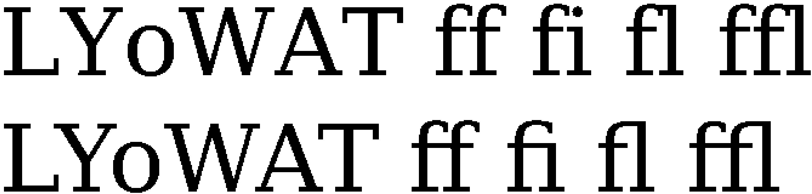

<b class="my_markdown">图6-12　比较为速度优化（上）和为可识别性优化（下）的文本</b>

例子中所使用的字体系列是DejaVu Serif。你应该清楚地看到两个文本元素之间的差异，特别是开头的大写Y和小写o以及结尾处的小写ffl字符。这种差异是很明显的，因为字体文件包含了用于字符的某种组合的特殊指令，可以改善单个字符之间的空间（称为字距调整），还可以把某些字符连结在一起（连字），从而提高文字的可识别性。

> 注意：
> Windows、OS X和Linux均使用不同的文本渲染方式，所以使用这种方式在用户系统上不可能总是获得同一效果。

WebKit浏览器提供了对文本渲染更加深入的控制：-webkit-font-smoothing属性。Mac OS X用户知道字体比在Windows上显示的更加柔和、丰满。这种差异是由于抗锯齿所造成的——也就是说，在这种方式下屏幕渲染的字体会显得柔和而非像素化。为了设置自己的字体抗锯齿级别，可以使用-webkit-font-smoothing属性：

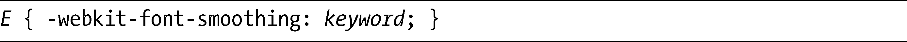
它的关键字值可以是subpixel-antialiased、antialiased或者none。默认值subpixel-antialiased提供了在Mac浏览器中所见到的平滑字体，而none值则会显示没有平滑边缘的锯齿状字体。虽然有些人觉得Mac字体有点过于臃肿，但没有人会喜欢没有抗锯齿的字体，所以antialiased值在二者之间提供了一种平衡。

图6-13对这三者进行了比较。第一行文本的值是subpixel-antialiased，它具有加粗的、丰满的字符。第二行的值是antialiased，所以文本显示得更细一些，但仍然非常清晰。最后一行的值是none，显示效果是锯齿状的，非常没有吸引力。

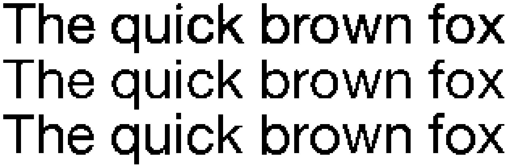

<b class="my_markdown">图6-13　比较Safari中的-webkit-font-smoothing值（从上到下）:
 subpixel-antialiased、antialiased和none</b>

这个属性为WebKit浏览器所独有，它并没有出现在任何的CSS3模块中。

### 6.4.6　应用标点属性

许多排版人员喜欢把标点固定到文本块的页边空白处，如图6-14所示。直到现在，如果我们要实现这种效果，就必须在text-indent属性上使用一个负值，如下：

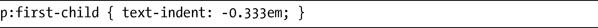

<b class="my_markdown">图6-14　固定标点的例子</b>

然而，这种方法要求我们对文本有很好的控制，可是现实情况通常不是这样，而提议的hanging-punctuation属性正是解决这一问题的尝试。这是它的语法：

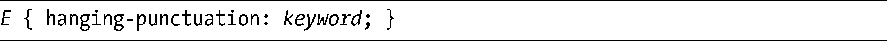
其关键字值可以是：start、end或者end-edge。这些值定义了标点是否可以分别固定在首行文本起始处、首行文本结尾处或所有行的结尾处的外部。该属性当前还没有被实现，也没有被完整地描述，所以也许会在未来的修订中被去掉。

另外还有一种标点排版的习惯，就是当某些标记出现在文本块的开头或结尾处，或者当某些组合紧挨着出现时（例如，像)]），就把某些标记中的空格去掉（即字距调整）。punctuation-trim属性就是为此而创建的，它的语法如下：

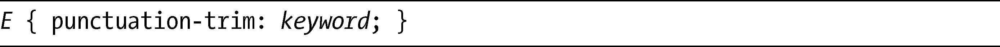
对于这个属性，所允许的关键字是：none、start、end和adjacent。它们描述了文本块中哪些位置可以被修剪。这个属性在我写这本书的时候仍然没有得到实现。

