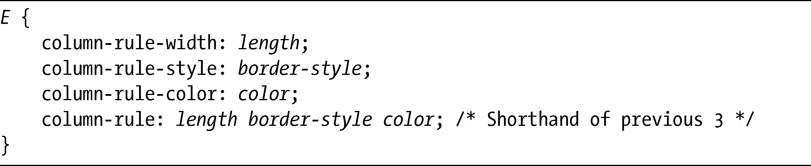
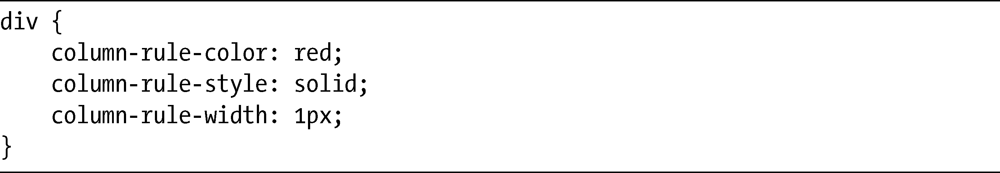
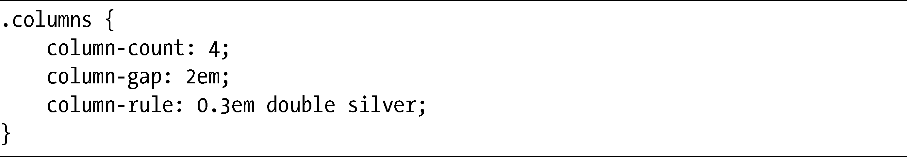

### 7.2　列间隔与分界线

在使用规范的多列布局的时候，浏览器应该会在每一列之间放入默认的1em的间隔（记住在使用动态布局的时候，1em是最小的宽度，如图7-5所示）。不过，你可以使用两个新的属性column-gap和column-rule去修改默认的值并指定自己的间隔距离。

第一个属性column-gap设置了各列之间的空间，它的语法是非常简单的：

length值可以是带有标准CSS长度单位的任何数字。以下是一个例子，它将在生成的各列中间放入2em的间隔（不过在第一列和最后一列外面不会放入间隔）：

第二个属性是column-rule，它画了一条线，类似于一条边界，等距离地位于各列之间。column-rule的语法实际就是三个子属性（column-rule-width、column-rule-style和column-rule-color）的简写。这些子属性使用的值与CSS2中等效的border-*属性是一模一样的。以下是其语法：

如果要添加真实的值，可以像下面这样：

之后可以使用column-rule简写属性同时设置全部三个子属性，如下：

现在我演示了两个新属性的语法，我们来看一个演示column-gap和column-rule简写属性的例子：

这个例子把元素的子元素分割成四列，每列之间有2em的间隔以及0.3em宽的边界。间隔在边界的每一边都均等地分配，也就是有1em的间隔、0.3em的边界和另一个1em的间隔。分界线的宽度会被添加到间隔的宽度上，所以两列之间的距离就是2.3em。可以在图7-9中看到这个例子的结果。

<b class="my_markdown">图7-9　列之间的间隔和分界线</b>

