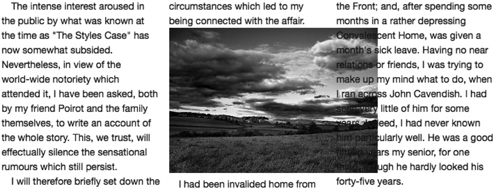
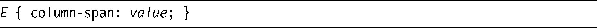
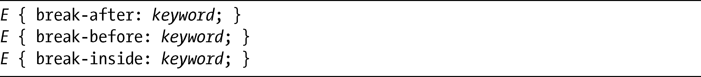
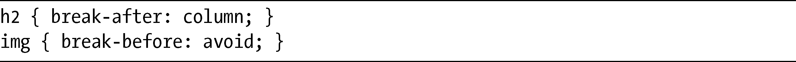

### 7.3　列中的包含元素

迄今为止，在这些例子中我只使用了文本块，所以文本会整洁地流入各列之中。但是如果有较大的元素又会怎么样呢？比如说对于比某一列的宽度还要宽的图片，Firefox和WebKit对待它们的方式是不同的，后者会遵循规范的内容去处理。

我们来看看每种浏览器中不同的解决方案，先使用img元素，把一张图片添加在分列布局的内部。首先，先看看Firefox中的结果，显示在图7-10中。

<b class="my_markdown">图7-10　在Firefox中宽度超过一列的img元素</b>

正如你所看到的，图片显示在第二列中，并且会延伸到第三列，在第三列中它在文本后面是可见的。现在我们看看在WebKit中显示的相同内容，如图7-11所示。

这幅图片显示的位置和前一个例子一样，但现在溢出部分被隐藏了，它在column-gap的中间位置被裁剪。这种实现效果是正确的，我们看看从规范中引用的这段话，就可以解释清楚了：

扩展到列间隔中的正常的内容流（例如，很长的文字或图片）会在列间隔的中部被修剪。

但是如果内容横跨多列的话又会发生什么呢——例如，如果要让图片跨越第二、第三列显示出来呢？如果在一列的结尾处有个标题，你不想让它分割到下一列，该如何处理呢？好消息是，多列布局模块的作者已经预料到这些可能性，并且提供了一些属性去处理这些情况；而坏消息是，在我写这本书的时候，还没有浏览器实现这些属性。

<b class="my_markdown">图7-11　在WebKit中宽度超过一列的img元素</b>

### 7.3.1　跨越多列的元素

为了处理那些需要横跨不只一列进行显示的元素，模块引入了column-span元素。它的语法是：

在这里，value只能是两个可能值之一：1或者all。默认情况下是1，它将让元素保持在分列流（column flow）中。另一个可选的值是all，将在流中出现中断——所有在元素（E）之前的内容将会分配到各列当中，所有在元素之后的内容也会被分配到各列中，但元素本身则不会。

### 7.3.2　打破多列的元素

到目前为止，我们主要都是对文本进行处理，而文本将自然地流过多列。但对于其他的元素，比如子标题或者列表，它们不应该在各列之中被拆分，这些又该如何处理呢？一列结束而下一列开始的点被称为中断（break），你可以使用break-after、break-before和break-inside属性覆盖自动生成的中断：

上面每个属性都接受一系列的关键字值：三个属性全部都接受auto和avoid值，而break-after和breadk-brefore属性允许使用一个额外的值：column。avoid值可以保证没有中断紧挨在指定元素之前或之后发生（不论应用了哪个属性），而column值的作用则是相反的，它强制中断发生在元素之后或之前。所以这些属性的默认值都是auto，它既不强制也不禁止中断的发生，让浏览器去决定中断是否应该发生在元素前面、后面或内部。

这些属性可以被应用到不突破一列的元素上，它们会命令浏览器在列的哪个地方应用中断。这里是两个例子：

在第一个例子中，列中断将会紧随在h2元素之后强制发生，不管中断在那里是否应该自然发生。在第二个例子中，中断永远不会在img元素之前发生，而只会在一种情况下发生，那就是img将会被放置在列的底部，img之后才会出现中断。

