### 9.1　为边框添加圆角效果

在网页设计的早期，设计人员就已经把圆角效果添加到页面元素上。但如果不使用图片的话，他们就无法创建这种效果，这听起来似乎不可思议。为了创建一个带四个圆角的具有灵活宽度的方框，就意味着我们需要生成四张图片并至少添加两个额外的非语义元素，这使得网站的维护与原先相比要困难得多。

但这种情况已经一去不复返了。背景与边框模块引入了一种新的方法，我们只要单独使用CSS，就可以为元素添加圆角效果。其中，每个边角都会被当作是一个四分之一的椭圆，它通过在x 轴和y 轴上这个两点之间绘制一条曲线进行定义（你也许还记得第6章的这些内容）。图9-1更为清晰地举例进行了说明。

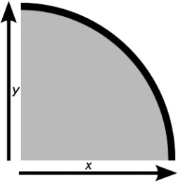

<b class="my_markdown">图9-1　x 轴和y 轴之间的一段曲线生成的四分之一椭圆</b>

四分之一的椭圆可以是规则的，即两条轴线上的长度都是相同的；也可以是不规则的，即每条轴线的长度均不相等。图9-2展示了这两种情况。

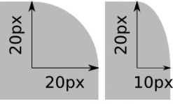

<b class="my_markdown">图9-2　规则曲线（左）在两条轴线上均有相等的值；不规则曲线在每条轴线上均有不同的值。</b>

CSS3使用border-radius属性去定义这些曲线。该属性允许你使用下面的语法简单地定义四分之一椭圆的半径：

在这种语法中，v是一个为top或者bottom的关键字值，h是为left或者right的关键字值，而x和y值则是定义四分之一椭圆的曲线在轴线上的长度。虽然听上去有些绕口，但我们看看下面这个例子应该可以更清楚一些：

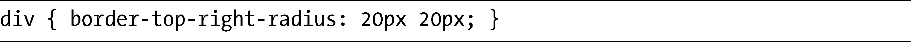
该语法会使用20px的水平和垂直半径，即用一条规则曲线把一个div元素的右上角变成圆角。

事实上，对于规则曲线来说，border-radius可以更进一步简化，只需留下x或y值即可。如果其中的一个值未作指定，这两个值就会被假定是相等的。所以如果要在元素的每个边角上应用这一半径，可以使用这段代码：

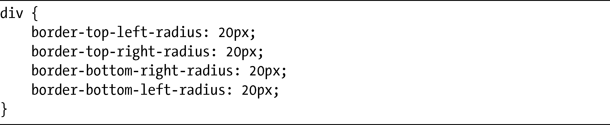
图9-3展示了其结果。

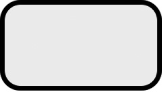

<b class="my_markdown">图9-3　四个相等的规则圆角</b>

如果要创建不规则曲线，只需要在个别属性上使用不同的值，如下：

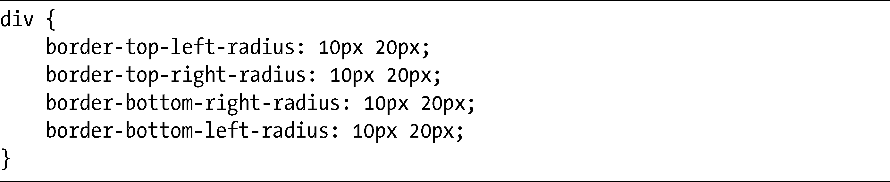
该语法创建的形状如图9-4所示。

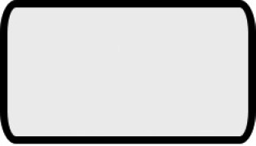

<b class="my_markdown">图9-4　四个不规则圆角</b>

### 9.1.1　border-radius简写

如果一定要为每个边角编写一个不同的属性，这些非常重复的事情将会令你大受打击。所以，当你获悉有一个简写属性可以使用的时候肯定会相当高兴。和border-width、margin以及padding一样，你也可以指定1个、2个、3个或者4个值。不过，在那些属性中这些值会对应到边，而border-radius的值则会对应到角，从左上角开始：

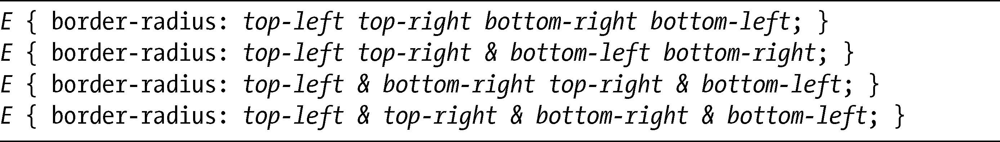
如果你使用规则圆角的话，只能够像这样去使用简写语法。换言之，水平值和垂直值必须是相同的并且使用一个单独的长度去定义（马上我就会谈到不规则边角的简写）。

为了演示简写属性的实际作用，我打算绘制三个方框，每个方框都使用一组不同的值：

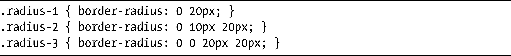
你可以在图9-5中看到输出的结果。

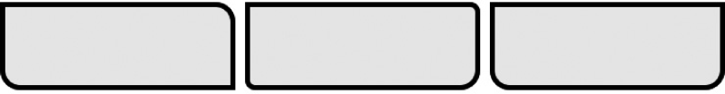

<b class="my_markdown">图9-5　border-radius简写属性不同值的效果</b>

第一个方框（左）为border-radius设置了两个值：左上角和右下角的值都是0，所以是直角的，但右上角和左下角则是半径为20px的圆角。第二个方框（中）有三个值：左上角也是直角，但现在右上角和左下角有10px的半径，而右下角则是20px的半径。最后一个方框（右）有四个值：左上角和右上角的值是0，所以是直角，而右下角和左下角的半径都是20px。

你也可以对不规则曲线使用简写语法。为了实现这种效果，需要列出用斜杆（/）隔开的值，如下：

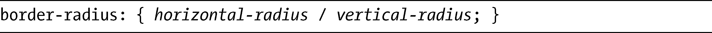
斜杆的两端均可以包含一至四个值，如同规则曲线的简写一样。举例来说，这就意味着你可以为水平半径设置一个值，然后为垂直半径设置四个单独的值。我会再次演示一下实际应用中的效果：

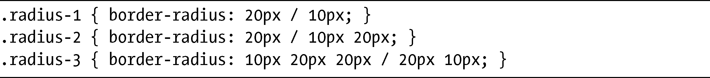
其结果如图9-6所示。

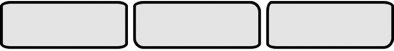

<b class="my_markdown">图9-6　使用border-radius简写属性产生的不规则圆角</b>

第一个方框（左）有四个水平半径为20px、垂直半径为10px的相同边角。第二个方框（中）有两个20px/10px和两个20px/20px。最后一个方框（右）的左上角是10px/20px，右上角和左下角是20px/10px，而右下角则是20px/20px。

### 9.1.2　各种浏览器实现的差异

本章目前所使用的语法都是在规范中出现的，所以你可以认为它是权威的。但如果在实际中要使用圆角的话，就必须知道各种浏览器是如何实现border-radius属性的。

Opera（10.5+）和最新版本的WebKit按照规范的要求支持了这一语法，反之之前的WebKit浏览器（比如Safari 4.04及以下版本）在每个属性前面都需要使用专用的-webkit-前缀，而第4版以下的Firefox完全使用不同的模式。Mozilla浏览器当前使用的是下面的语法：

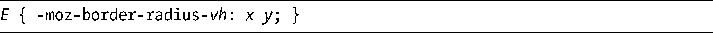
这意味着如果我们要把半径应用到元素的左上角，代码要像这样写：

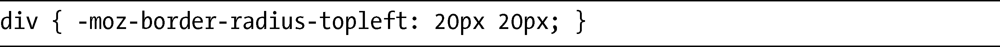
同样，较老版本的WebKit——比如最新的4.04版以前的Safari所使用的内核，对于border-radius简写属性的实现并不正确，它只接受一个单独的值。如果想要实现四个规则边角以外的其他效果，就必须为每个border-*-*-radius属性指定单独的值，就像在本章开头展示的那样。

