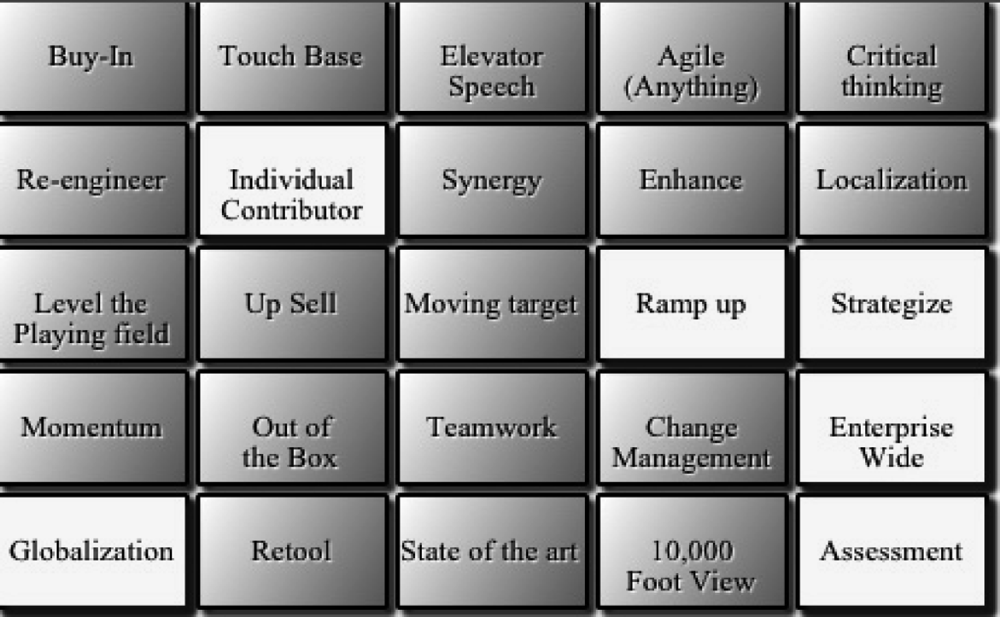

### 10.1.3　应用程序代码

创建好所有的函数和TextButton对象原型后，实际的应用程序代码是非常简单的。因为这是一个完全基于事件的应用程序，不需要主循环，也不需要设置其他的状态或按钮，例如标题屏或者重置按钮。这样做可能对用户不太友好，但是对于这个简单示例足够了。这也使得应用程序的代码非常简单。

```javascript
// **** 开始应用程序
　 var gr = context.createLinearGradient(0, 0, 100, 100);
　 // 添加渐变色节点
　 gr.addColorStop(0,'#ffffff');
　 gr.addColorStop(.5,'#bbbbbb');
　 gr.addColorStop(1,'#777777');
　 theCanvas.addEventListener("mousemove", onMouseMove, false);
　 theCanvas.addEventListener("click", onMouseClick, false);
　 initSounds();
　 initButtons();
　 initLists();
　 chooseButtonsForCard();
　 drawScreen();
```

首先，创建一个共享的线性渐变色，所有 TextButton 实例都可以使用。接下来，为鼠标的单击事件和移动事件添加监听器。最后，运行函数设置卡片，接着等待用户按下一个按钮。这就是全部代码了。这里甚至没有添加一个宣布用户获胜的方式。将这个程序扩展为一个完整的应用非常简单，因此留给感兴趣的读者来完成。

图10-1展示了最终的应用程序的效果。


<center class="my_markdown"><b class="my_markdown">图10-1　在桌面版的Safari中运行BS Bingo游戏</b></center>

接下来，本书将介绍如何将这个游戏修改为一个基于Web的、全屏的iOS程序。

