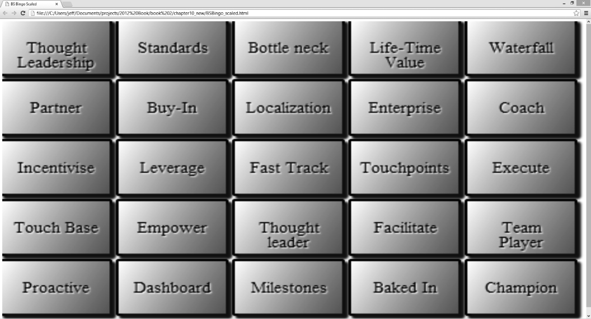
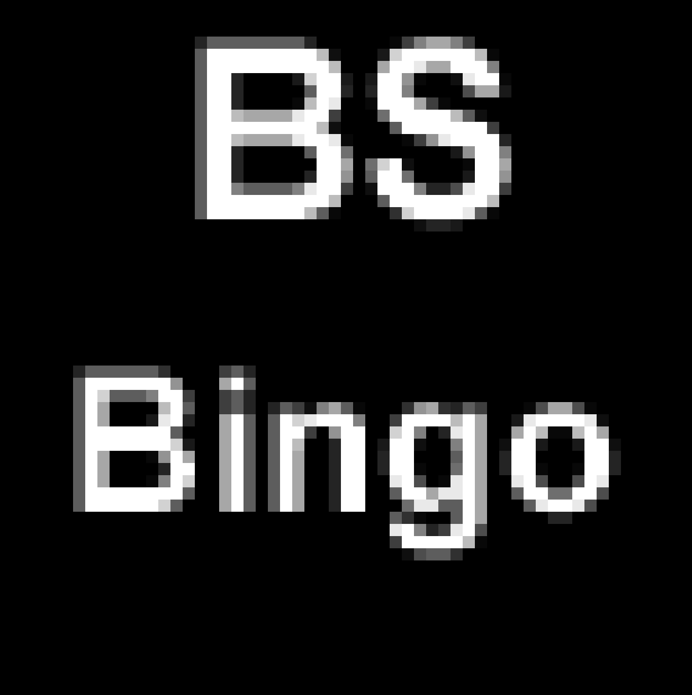
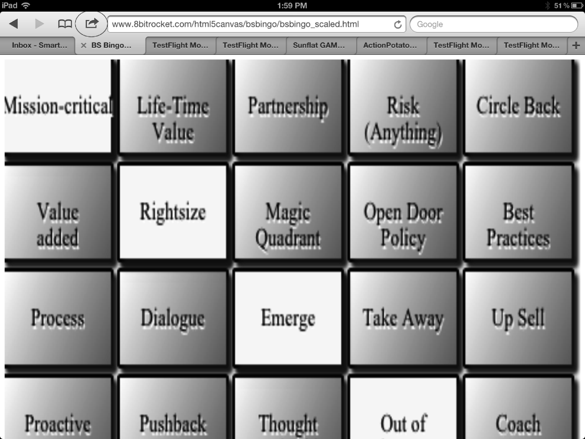

### 10.1.4　针对浏览器修改游戏

当面向移动版Safari浏览器开发HTML5 Canvas应用时，最有意思的事情是可以很容易地开发一个面向iOS设备的全屏应用，并且可以允许用户在主屏幕上添加一个应用程序图标。点击这个图标就可以在全屏状态下运行该应用（没有顶部的浏览栏），这个程序就像从iTunes上下载的一样。唯一需要注意的是，应用程序实际上是一个托管在Web服务器上的网页，用户需要上网才能使用。

#### 1．创建全屏的移动版BS Bingo游戏

现在，在浏览器中运行游戏。游戏画面被挤到了浏览器窗口的左上角，虽然可以正常运行，但是对于手机浏览器来说画面太小了；而对于平板电脑来说，画面被挤到了一个角落。让游戏能够在桌边电脑和移动设备上缩放画面并不困难，但是需要对现有的bsbingo.html代码文件做一些修改和补充。

游戏画面的横纵比对于移动版Safari的全屏应用来说并不理想，因此正如读者所见，按钮和文本看起来有像素的颗粒感，而且对于iOS屏幕的适配效果不好。

然而，这仅仅是两个示例中的第一个，它让读者可以在实践中学习到应该对本章的第二个示例做什么样的修改才能让它更好的适配iOS设备的屏幕。

#### 2．修改Canvas的样式属性

为了辅助.html文件进行定位和缩放，需要添加一些新的样式。新版本的文件名称为bsbingo_scaled.html。以下是能够将Canvas全屏显示的样式。

```javascript
<style>
<style type="text/css">
　　　　html, body {
　　　　　　background-color: #2f9acc;
　　　　　　margin: 0px;
　　　　　　padding: 0px;
　　　　　　color: #fff;
　　　　　　　height: 100%;
　　　　　　　overflow: hidden;
　　　　}
　　　　#canvas {
　　　　　　overflow: hidden;
　　　　　　image-rendering: optimizeSpeed;
　　　　　　-ms-interpolation-mode: nearest-neighbor;
　　　　　　-webkit-optimize-contrast;
　　　　　　 width:100%;
　　　　　　 height:100%;
　　　　}
　　　　 :webkit-full-screen {
　　　　　　width: 100%;
　　　　　　height: 100%;
　　　　}
</style>
```

上面的样式可以将<BODY>标签和画布强制缩放至全屏幕显示，并且限制滚动条的尺寸。

图10-2演示了bsbingo_scaled.html在桌面浏览器中运行的样子。


<center class="my_markdown"><b class="my_markdown">图10-2　BS Bingo在Chrome浏览器中缩放至合适大小</b></center>

#### 3．更新监听鼠标事件的代码

现在的游戏画面已经能够自动缩放，但是当前监听鼠标事件的代码还不能正确判断用户的点击操作。为了能够在画布进行缩放之后正确识别鼠标点击，需要添加下面的代码。

```javascript
function onMouseClick(e) {
　　var mouseX;
　　var mouseY;
　　var xFactor = theCanvas.width / window.innerWidth;
　　var yFactor = theCanvas.height / window.innerHeight;
　　var mouseX1 = event.clientX - theCanvas.offsetLeft;
　　var mouseY1 = event.clientY - theCanvas.offsetTop;
　　mouseX = mouseX1 * xFactor;
　　mouseY = mouseY1 * yFactor;
　　//找出被点击的按钮
　　var col = Math.floor(mouseX/(92));
　　var row = Math.floor(mouseY/(57));
　　console.log("row",row,"col", col);
　　tempButton=buttons[row][col];
　　clickSound.play();
　　tempButton.pressDown();
　　tempButton.draw(context);
}
```

变量xFactor和yFactor是上面的代码中的关键，它们分别乘以mouseX和mouseY可以得到新的坐标值。这样，当应用新的缩放比例时就可以比较容易地确定col和row的值。

缩放系数可以通过使用当前画布的宽度和高度分别除以浏览器的实际大小（window. innerWidth和window.innerHeight）来确定。这样可以得到横纵两个方向的缩放系数，然后，将它们应用于鼠标指针的位置后，就可以将相对于浏览器的像素位置转换为画布上的像素位置了。在公式中无须考虑缩放问题，使用程序原有的算法就即可，也不需要考虑Canvas被缩放之后的实际尺寸。

读者需要注意一个问题：如果屏幕被纵向滚动，那么代码就不能正常工作了。这就是为什么要将这个应用设计为一个可以从iOS设备主屏幕运行的全屏应用的原因，这样可以尽可能地消除滚动带来的问题。

提示

> 如果读者在可滚动的浏览器窗口中使用event.clientX和event.clientY的值时遇到mouseX和mouseY定位不准确的问题，可以使用event.pageX和event.pageY进行替换。在大多数浏览器中，进行替换后都可以适用于屏幕滚动的情况。

#### 4．为iOS设备添加meta标签

添加meta标签可以帮助iOS设备在缩放模式下正确识别视窗大小，而且还可以定义图标。开发者通过图标可以允许用户在iOS设备上添加一个网页游戏的链接，这样就可以像其他应用一样，点击图标运行游戏了。

```javascript
<meta name="viewport" content="initial-scale=1 maximum-scale=1
　　　user-scalable=0" />
<meta name="apple-mobile-web-app-capable" content="yes" />
<meta name="apple-touch-fullscreen" content="yes">
<link rel="apple-touch-icon" href="bsicon.png" >
```

图10-3和图10-4展示了本示例中使用的图标和按钮。


<center class="my_markdown"><b class="my_markdown">图10-3　57×57的图标（为方便查看进行了放大）</b></center>


<center class="my_markdown"><b class="my_markdown">图10-4　点击屏幕顶部的按钮可以在主屏幕添加图标</b></center>

