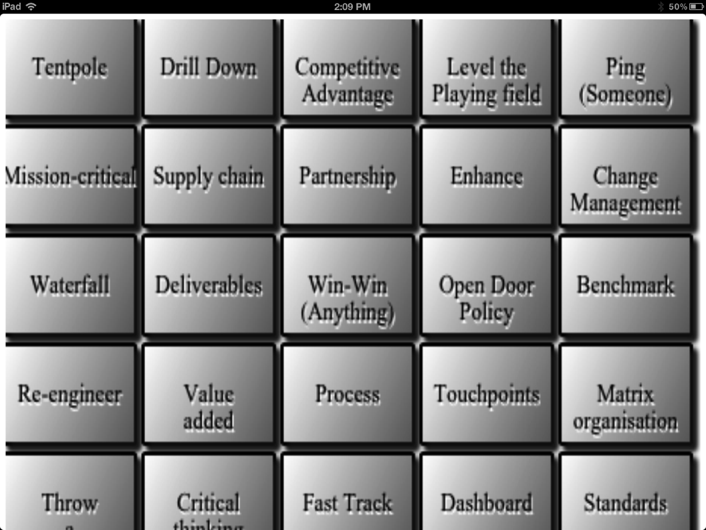

### 10.1.5　在真实设备上测试游戏

读者可以访问以下网站查看在线的示例文件：<a class="my_markdown" href="['http://www.8bitrocket.com/html5canvas/bsbingo/bsbingo_scaled.html']">http://www.8bitrocket.com/html5canvas/ bsbingo/bsbingo_scaled.html</a>。

读者可以访问O’Reilly的网站（<a class="my_markdown" href="['http://oreil.ly/html5-canvas-2edition']">http://oreil.ly/html5-canvas-2edition</a>）下载本书的代码包，其中，在Chapter10目录下可以找到bsbingo文件夹，该文件夹包含了本示例的全部文件。

文件夹中包含以下文件：

+ bsbingo_scaled.html；
+ bsicon.png；
+ click.mp3；
+ ConsoleLog.js；
+ modernizr-min.js；
+ TextButton.js。

为了将上述网页（或开发者自己的页面）添加到iPad或iPhone的桌面上，仅需要访问该页面，然后点击浏览器地址栏旁边的“添加到主屏幕”按钮。图10-4展示了在iPad上使用移动版Safari浏览器打开bsbing_scaled.html页面的样子，“添加到主屏幕”按钮是圆圈中标注的位于屏幕顶部紧挨地址栏的按钮。

当点击“添加到主屏幕”按钮时，系统会询问用户是否要使用设计好的bsicon.png图片作为图标。系统还会要求用户输入一个用于在主屏幕上显示在图标下方的文字名称。点击图标，输入名称，图标就会被添加到设备的主屏幕上，就好像其他应用一样。此时，再次运行应用发现浏览器的地址栏没有出现，而且游戏画面可以完美的匹配iPad和iPhone的屏幕了。图10-5展示了运行于此种模式的游戏画面。

<b class="my_markdown">图10-5　从主屏幕启动游戏</b>

读者可能已经注意到，这个示例没有针对缩放后的屏幕选定一个匹配的横纵比。不过，第一个示例仅仅用于入门。虽然这里没有实现这个功能，但是可以尝试修改代码，通过为程序添加边框的方式，将横纵比锁定为640×480，这样可以更好地与屏幕进行适配。如果读者选用640×480或1024×768的画布开发游戏，那样效果会更好。接下来，将第9章介绍的扩展版GeoBlaster游戏进行改造升级为一个全屏的应用。首先在桌面浏览器中测试，然后成为一个移动版Safari应用。这个游戏将使用更完美的横纵比。

