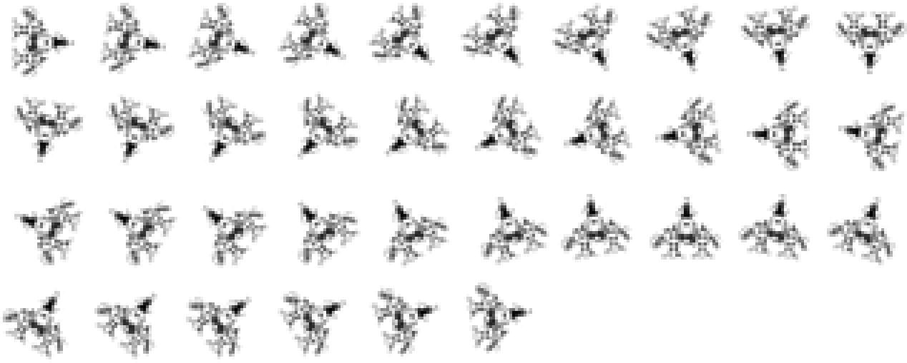
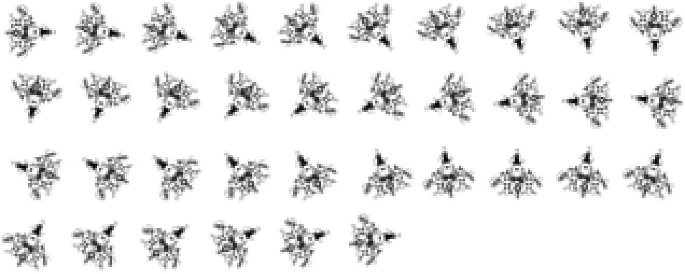
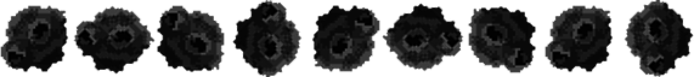
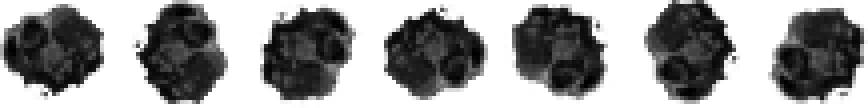
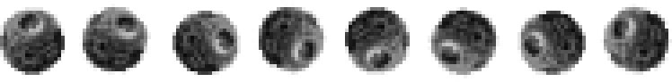
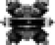
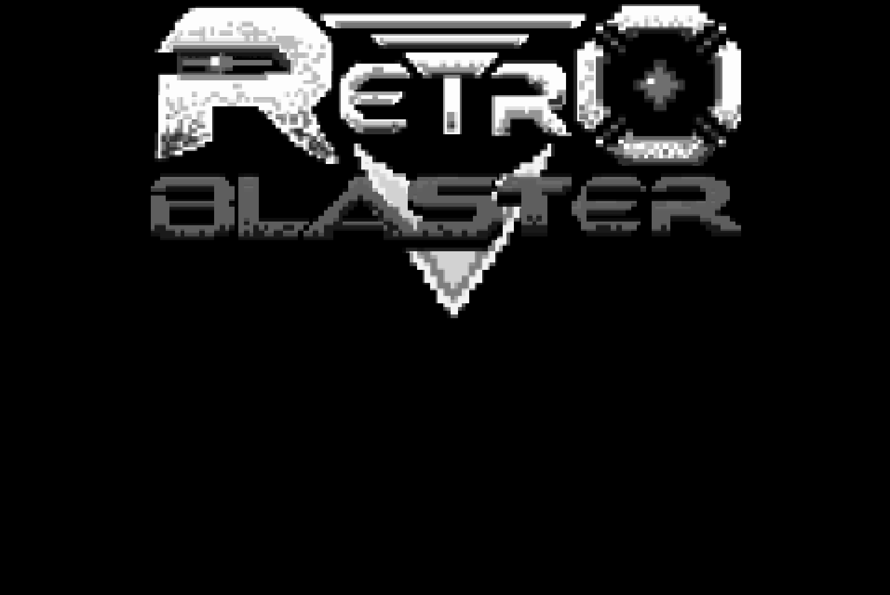
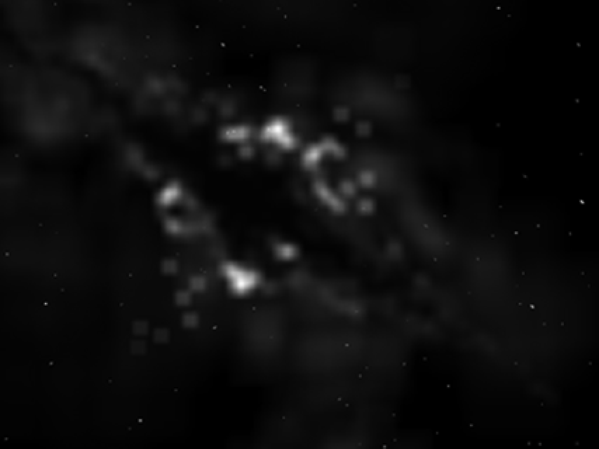

### 10.2　触屏版的Retro Blaster游戏

我们将以第9章中介绍的扩展版GeoBlaster游戏为基础，优化图形界面，然后将它修改为支持触摸控制的版本。鼠标移动和触摸移动是桌面电脑和移动版Safari上两种不同的操作行为，因此大部分的代码改动都集中在这个方面。在这个游戏中还将加入自动射击的设置，这是因为我们不希望用户必须通过在屏幕上进行复杂按键操作才能发射导弹。

原版的Retro Blaster是作者曾经开发的一个独立Flash游戏。如果读者上网搜索“8bitrocket Retro Blaster”应该可以找到不少结果。不过，网上的版本与本章将要创建的游戏相比要更加复杂。本章需要做的就是用Retro Blaster游戏中的图片替换扩展版GeoBlaster中的图片，然后再添加一个游戏的背景图片和启动画面。

图10-6和图10-7展示了本次将要使用的新飞船的图片表。

<b class="my_markdown">图10-6　Retro Blaster的飞船图片表1</b>

<b class="my_markdown">图10-7　Retro Blaster的飞船图片表2（有推进器火焰）</b>

图10-8、图10-9和图10-10展示了在触屏版Retro Blaster游戏中使用的大型、中型和小型陨石的图片表。

<b class="my_markdown">图10-8　Retro Blaster的大型陨石图片表</b>

<b class="my_markdown">图10-9　Retro Blaster的中型陨石图片表</b>

<b class="my_markdown">图10-10　Retro Blaster的小型陨石图片表</b>

此外，还有一套爆炸碎片的图片和一个攻击玩家飞船的飞碟图片。图10-11和图10-12分别展示了这两幅图片。

<b class="my_markdown">图10-11　放大10倍的Retro Blaster爆炸碎片的图片表</b>

<b class="my_markdown">图10-12　Retro Blaster中敌人飞碟的图片</b>

除了游戏中的动态元素，本例还创建了一个启动屏幕的图片，背景图片和游戏在主屏幕的图标。如图10-13、图10-14和图10-15所示。

<b class="my_markdown">图10-13　Retro Blaster的启动画面</b>

<b class="my_markdown">图10-14　Retro Blaster的游戏背景图</b>

<b class="my_markdown">图10-15　64×64的主屏幕图标（印刷时进行了放大）</b>

上面介绍了新的游戏素材，接下来介绍将游戏放大到浏览器窗口大小，以及添加鼠标和触摸事件的所需要修改的代码。

