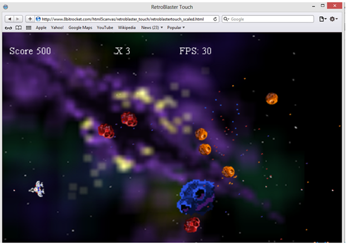
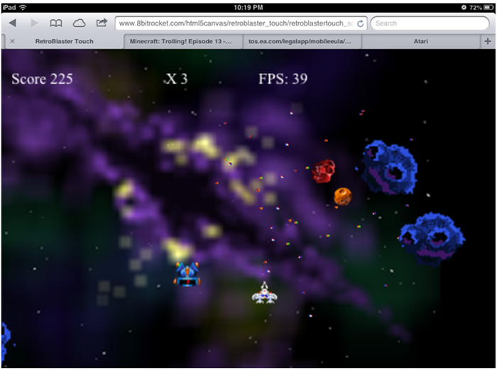
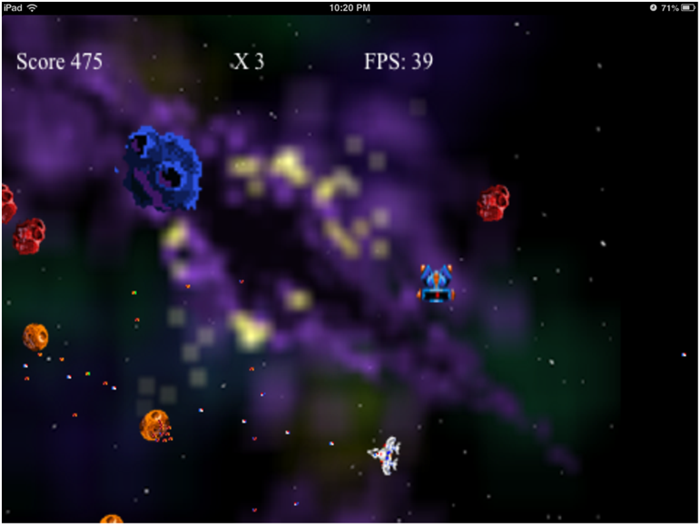

### 10.3.2　触摸移动事件

桌面鼠标与移动设备的一大区别就是手指触摸。手指触摸屏幕时的触摸事件等同于鼠标点击事件。因此，可以利用与bsbingo_scaled.html相同的基础代码。对于触屏版的Retro Blaster来说则需要将两种事件分开处理。一种用于处理手指触摸，一种用于处理鼠标操作。缩放系数的确定方法可以采用与bsbingo_scaled.html中一样的算法。使用缩放系数，不论在哪种设备上（桌面版Safari或移动版Safari）运行游戏，都可以在鼠标事件中计算出正确的x轴和y轴坐标。

#### 1．新的全局变量

定义一组新的全局变量用于在游戏屏幕上移动玩家飞船。

```javascript
//触摸
var mouseX;
var mouseY;
var touchX;
var touchY;
```

在触摸和鼠标事件的监听函数中，将手指或鼠标在屏幕上的坐位置转换为mouseX和mouseY的变量值。在使用移动设备时，将通过touchX和touchY变量获取和设置mouseX和mouseY的值，在使用桌面浏览器时，则直接使用mouseX和mouseY变量。代码将在下一小节中展示。

#### 2．新的事件监听函数

当玩家飞船启动时，将在GeoBlaster扩展版中的gameStatePlayer()函数里面添加几个新的函数。

```javascript
theCanvas.addEventListener("mousemove", onMouseMove, false);
theCanvas.addEventListener("touchmove", onTouchMove, false);
```

为每个事件添加一个事件监听函数，以及添加一个专门用于将touchX和touchY赋值给mouseX和mouseY的函数。这样，游戏不需要知道当前是在何种设备上运行，也可以采用同样方式处理鼠标和触摸事件。

```javascript
function onMouseMove(e) {
　　var xFactor = theCanvas.width / window.innerWidth;
　　var yFactor = theCanvas.height / window.innerHeight;
　　var mouseX1 = event.clientX - theCanvas.offsetLeft;
　　var mouseY1 = event.clientY - theCanvas.offsetTop;
　　mouseX = mouseX1 * xFactor;
　　mouseY = mouseY1 * yFactor;
　　allMoveHandler(mouseX,mouseY);
}
function onTouchMove(e) {
　　if (e.touches.item(0)) {
　　　　targetEvent = e.touches.item(0);
　　}else{
　　　　targetEvent = e;
　　}
　　touchX1=targetEvent.clientX-theCanvas.offsetLeft;
　　touchY1=targetEvent.clientY-theCanvas.offsetTop;
　　xFactor = theCanvas.width/window.innerWidth;
　　yFactor = theCanvas.height/window.innerHeight;
　　touchX=touchX1*xFactor;
　　touchY=touchY1*yFactor;
　　allMoveHandler(touchX,touchY);
　　e.preventDefault();
}
function allMoveHandler(x, y) {
　　mouseX=x;
　　mouseY=y;
}
```

在onMouseMove()函数中，通过当前画布的尺寸和浏览器窗口的尺寸计算xFactor和yFactor的值。在每个事件监听函数中都将重新计算这两个值，以防上次计算之后，窗口大小发生了改变。然后调用allMoveHandler()函数，将计算出来的坐标赋值给mouseX和mouseY。

allMoveHandler函数负责将出入的数值赋值给mouseX和mouseY变量。这里不是必须的，因为这两个变量都是全局变量。但是在下一个函数onTouchMove中，需要设置touchX和touchY，并将它们传入到这个函数中。为了防止将来在allMoveHandler()函数中有可能进行更多的操作，在两个事件监听函数中都对它进行了调用。尽管本例中这样做会存在一些冗余，但是在一个大型游戏中将它抽象为一个可重用的函数是非常有必要的。

onTouchMove函数对于读者可能有一些陌生。这是因为不是所有浏览器都提供了一样的触摸事件。有些将触摸事件作为一个数组提供，有些则将它处理为一个实际事件。为了能够兼容尽可能多的设备，这里首先检查e.touches数组中是否存在第一个元素。如果存在，那么就访问该元素的属性来计算当前的触摸位置。如果不存在，则直接使用参数e的属性进行计算。

除此之外，touchX和touchY的计算方法与onMouseMove函数中计算mouseX和mouseY的方法一样，需要确保手指的移动事件不要传递到手机上的Safari浏览器中，否则将会导致浏览器窗口移动，而不是飞船移动。因此，此处需要调用e.preventDefault()函数。

提示

> 如果读者在可滚动的浏览器窗口中使用event.clientX和event.clientY的值时遇到mouseX和mouseY定位不准确的问题，可以使用event.pageX和event.pageY进行替换。在大多数浏览器中，进行替换后都可以适用于屏幕滚动的情况。

#### 3．自动射击

另一个改变是发射子弹既需要玩家按某个按键，又不能点击屏幕。为此，将在updatePlayer()函数中添加以下代码。

```javascript
player.missileFrameCount++;
　　if (player.missileFrameCount>player.missileFrameDelay){
　　　　playSound(SOUND_SHOOT,.5);
　　　　firePlayerMissile();
　　　　player.missileFrameCount=0;
}
```

player.missileFrameCount和player.missileFrameDelay属性是在扩展版GeoBlaster的gameStateNewgame()函数中添加的新的player对象的属性。

```javascript
player.missileFrameDelay=5;
player.missileFrameCount=0;
```

#### 4．玩家的移动

飞船将跟随鼠标移动，不再响应任何方向键的操作。因此，需要在扩展版GeoBlaster的代码基础上删除checkKey()函数以及对该函数的引用。在updatePlayer()函数中，原本调用checkKey()函数原来的位置加入下面的代码。

```javascript
var radians=Math.atan2((mouseY)-player.y, (mouseX)-player.x)
var degrees=(radians * (180/ Math.PI));
var yChange=(mouseY-player.y)
var xChange=(mouseX-player.x)
var delay=16;
var yMove=(yChange/delay)*frameRateCounter.step;
var xMove=(xChange/delay)*frameRateCounter.step;
player.x=player.x+xMove;
player.y=player.y+yMove;
if (degrees <0) {
　　player.rotation=359+degrees;
}else{
　　player.rotation = degrees;
}
```

首先，计算飞船转向鼠标方向需要转动的弧度radians的值。然后，根据屏幕上玩家飞船位置与鼠标位置的差计算yChange和xChange变量的值。最后，计算出玩家移动的距离的实际值（xMove和yMove）。将delay变量的值设置为16。这个值起到了一个平滑缓动函数的作用，当鼠标或手指点击时，飞船不会生硬地直接飞过来。修改这个值就可以调整缓动的效果。

最后检查degrees变量值，确保它不小于0°。如果小于0，就加上359；如果不小于0，就直接使用degree的值进行计算。这样可以保证玩家飞船的角度永远在0～359之间，不会出现负值。

#### 5．测试游戏

完成后，看看最终的游戏效果。

读者可以在任何位置运行这个游戏。该游戏可以直接在本地文件夹中运行，但是，如果想在移动设备上运行，则必须将文件发布到读者自己的网络服务器上。

接下来，看一下3种不同的游戏版本。首先，图10-16展示了在桌面Safari浏览器中运行游戏的样子（在Chrome中也可以正常运行）。


<center class="my_markdown"><b class="my_markdown">图10-16　在桌面Safari浏览器中运行触屏版Retro Blaster</b></center>

接下来，图10-17展示了在移动版的Safari浏览器下，在主屏幕添加图标之前运行游戏的样子。


<center class="my_markdown"><b class="my_markdown">图10-17　在移动版Safari浏览器中运行触屏版Retro Blaster</b></center>

最后，图10-18展示了通过点击主屏幕图标之后运行游戏的样子。注意，此版本中浏览器栏和其他导航元素都没有被显示出来。


<center class="my_markdown"><b class="my_markdown">图10-18　从iOS主屏幕图标运行触屏版Retro Blaster</b></center>

至此，本书已经介绍了如何将应用程序在移动设备上进行缩放。这个游戏和其中展示的概念都可以用于创建更加巧妙的应用。本章的目的是向读者展示HTML5 Canvas的应用既可以非常容易地转换为桌面应用，也可以转换为移动版Safari浏览器器的应用，而且两种应用的工作模式类似。HTML5 Canvas的应用也可以很容易地转变为一个可以从iOS主屏幕上启动的应用，跟从iTunes应用商店中下载的程序一样。

提示

> 目前，声音还不能在所有的浏览器和平台上以相同的方式工作。比如，在移动版Safari浏览器中需要出发一个时间才能播放声音。再比如一个按钮点击事件，用户可以在屏幕上添加一个HTML的发射按钮，当点击按钮发射导弹的时候就可以播放一个射击的声音了。

