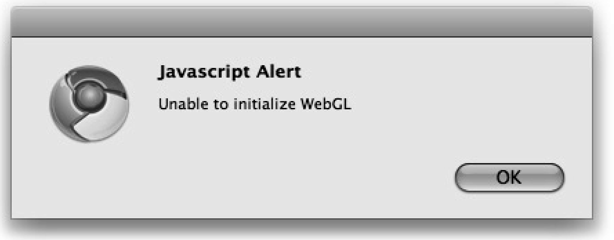

### 11.1.2　测试WebGL

首先，需要找到一个支持WebGL的浏览器。当运行一个WebGL应用时，如果浏览器不支持WebGL，可能会弹出一个类似图11-1所示的消息提示。


<center class="my_markdown"><b class="my_markdown">图11-1　在标准浏览器中运行WebGL应用</b></center>

目前，只有Google Chrome和FireFox的正式版支持WebGL。

一旦浏览器可以显示WebGL应用，就需要用户编写代码以实现功能。读者在开始操作时，首先需要访问WebGL环境代替Canvas的“2D”环境。因此，要替换在本书中一直使用的以下代码。

```javascript
context = theCanvas.getContext("2d");
```

使用experimental-webgl，如下所示。

```javascript
gl = theCanvas.getContext("experimental-webgl");
```

