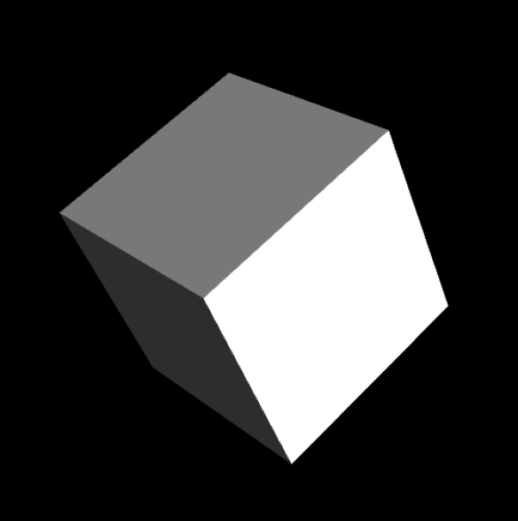

### 11.1.4　WebGL应用示例

现在将向读者展示一个WebGL应用程序的范例，这个应用会在Canvas上绘制一个旋转的正方体，如图11-2所示。由于很多人都不是3D图形的专家，因此本章不会向读者讲解每一行代码的意思。取而代之的是，将重点向读者介绍代码中有意思的部分，以帮助读者了解其运行原理。


<center class="my_markdown"><b class="my_markdown">图11-2　旋转的3D立方体（CH11EX1.html）</b></center>

这个是根据Giles Thomas的《Learning WebGL》第4课制作的。虽然这是一个简单的范例，但是可以帮助读者对于如何创建并制作一个WebGL的应用程序建立良好的概念。

提示

> 大部分代码是改编Giles Thomas的工作，并得到了他明确的书面许可。

#### 1．JavaScript类库

首先要添加一些JavaScript的类库。Modernizr 1.6包含了测试浏览器时是否支持WebGL的代码。这个版本刚刚发布，但它可能随时更新和添加新功能（写作本书时，它已经更新到了2.6版本），读者需要确保自己使用的类库是最新版本。

```javascript
<script src="modernizr.js"></script>
```

现在，需要包含一些JavaScript类库来辅助创建应用程序。读者可以发现，在大多数使用WebGL的应用程序中都会用到sylvester.js和glUtils.js这两个类库。sylvester.js类库可以帮助人们在JavaScript中进行矢量以及矩阵的数学运算。glUtils.js是一个sylvester.js的扩展项，可以帮助用户处理与WebGL相关的数学运算。

```javascript
<script type="text/javascript" src="sylvester.js"></script>
<script type="text/javascript" src="glUtils.js"></script>
```

#### 2．着色器

着色器是一段直接运行在显卡上的代码。这些代码描述了应该如何渲染一个场景，当使用WebGL时，就是指定3D画布应该如何渲染。这些代码通常都是进行大量的数学变换的运算，如果使用JavaScript进行运算会非常慢。实际上，之所以特别指出这些代码，是因为它们不是JavaScript代码，这些代码被写成WebGL可以识别的形式。这些代码段将会像文本文件那样被读入，然后传递给图形加速硬件。对类似于着色器的话题进行全面的讨论已经远远超出了本节的范围，但是本节将蜻蜓点水地介绍每个话题，以此为接下来的内容定下基调。

下面的第一个着色器是fragment shader。这个着色器告诉图形显卡此处将使用浮点数和混合色。第二个着色器是vertex shader：在创建三维物体时，将三维空间中的点定义为顶点。当在Canvas的3D环境中绘制每一个顶点时，都需要用到这个顶点着色器。

```javascript
<script id="shader-fs" type="x-shader/x-fragment">
　#ifdef GL_ES
　precision highp float;
　#endif
　varying vec4 vColor;
　void main(void){
　　gl_FragColor = vColor;
　}
</script>
<script id="shader-vs" type="x-shader/x-vertex">
　attribute vec3 aVertexPosition;
　attribute vec4 aVertexColor;
　uniform mat4 uMVMatrix;
　uniform mat4 uPMatrix;
　varying vec4 vColor;
　void main(void){
　　gl_Position = uPMatrix * uMVMatrix * vec4(aVertexPosition, 1.0);
　　vColor = aVertexColor;
　}
</script>
```

#### 3．使用Modernizr测试是否支持WebGL

在本示例中，代码的组织形式与在本书中其他的应用程序类似。但是，为了配合3D环境的特殊需求，对其进行了修改。在canvasApp()函数中，需要检测浏览器是否支持WebGL。在Modernizr 中使用静态常量Modernizr.webgl可以很容易地实现此功能。

```javascript
if ( !webglSupport()){
　 alert("Unable to initialize WebGL");
　 return;
}
function webglSupport(){
　 return Modernizr.webgl;
}
```

#### 4．在canvasApp()中进行初始化

在canvasApp()函数中，依然需要一个环境，只不过这次的环境是experimental-webgl。而且像其他的应用程序一样，依然在每个间隔调用drawScreen()函数渲染画布。

```javascript
var theCanvas = document.getElementById("canvasOne");
webGLContext = theCanvas.getContext("experimental-webgl");
setInterval(drawScreen, 33);
```

然而，在canvasApp()中还需要另外的代码来为应用程序设置旋转立方体。在初始化时，有两个重要的步骤就是调用initShader()函数和initBuffers()函数。

```javascript
initShaders();
initBuffers();
```

initShaders()函数自身调用了名为getShader()的函数来加载已经预先定义的shader程序的文本。读者可以在例A-3的代码列表中查看这些函数的代码。

提示

> 读者可以在网上查找《Learning WebGL》的第2课“添加颜色”中使用这个程序学习着色器相关的知识。

在加载了shader程序之后，需要创建缓存。缓存指的是显卡内存中的空间，用于存储描述3D对象的几何图形。在示例中，需要创建缓存用于描述在画布上旋转的立方体。在initBuffers()函数中完成这项工作。

在initBuffers()函数中包含了许多代码，但是，此处仅讨论其中最有意思的两个部分。第一个部分是顶点位置缓存，用于描述组成立方体的每个面的顶点。

```javascript
webGLContext.bindBuffer(webGLContext.ARRAY_BUFFER, cubeVertexPositionBuffer);
　　　vertices = [
　　　// 前面
　　　-1.0, -1.0, 1.0,
　　　 1.0　, -1.0, 1.0,
　　　 1.0　, 1.0, 1.0,
　　　-1.0, 1.0, 1.0,
　　　// 背面
　　　-1.0, -1.0, -1.0,
　　　-1.0, 1.0, -1.0,
　　　 1.0　, 1.0, -1.0,
　　　 1.0　, -1.0, -1.0,
　　　// 上面
　　　-1.0, 1.0, -1.0,
　　　-1.0, 1.0, 1.0,
　　　 1.0　, 1.0, 1.0,
　　　 1.0　, 1.0, -1.0,
　　　// 下面
　　　-1.0, -1.0, -1.0,
　　　 1.0　, -1.0, -1.0,
　　　 1.0　, -1.0, 1.0,
　　　-1.0, -1.0, 1.0,
　　　// 右面
　　　 1.0　, -1.0, -1.0,
　　　 1.0　, 1.0, -1.0,
　　　 1.0　, 1.0, 1.0,
　　　 1.0　, -1.0, 1.0,
　　　// 左面
　　　-1.0, -1.0, -1.0,
　　　-1.0, -1.0, 1.0,
　　　-1.0, 1.0, 1.0,
　　　-1.0, 1.0, -1.0,
　　];
```

顶点颜色缓存用于保存立方体每个面呈现颜色相关的信息。这些值都被设置为RGBA值（红、绿、蓝、透明）的百分比。

```javascript
webGLContext.bindBuffer(webGLContext.ARRAY_BUFFER, cubeVertexColorBuffer);
　　　var colors = [
　　　　[1.0, 1.0, 1.0, 1.0], 　　// 前面
　　　　[0.9, 0.0, 0.0, 1.0], 　　// 背面
　　　　[0.6, 0.6, 0.6, 1.0], 　　// 上面
　　　　[0.6, 0.0, 0.0, 1.0], 　　// 下面
　　　　[0.3 ,0.0, 0.0, 1.0], 　　// 右面
　　　　[0.3, 0.3, 0.3, 1.0], 　　// 左面
　　　];
```

顶点索引缓存是某种类型的对照图，它可以根据在顶点颜色缓存中指定的颜色（按照元素的顺序）以及在顶点位置缓存中指定的顶点搭建物体（立方体）。每一个组值都表示一个绘制在3D环境中的三角形。

```javascript
webGLContext.bindBuffer(webGLContext.ELEMENT_ARRAY_BUFFER, cubeVertexIndexBuffer);
　　　var cubeVertexIndices = [
　　　　0, 1, 2,  0, 2, 3, 　　　　　　// 前面
　　　　4, 5, 6,  4, 6, 7, 　　　　　　// 背面
　　　　8, 9, 10,  8, 10, 11,　　　　 // 上面
　　　　12, 13, 14,  12, 14, 15,　　 // 下面
　　　　16, 17, 18,  16, 18, 19, 　 // 右面
　　　　20, 21, 22,  20, 22, 23 　  // 左面
　　　]
```

在initBuffers()还有很多代码，这里仅介绍了其中的一小部分。但是，当读者想编写自己的代码创建自己的物体时，可以从这3节开始。

#### 5．为立方体应用动画效果

现在，读者已经了解了一些如何在WebGL中创建物体的知识，下面看看如何在画布上为立方体应用动画效果。与在2D环境中的工作类似，使用drawScreen()函数在3D环境中对物体进行定位、绘制和应用动画。在这里，首先需要设置观察窗口（ViewPort）。观察窗口定义了3D场景在画布上的视图。接下来清空画布，然后设置透视法（perspective）。

```javascript
function drawScreen() {
　 webGLContext.viewport(0, 0, webGLContext.viewportWidth,
　　　 webGLContext.viewportHeight);
　 webGLContext.clear(webGLContext.COLOR_BUFFER_BIT |
　　　 webGLContext.DEPTH_BUFFER_BIT);
　 perspective(25, (webGLContext.viewportWidth / webGLContext.viewportHeight),
　　 0.1, 100.0);
```

透视法有以下4个参数。

+ 观察的视野：查看3D场景时的角度（25°）。
+ 横纵比：画布当前大小（500×500）的宽度与高度的比例。
+ 最小单位：在观察窗口上需要显示的最小的物体单位尺寸（0.1）。
+ 最大单位：从观察窗口上能够看到的最远的物体单位的大小（100.0）。

接下来，进入3D场景的核心，调用loadIdentity()函数开始进行绘制。然后调用mvTranslate()函数，传入x轴、y轴和z轴的坐标位置绘制立方体。为了让立方体旋转，调用名为mvPushMatrix()函数，之后再调用mvPopMatrix()函数。这与在2D画布上旋转物体时调用context.save()和context.restore()函数的方式类似。调用mvRotate()函数将会使立方体从中心开始旋转，并向上向右倾斜。

```javascript
loadIdentity();
mvTranslate([0, 0.0, -10.0])
mvPushMatrix();
mvRotate(rotateCube, [0, .5, .5]);
```

之前曾将立方体的顶点信息和颜色信息保存在缓冲区中，现在通过将缓冲区与立方体的面绑定的方式绘制立方体。首先绘制立方体的每一个面，每一面都是由两个三角形组成的。

```javascript
webGLContext.bindBuffer(webGLContext.ARRAY_BUFFER, cubeVertexPositionBuffer);
webGLContext.vertexAttribPointer(shaderProgram.vertexPositionAttribute,
　　cubeVertexPositionBuffer.itemSize, webGLContext.FLOAT, false, 0, 0);
webGLContext.bindBuffer(webGLContext.ARRAY_BUFFER, cubeVertexColorBuffer);
webGLContext.vertexAttribPointer(shaderProgram.vertexColorAttribute,
　　cubeVertexColorBuffer.itemSize, webGLContext.FLOAT, false, 0, 0);
webGLContext.bindBuffer(webGLContext.ELEMENT_ARRAY_BUFFER, cubeVertexIndexBuffer);
setMatrixUniforms();webGLContext.drawElements(webGLContext.TRIANGLES,
　 cubeVertexIndexBuffer.numItems, webGLContext.UNSIGNED_SHORT, 0);
mvPopMatrix();
```

最后，在每次调用drawScreen()函数时增加rotateCube变量的值，立方体将被更新为一个新的角度。以下代码在每次调用drawScreen()函数时将旋转角度增加2°。

```javascript
rotateCube += 2;
 }
```

