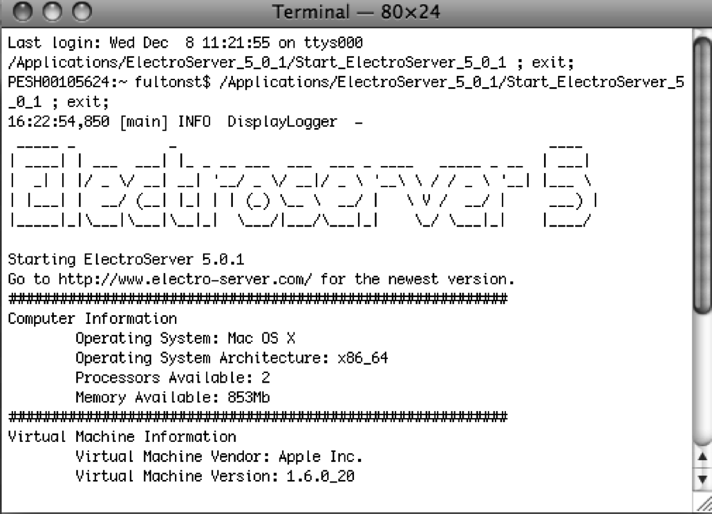
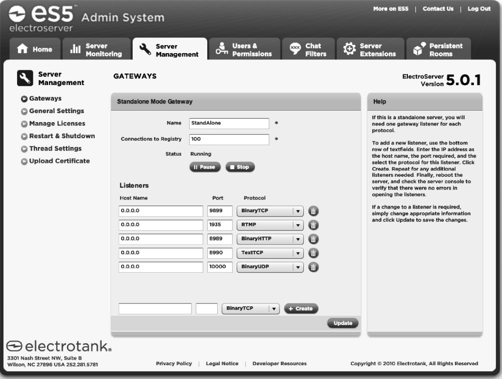

### 11.2.1　安装ElectroServer

想要使用HTML5的Canvas和ElectroServer进行多人应用的开发，首先需要从ElectroTank网站下载免费的最多支持25个用户版本的软件。读者可以根据自己的操作系统从网下载适合的版本（Windows、Mac和Linux）。

提示

> 在安装软件时需要一些先决条件，例如已经安装1.6版本的Java。

安装包中包括了服务器软件、客户端API、文档以及示例应用程序。在安装完服务器软件之后，可以在电脑上找到一个名称类似ElectroServer_5_x_的文件夹。本书是使用Mac电脑进行测试的，因此这个文件夹被创建于Mac的应用程序文件夹中。在Windows上安装时，可以指定文件夹的安装位置。

#### 1．启动服务器

在文件安装完成之后，需要进入安装目录运行名为Start_ElectroServer_5_0_1的可执行文件，才能启动ElectroServer的套接字服务（注意：文件名后面的3个数字会随版本升级而变化，但名称的形式还是一样的）。

当ElectroServer运行后，可以看到类似图11-3所示的屏幕画面。

<b class="my_markdown">图11-3　ElectroServer启动</b>

可以将服务运行在本机进行测试。然而在真实的环境中，需要在网络服务器上安装生产版本的软件。

#### 2．ElectroServer的管理工具

由于ElectroServer是一个套接字服务，因此它必须监听指定的端口并使用被支持的协议才能与JavaScript客户端进行通信。ElectroServer有多种协议，但需要确保使用BinaryHTTP协议与JavaScript的API通信。BinaryHTTP协议在ElectroServer中默认的端口是8989。

提示

> 如果ElectroServer新版JavaScript的API支持WebSockets，那么端口和协议可能会有所不同。

ElectroServer提供了一个华丽的管理工具，用户可以利用这个工具查看并修改所有支持的协议和端口，以及套接字服务的其他有用的功能。在安装目录的admin文件夹中可以找到一个用Adobe AIR开发的管理工具的安装文件（名称类似于es5-airadmin05.0.0.air），还可以在webadmin文件夹中找到一个名为webadmin.html的HTML文件。用这两个工具中的任何一个都可以完成本章的练习。

提示

> 为了确保管理控制台能够正常显示，需要先启动服务。

当打开管理工具时，需要输入用户名和密码。默认的用户名和密码是administrator和password。也可以在安装过程中修改用户名和密码。

登录后，单击菜单上的Server Management按钮，然后在侧边的菜单中选择Gateways选项。之后可以看到图11-4所示的屏幕画面。

<b class="my_markdown">图11-4　ElectroServer的端口和协议</b>

这个屏幕显示ElectroServer支持的每一种协议的端口设置。对于JavaScript的API，这里只关注BinaryHTTP的设置，可以看到它的端口被设置为8989。

#### 3．JavaScript的API

除了要启动ElectroServer，还需要有JavaScript的API才能开始创建能够连接服务器的Canvas应用程序。可以在ElectroServer的安装目录下的apis/client/javascript文件夹中找到JavaScript的API（文件夹名称可能在新版本中更改）。API的名称是ElectroServer-5-Client-JavaScript.js。

