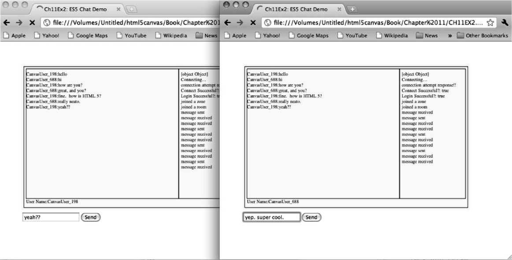

### 11.2.5　在Google Chrome中测试应用程序

为了测试ElectroServer的JavaScript API，需要启动Google的Chrome浏览器，并且关闭网络的安全选项。不同操作系统的操作方法不一样。在Mac OS X中，需要打开一个终端会话，执行下面的命令（如果已经在Application文件夹中安装了Chrome，那么Chrome将会启动）。

```javascript
/Applications/Google\ Chrome.app/Contents/MacOS/Google\
　　Chrome--disable-web-security
```

如果使用Windows系统的计算机，可以在命令行窗口中输入类似的命令，或者使用.bat的批处理文件执行命令。

```javascript
"C:\Program Files (x86)\Google\Chrome\Application\chrome.exe" 
　　--disable-web-security
```

提示

> 显然，对于一个产品化的应用程序来说这不是一个可接受的方案。ElectroTank（以及其他制作类似产品的公司）会继续增强他们API的特性，并且添加对HTML5的WebSockets的支持，因此这个限制应该会被消除。

在自己的开发机上测试多人应用程序的最好的办法是同时打开两个网页浏览器，或者两个网页浏览器窗口。当读者运行使用这个办法在Google的Chrome浏览器打开CH11EX2.html时，读者应该可以看到与图11-5类似的界面。


<center class="my_markdown"><b class="my_markdown">图11-5　ElectroServer使用JavaScriptAPI在画布上制作的聊天程序演示</b></center>

