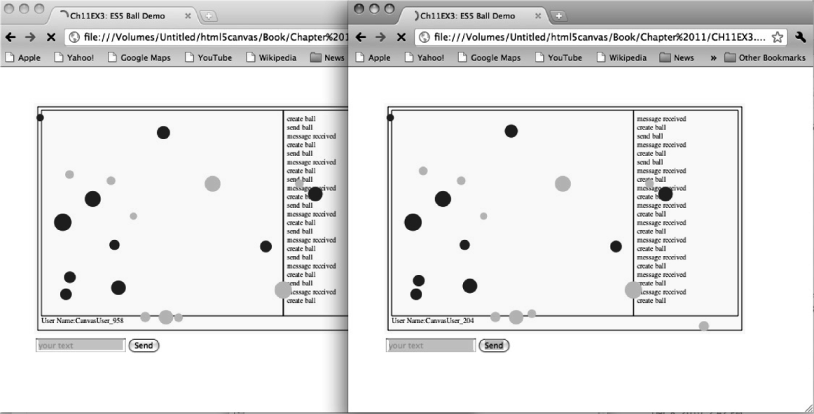

### 11.2.6　进一步探索ElectroServer

虽然在HTML5的Canvas上显示文字很有意思，但是正如本书向读者所展示的，还有更多的事情可以做。可以在上一个示例中添加一些图形。已经加入的第二个程序的文件名是CH11EX3.html，读者可以仔细阅读。在刚刚创建的聊天程序中添加了第5章中的反弹球游戏的程序。这个程序中，聊天者可以通过单击画布向其他人发送跳跃的小球。

这个程序目的仅仅是向读者展示聊天程序中的EsObject的另一个用途。当用户单击画布时，将会创建一个EsObject对象。这个EsObject对象中将会添加用户创建的小球的信息，这个信息会发送给房间中的其他用户。

```javascript
function eventMouseUp(event){
　 var mouseX;
　 var mouseY;
　 if (event.layerX || event.layerX == 0){ // Firefox
　　　mouseX = event.layerX ;
　　　mouseY = event.layerY;
　 } else if (event.offsetX || event.offsetX == 0){ // Opera
　　　mouseX = event.offsetX;
　　　mouseY = event.offsetY;
　 }
　 ballcounter++;
　 var maxSize = 8;
　 var minSize = 5;
　 var maxSpeed = maxSize+5;
　 var tempRadius = Math.floor(Math.random()*maxSize)+minSize;
　 var tempX = mouseX;
　 var tempY = mouseY;
　 var tempSpeed = maxSpeed-tempRadius;
　 var tempAngle = Math.floor(Math.random()*360);
　 var tempRadians = tempAngle * Math.PI/ 180;
　 var tempvelocityx = Math.cos(tempRadians)* tempSpeed;
　 var tempvelocityy = Math.sin(tempRadians)* tempSpeed;
　 var pmr = new PublicMessageRequest();
　 pmr.message = "";
　 pmr.roomId = _room.id;
　 pmr.zoneId = _room.zoneId;
　 var esob = new ElectroServer.EsObject();
　 esob.setFloat("tempX",tempX );
　 esob.setFloat("tempY",tempY );
　 esob.setFloat("tempRadius",tempRadius );
　 esob.setFloat("tempSpeed",tempSpeed );
　 esob.setFloat("tempAngle",tempAngle );
　 esob.setFloat("velocityx",tempvelocityx );
　 esob.setFloat("velocityy",tempvelocityy );
　 esob.setString("usercolor",usercolor );
　 esob.setString("ballname",username+ballcounter);
　 esob.setString("type", "newball");
　 pmr.esObject = esob;
　 es.engine.send(pmr);
　 statusMessages.push("send ball");
　 }
```

当在同一个房间的用户接收到这个公共消息时，将在onPublicMessageEvent()函数中处理newball事件，处理的方法与处理聊天文字的方法类似。当函数看到事件的类型是newball，它将调用createNetBall()函数。在createNetBall()函数中，将创建一个新的球，并让它在画布上反弹，处理过程与第5章的处理类似。

```javascript
function onPublicMessageEvent(event){
　 statusMessages.push("message received")
　 var esob = event.esObject;
　 if (esob.getString("type")== "chatmessage"){
　　chatMessages.push(event.userName + ":" + esob.getString("message"));
　 } else if (esob.getString("type")== "newball"){
　　　statusMessages.push("create ball")
　　　createNetBall(esob.getFloat("tempX"),esob.getFloat("tempY"),
　　　　　esob.getFloat("tempSpeed"),esob.getFloat("tempAngle"),
　　　　　esob.getFloat("tempRadius"),esob.getFloat("velocityx"),
　　　　　esob.getFloat("velocityy"),event.userName,esob.getString("usercolor"),
　　　　　esob.getString("ballname"));
　 }
}
function createNetBall(tempX,tempY,tempSpeed,tempAngle,tempRadius,tempvelocityx,
　　　　　　　　　 　　　 tempvelocityy, user, usercolor, ballname){
　　tempBall = {x:tempX,y:tempY,radius:tempRadius, speed:tempSpeed, angle:tempAngle,
　　　　velocityx:tempvelocityx, velocityy:tempvelocityy,nextx:tempX, nexty:tempY,
　　　　mass:tempRadius, usercolor:usercolor, ballname:ballname}
　　balls.push(tempBall);
　　}
```

图11-6展示了这个演示程序的界面，当用户在画布上单击鼠标按钮时会向其他用户发送小球。小球的演示是随机指定的。读者可以在CH11EX3.html文件中查看本示例的完整代码。


<center class="my_markdown"><b class="my_markdown">图11-6　ElectroServer的加入反弹球的聊天程序演示</b></center>

