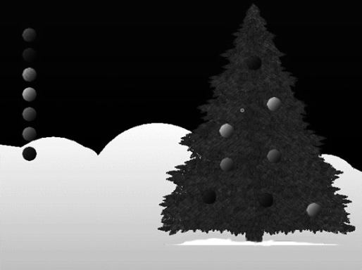

### 11.3　为Canvas创建一个简单对象框架

正如读者在本书中所看到的，当使用HTML5 Canvas的时候，很容易就能写出许多代码。事实上，如果将所有JavaScript代码全部写入主要的.html文件中，就会得到一个大型应用。但是，为了在开发HTML5 Canvas程序时变得更有效率，则需要为程序开发一个框架。目前，已经有许多免费且好用的框架读者可以选择（比如Impact.js和Easel.js）。但是，本书将专门为Canvas应用的开发制作一个小型框架。

本节将创建一个支持drag-and-drop拖放的应用。如图11-7所示，用户可以使用一个彩色灯泡来装饰圣诞树。虽然看起来这是一个小程序，但是需要创建一个系统来识别鼠标点击、拖动项目以及无限数量的对象跟踪工作。

<b class="my_markdown">图11-7　支持拖放的应用示例</b>

