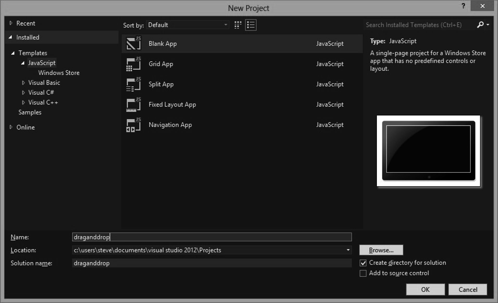
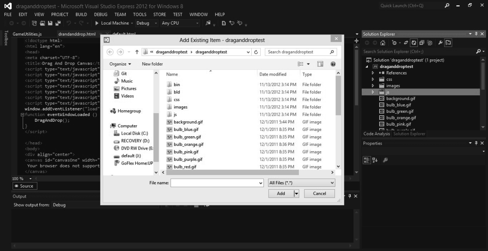
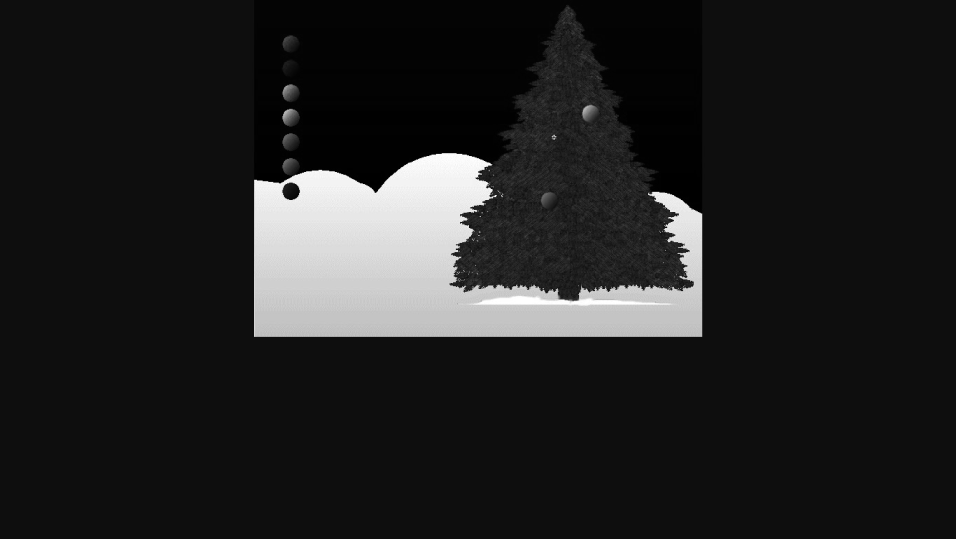

### 11.4　Windows 8应用与HTML5 Canvas

Windows 8提供了为开发人员提供了许多为操作系统和应用商店开发应用程序的新途径。其中一个就是用Visual Studio 2012打包HTML5的应用。

为了演示一下开发Windows 8版的HTML5 Canvas应用有多么容易，本书将刚刚开发的支持拖放的应用作为示例，向读者展示将它改造为一个Windows 8下面的应用需要做哪些修改。

首先，需要下载Windows 8版本的Visual Studio Express。如果读者已经安装了Visual Studio 2012，则不需要下载。

接下来，使用JavaScript模板创建一个新的Blank App工程，如图11-8所示。


<center class="my_markdown"><b class="my_markdown">图11-8　在Visual Studio 2012中创建一个新的JavaScript工程</b></center>

下一步，将拖放应用示例中创建的所有文件添加到新的工程中。直接将所有文件复制到Visual Studio创建的解决方案文件夹中（通常，文件夹会是“documents\visual studio 2012\projects\[工程名称]\[工程名称]”）。

完成这步之后，在Solution Explorer窗口中点击鼠标右键，选择“Add –>Existing Item”菜单项。然后，选中刚才复制到目录中的所有文件，如图11-9所示。


<center class="my_markdown"><b class="my_markdown">图11-9　将拖放应用示例中的所有文件添加到工程</b></center>

现在已经完成了编辑代码和运行程序的准备工作。接下来，将介绍如何用快捷的方法完成一个可运行的应用程序。

打开default.html文件，将dragandrop.html文件中所有引用JavaScript文件的语句复制到default.html中（引用modernizr.js的语句除外）。然后，将dragandrop.html文件中的HTML标签（<div>和<canvas>）复制到default.html文件中的body标签下。其他部分保持原装。最终的文件代码如下。

```javascript
<!DOCTYPE html>
<html>
<head>
　　<meta charset="utf-8" />
　　<title>draganddroptest</title>
　　<!-- WinJS references -->
　　<link href="//Microsoft.WinJS.1.0/css/ui-dark.css" rel="stylesheet" />
　　<script src="//Microsoft.WinJS.1.0/js/base.js"></script>
　　<script src="//Microsoft.WinJS.1.0/js/ui.js"></script>
　　<!-- draganddroptest references -->
　　<link href="/css/default.css" rel="stylesheet" />
　　<script src="/js/default.js"></script>
　　<script type="text/javascript" src="EventDispatcher.js"></script>
　　<script type="text/javascript" src="DisplayList.js"></script>
　　<script type="text/javascript" src="GameUtilities.js"></script>
　　<script type="text/javascript" src="DragAndDrop.js"></script>
　　<script type="text/javascript" src="Ornament.js"></script>
</head>
<body>
<div align="center">
<canvas id="canvasOne" width="640" height="480" style="cursor: default;">
 Your browser does not support the HTML 5 Canvas.
</canvas>
</div>
</body>
</html>
```

接下来，需要更新default.js文件。调用dragandrop.js文件中的DragAndDrop()函数，这样才能在Windows 8应用启动之后运行程序。调用语句需要添加到下面的注释语句之后。

```javascript
// TODO: This application has been newly launched. Initialize
// your application here.
```

其他语句保持不变，确保Windows 8应用可以正常运行。

```javascript
// For an introduction to the Blank template, see the following documentation:
// http://go.microsoft.com/fwlink/?LinkId=232509
(function () {
　　"use strict";
　　WinJS.Binding.optimizeBindingReferences = true;
　　var app = WinJS.Application;
　　var activation = Windows.ApplicationModel.Activation;
　　app.onactivated = function (args) {
　　　　if (args.detail.kind === activation.ActivationKind.launch) {
　　　　　　if (args.detail.previousExecutionState !==
　　　　　　　　activation.ApplicationExecutionState.terminated) {
　　　　　　　　// TODO: This application has been newly launched. Initialize
　　　　　　　　// your application here.
　　　　　　　　DragAndDrop();
　　　　　　} else {
　　　　　　　　// TODO: This application has been reactivated from suspension.
　　　　　　　　// Restore application state here.
　　　　　　}
　　　　　　args.setPromise(WinJS.UI.processAll());
　　　　}
　　};
　　app.oncheckpoint = function (args) {
　　　　// TODO: This application is about to be suspended. Save any state
　　　　// that needs to persist across suspensions here. You might use the
　　　　// WinJS.Application.sessionState object, which is automatically
　　　　// saved and restored across suspension. If you need to complete an
　　　　// asynchronous operation before your application is suspended, call
　　　　// args.setPromise().
　　};
　　app.start();
})();
```

最后修改GameUtilities.js文件中的canvasSupport()函数，让它总是返回true。因为读者已经知道Canvas肯定会被支持，所以可以在default.html文件中删除对moderizr.js的引用。

```javascript
function canvasSupport () {
　　return true;
}
```

现在，可以对应用程序进行测试了。点击菜单栏中绿色箭头的按钮开始测试，如图11-10所示。注意，在下拉菜单中要选择“Local Machine”。


<center class="my_markdown"><b class="my_markdown">图11-10　在Visual Studio中测试应用程序</b></center>

测试引用程序时应该可以看到图11-11所示的画面。


<center class="my_markdown"><b class="my_markdown">图11-11　将拖放程序示例改造为Windows 8的应用</b></center>

如果要返回Visual Studio，可以将鼠标指针移动到屏幕的左上角，然后点击Visual Studio的缩略图界面。在Visual Studio中可以用同样的操作将应用程序关闭，用鼠标右键点击拖放程序，然后选择关闭。

读者可以在本书的代码包中的Chapter11目录下的windows8文件夹中找到本程序的所有代码。

现在，读者可以利用HTML5 Canvas和Visual Studio 2012开发各种各样的Windows 8 应用程序。

如果读者想要知道为什么这里没有介绍Windows Phone，这是因为目前还不支持通过Visual Studio为Windows Phone创建HTML5的应用（尽管Windows Phone已经支持IE10浏览器）。然而在本书出版时，Phonegap/Cordova社区正在为提供Windows Phone模板而努力。如果他们能够成功，读者就可以在Windows Phone平台上测试HTML5 Canvas的应用程序了。

