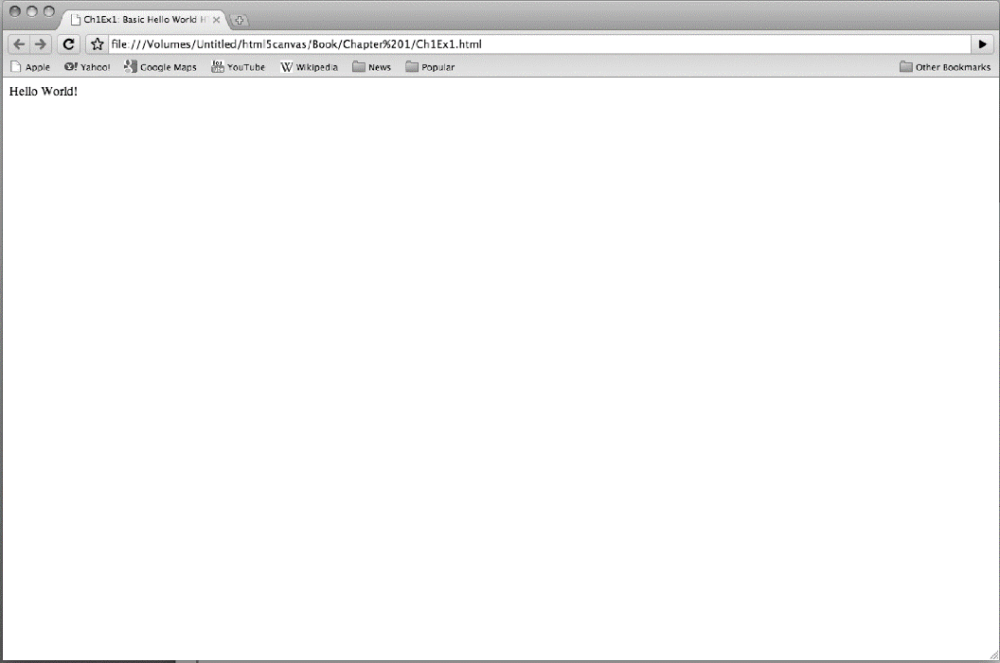

### 1.2.5　一个简单的HTML5页面

现在，在浏览器中看看这个页面（这是一个伟大的时刻，可以准备好工具开始开发代码了）。打开所选择的文本编辑器以及Web浏览器——Safari、FireFox、Opera、Chrome或IE。

（1）在文本编辑器中，输入例1-1中的代码。

（2）选择路径，保存为CH1EX1.html。

（3）在Chrome、Safari或Firefox的File菜单中，找到Open File命令，单击它，将看到一个能够打开文件的对话框（在Windows下用Chrome时，也可以按Ctrl+O键来打开文件）。

（4）找到刚刚创建的CH1EX1.html。

（5）单击“打开”按钮。

可以看到图1-1所示的结果。

<b class="my_markdown">图1-1　“Hello World！”页面</b>

