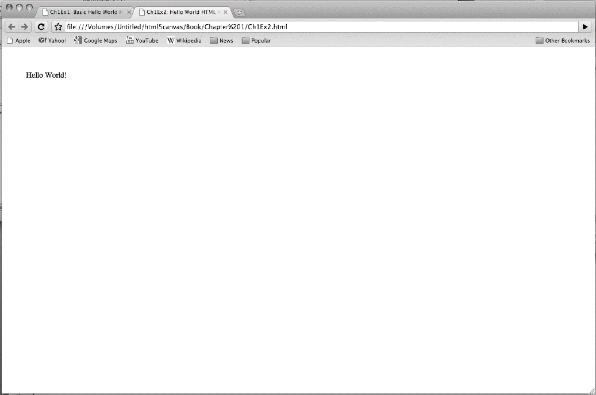

### 1.3.1　<div>

<div>是本书主要使用的一个HTML标签，用来定位<canvas>在HTML页面的位置。

例1-2使用<div>标签定义了“Hello World!”在屏幕上的位置，如图1-2所示。

例1-2　HTML5中的“Hello World！”

```javascript
<!doctype html>
<html lang="en">
<head>
<meta charset="UTF-8">
<title>CH1EX2: Hello World HTML Page With A DIV </title>
</head>
<body>
<div style="position: absolute; top: 50px; left: 50px; ">
Hello World!
</div>
</body>
</html>
```


<center class="my_markdown"><b class="my_markdown">图1-2　使用<div>的HTML5中的“Hello World！”</b></center>

style="position: absolute; top: 50px; left: 50px;"——这段代码是在HTML页面中使用内联CSS的例子。它告诉浏览器呈现内容的绝对位置为：距离页面顶端50像素，并且距离页面左端50像素。

警告

> 这个<div>可以在浏览器中定位画布，但是对试图在画布上捕捉鼠标点击时则没有任何帮助。在第5章中，本书将讨论一种既能定位画布又能捕获正确的鼠标点击位置的方法。

