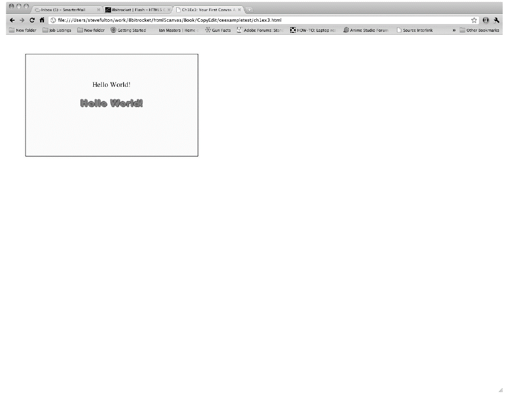

### 1.6.5　drawScreen()函数

现在便可以创建实际的Canvas API代码了。在Canvas上运行的各种操作都要通过context对象，因为它引用了HTML页面上的对象。

在后面几章中，本书将深入讲解如何在HTML5 Canvas中绘制文本、图形和图像等内容，所以现在只需花一点点时间来了解drawScreen()函数的代码。

这里说的“屏幕”实际上就是定义的画布绘图区域，而不是整个浏览器窗口。之所以将它称为屏幕，是因为在编写游戏或应用程序时，它就是在操作画布时的显示窗口或屏幕。

首先要做的事情是清空绘图区域。下面的两行代码在屏幕上绘制出一个与画布大小相同的黄色方块。fillStyle()设置了颜色，fillRect()创建了一个矩形，并把它放到了屏幕上。

```javascript
context.fillStyle = "#ffffaa";
context.fillRect(0, 0, 500, 300);
```

提示

> 注意，这里调用了context的函数。没有屏幕对象、颜色对象或者其他对象。这就是之前描述的即时模式的示例。

下一章将讨论Canvas的文本函数，这里只是简单地浏览将“Hello World!”文本放到屏幕上的代码。

首先，使用与设置矩形颜色相同的方法设置文本的颜色。

```javascript
context.fillStyle = "#000000";
```

然后，设置字体的大小和字号。

```javascript
context.font = "20px Sans-Serif";
```

接下来，设置字体的垂直对齐方式。

```javascript
context.textBaseline = "top";
```

最后，通过调用context对象的fillText()方法将测试文本显示到屏幕上。这个方法的3个参数分别是是文本字符串、x坐标和y坐标。

```javascript
context.fillText ("Hello World!", 195, 80);
```

下面给“Hello World!”文本添加图形。首先，加载一个图像并将它显示出来。第4章将深入讨论图像及其操作，现在仅仅要做的就是显示一个图像到屏幕上。为了将图像显示到画布上，需要创建一个Image()对象的实例，并且将Image.src属性设为将要加载的图像的名字。

提示

> 读者也可以将其他画布或者视频当作图像显示出来。本书会在第4章和第6章讨论相关主题。

在显示图像之前，需要等待图像加载完毕。设置Image对象的onload函数可以为Image load事件创建一个匿名的回调函数。这个匿名的回调函数将在onload事件发生时被执行。当图像加载完毕，调用context.drawImage()并传输3个参数将图像显示到画布上：Image对象、x坐标以及y坐标。

```javascript
var helloWorldImage = new Image(); 
helloWorldImage.onload = function () { 
　 context.drawImage(helloWorldImage, 160, 130); 
}
helloWorldImage.src = "helloworld.gif";
```

最后，围绕文本和图像绘制一个方块。为了绘制方块而不填充，可以使用context.strokeStyle属性设置方块边框的颜色，然后调用context.strokeRect()方法绘制矩形边框。strokeRect()的4个参数分别是：左上角的x坐标和y坐标，以及矩形的宽度和高度。

```javascript
context.strokeStyle = "#000000";
context.strokeRect(5, 5, 490, 290);
```

完整的HTML5“Hello World!”应用程序代码如例1-3所示，结果如图1-3所示。

例1-3　HTML5 Canvas下的“Hello World！”

```javascript
<!doctype html>
<html lang="en">
<head>
<meta charset="UTF-8">
<title>CH1EX3: Your First Canvas Application </title>
<script src="modernizr.js"></script>
<script type="text/javascript">
window.addEventListener("load", eventWindowLoaded, false);
var Debugger = function (){ };
Debugger.log = function (message){
　 try {
　　　console.log(message);
　 } catch (exception){
　　　return;
　 }
}
function eventWindowLoaded (){
　 canvasApp();
}
function canvasSupport (){
　 return Modernizr.canvas;
}
function canvasApp (){
　　　　if (!canvasSupport()){ 
　　　　　 return;
　　　　}
　　　var theCanvas = document.getElementById("canvasOne");
　　　var context = theCanvas.getContext("2d");
　　　Debugger.log("Drawing Canvas");
　　　　function drawScreen(){
　　　　 //背景
　　　　 context.fillStyle = "#ffffaa";
　　　　 context.fillRect(0, 0, 500, 300);
　　　　 //文字
　　　　 context.fillStyle = "#000000";
　　　　 context.font = "20px Sans-Serif";　　　　 
　　　　 context.textBaseline = "top";
　　　　 context.fillText ("Hello World!", 195, 80 );
　　　　 //图像
　　　　 var helloWorldImage = new Image(); 
　　　　 helloWorldImage.onload = function () { 
　　　　　　　context.drawImage(helloWorldImage, 155, 110); 
　　　　　 } 
　　　　　 helloWorldImage.src = "helloworld.gif"; 
　　　　 //边框
　　　　 context.strokeStyle = "#000000";
　　　　 context.strokeRect(5, 5, 490, 290);
　　　}
　　　drawScreen();
}
</script>
</head>
<body>
<div style="position: absolute; top: 50px; left: 50px;">
<canvas id="canvasOne" width="500" height="300">
Your browser does not support HTML5 Canvas.
</canvas>
</div>
</body>
</html>
```


<center class="my_markdown"><b class="my_markdown">图1-3　HTML5 Canvas下的“Hello World！”</b></center>

