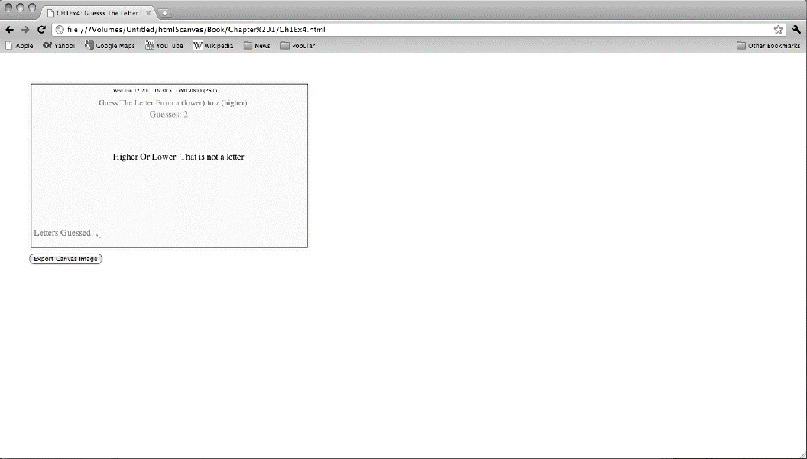

### 1.10　第二个示例：猜字母

现在来快速看一下另一个广泛提及的“Hello World!”类型的应用程序示例——“猜字母”游戏。本章通过这个示例来说明用JavaScript编写Canvas程序比用Canvas API多了哪些工作量。

图 1-4所示的游戏中，玩家要做的是猜出计算机从字母表中随即抽取的字母。游戏会记录玩家已经猜了多少次，并列出已经猜过的字母，同时告诉玩家需要往哪个方向猜（往Z方向猜还是往A方向猜）。

<b class="my_markdown">图1-4　HTML5下的“猜字母”游戏</b>

