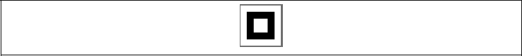

### 2.2　基本矩形

首先，从最简单、最原始的Canvas内建的几何形状——矩形开始。在Canvas上，绘制基本矩形有3种不同的方式：填充、描边和清除。创建矩形（或者其他形状）还可以使用路径，下节将会讲到。

实现这3种操作的API函数如下。

```javascript
fillRect(x,y,width,height)
```

在位置（x, y）处以宽为width、高为height绘制一个填充的矩形。

```javascript
strokeRect(x,y,width,height)
```

在位置（x, y）处以宽为width、高为height绘制一个矩形边框。它需要使用当前的strokeStyle、lineWidth、lineJoin以及miterLimit设置。

```javascript
clearRect(x,y,width,height)
```

在位置（x, y）处以宽为width、高为height，清除指定区域并使其完全透明（使用透明黑作为颜色）。

在使用这些功能之前，需要预先设置好Canvas绘图时所需的填充或描边的样式。

设置这些样式最基本的方法就是使用24位的十六进制字符串。下面是第一个演示的示例。

```javascript
context.fillStyle = '#000000';
context.strokeStyle = '#ff00ff';
```

在例2-1中，填充样式简单设为RGB黑色，描边样式设为传统的紫色，结果如图2-1所示。

例2-1　基本矩形

```javascript
function drawScreen(){
　　　context.fillStyle = '#000000';
　　　context.strokeStyle = '#ff00ff';
　　　context.lineWidth = 2;
　　　context.fillRect(10,10,40,40);
　　　context.strokeRect(0, 0,60,60);
　　　context.clearRect(20,20,20,20);
}
```


<center class="my_markdown"><b class="my_markdown">图2-1　基本矩形</b></center>

