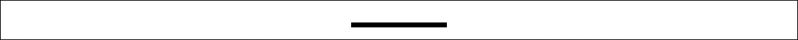

### 2.4.2　动态绘图

最基本的路径通过moveTo()命令和lineTo()命令控制，如例2-2所示。

例2-2　简单直线路径

```javascript
function drawScreen(){
　 context.strokeStyle = "black"; 
　 context.lineWidth = 10;
　 context.lineCap = 'square';
　 context.beginPath();
　 context.moveTo(20, 0);
　 context.lineTo(100, 0);
　 context.stroke();
　 context.closePath();
}
```

图2-2为这个示例的输出效果。


<center class="my_markdown"><b class="my_markdown">图2-2　简单直线路径</b></center>

例2-2简单地绘制了一个10像素宽的水平线（或笔画），从位置（20，0）到（100，0）。

此处添加了lineCap属性和strokeStyle属性。在继续学习更高级的绘制前，首先简单介绍可以应用在直线上的不同属性。context.stroke(); 方法将最终完成、画出构建的路径。

#### 1．lineCap属性

lineCap定义上下文中线的端点，可以有以下3个值。

+ butt：默认值，端点是垂直于线段边缘的平直边缘。
+ round：端点是在线段边缘处以线宽为直径的半圆。
+ square：端点是在选段边缘处以线宽为长、以一半线宽为宽的矩形。

#### 2．lineJoin属性

lineJoin定义两条线相交产生的拐角，可将其称为连接。在连接处创建一个填充三角形，可以使用lineJoin设置它的基本属性。

+ miter：默认值，在连接处边缘延长相接。miterLimit是角长和线宽所允许的最大比例（默认是10）。
+ bevel：连接处是一个对角线斜角。
+ round：连接处是一个圆。

#### 3．线宽

lineWidth定义线的宽度（默认值为1.0）。

#### 4．笔触样式

strokeStyle定义线和形状边框的颜色和样式（见例2-2所示的简单矩形）。

