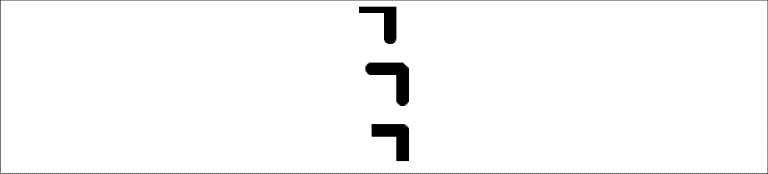

### 2.4.3　高级线段绘制举例

例2-3展示了这些属性所起的作用，结果如图2-3所示。在画布上绘制线段时，会有一些奇怪的现象发生，本书将在讲解过程中详细指出。

例2-3　线段终点和连接

```javascript
function drawScreen(){
　　　// 实例1: 圆形端点，斜角连接，在画布左上角
　　　context.strokeStyle = "black"; 
　　　context.lineWidth = 10;
　　　context.lineJoin = 'bevel';
　　　context.lineCap = 'round';
　　　context.beginPath();
　　　context.moveTo(0, 0);
　　　context.lineTo(25, 0);
　　　context.lineTo(25,25);
　　　context.stroke();
　　　context.closePath();
　　　// 实例2: 圆形端点，斜角连接，不在画布左上角
　　　context.beginPath();
　　　context.moveTo(10, 50);
　　　context.lineTo(35, 50);
　　　context.lineTo(35,75);
　　　context.stroke();
　　　context.closePath();
　　　// 实例3: 平直端点，圆形连接，不在画布左上角
　　　context.lineJoin = 'round';
　　　context.lineCap = 'butt';
　　　context.beginPath();
　　　context.moveTo(10, 100);
　　　context.lineTo(35, 100);
　　　context.lineTo(35,125);
　　　context.stroke();
　　　context.closePath();
　 }
```


<center class="my_markdown"><b class="my_markdown">图2-3　线段端点和连接</b></center>

这3个线段和连接的实例有助于说明在画布上绘制线段时不同属性的组合。

实例1尝试从画布左上角开始绘制，结果发生了一个奇怪的现象。Canvas路径在x轴和y轴方向上都绘制到了起点的外侧。由于这个原因，实例1上面的线看起来比设置的10像素要细些。另外，左上角水平部分中圆形端点也无法看到，它们都被绘制到了屏幕之外的负值坐标区域。此外，lineJoin定义的对角线斜角也没有绘出。

实例2调整了例子1中出现的问题，将起始点离开左上角。这样就绘制出了完整的水平线，并且圆形lineCap和斜角lineJoin都被绘制出来了。

实例3显示了去掉lineCap设置后的默认端点效果，并且将lineJoin调整为圆角。

