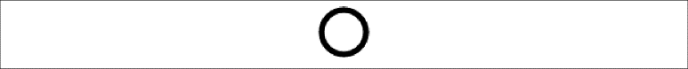
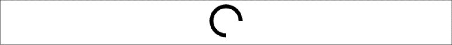
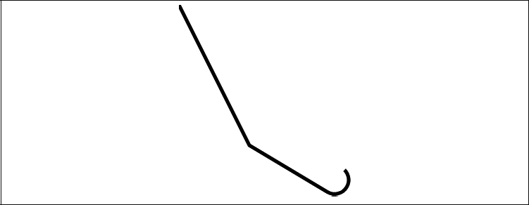

### 2.5.1　弧线

有4种函数可以绘制弧线和曲线。弧线可以是一个整圆，也可以是圆的任何一部分。

#### 1．context.arc()

context.arc()的使用方法如下：

```javascript
context.arc(x, y, radius, startAngle, endAngle, anticlockwise)
```

x和y定义圆心的位置，radius定义弧线的半径。startAngle和endAngle使用弧度值，而不是角度值。anticlockwise的值可以是true或false，用于定义弧线的方向。例如，绘制一个圆心在（100，100），半径为20的圆（见图2-4），可以使用下面这段drawScreen()代码。

```javascript
context.arc(100, 100, 20, (Math.PI/180)*0, (Math.PI/180)*360, false);
```


<center class="my_markdown"><b class="my_markdown">图2-4　圆</b></center>

例2-4显示了创建一个简单圆形所必须的代码。

例2-4　圆弧

```javascript
function drawScreen(){
　　　context.beginPath();
　　　context.strokeStyle = "black";
　　　context.lineWidth = 5;
　　　context.arc(100, 100, 20, (Math.PI/180)*0, (Math.PI/180)*360, false);
　　　//整圆
　　　context.stroke();
　　　context.closePath();
}
```

注意，这里应将起始角度（0）和结束角度（360）乘以（Math.PI/180）来将其转换为弧度。使用0和360可以创建一个完整的圆形。

如果不以0和360作为起止点，则可以绘制出一段圆弧。下面这段drawScreen()代码将按顺时针方向画1/4个圆，如图2-5所示。

```javascript
context.arc(100, 200, 20, (Math.PI/180)*0, (Math.PI/180)*90, false);
```


<center class="my_markdown"><b class="my_markdown">图2-5　1/4个圆</b></center>

如果要画0～90以外的部分（见图2-6），可以将anticlockwise值设置为true。

```javascript
context.arc(100, 200, 20, (Math.PI/180)*0, (Math.PI/180)*90, true);
```


<center class="my_markdown"><b class="my_markdown">图2-6　3/4个圆</b></center>

#### 2．context.arcTo()

context.arcTo()的使用方法如下：

```javascript
context.arcTo(x1, y1, x2, y2, radius)
```

只有最新的一些浏览器支持arcTo方法——或许是因为其能力可以被arc()函数替代的原因。这个函数以给定的半径绘制一条弧线，圆弧的起点与当前路径的位置到（x1，y1）点的直线相切，圆弧的终点与（x1，y1）点到（x2，y2）的直线相切。

context.arcTo方法要求当前路径至少有一个子路径。那么，如果从（0，0）到（100，200）画一条直线，然后创建一条小弧线，这看起来会有点像一个钢丝衣架（没有更好的比喻了），如图2-7所示。

```javascript
context.moveTo(0,0);
context.lineTo(100, 200);
context.arcTo(350,350,100,100,20);
```


<center class="my_markdown"><b class="my_markdown">图2-7　arcTo()示例</b></center>

